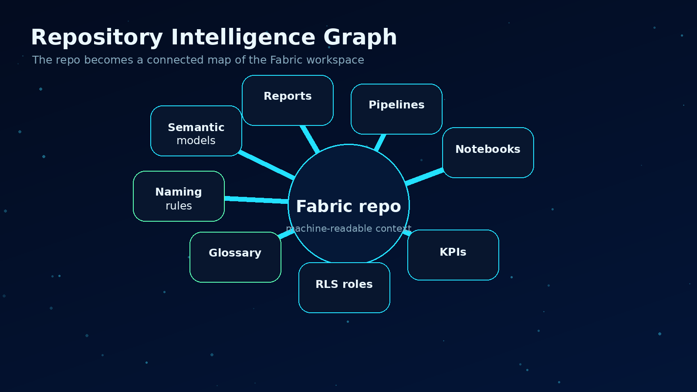
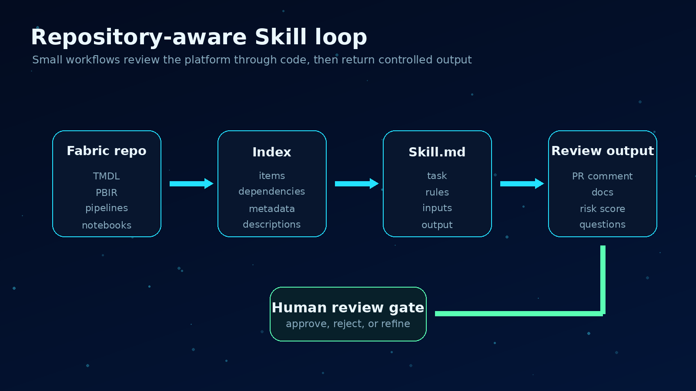
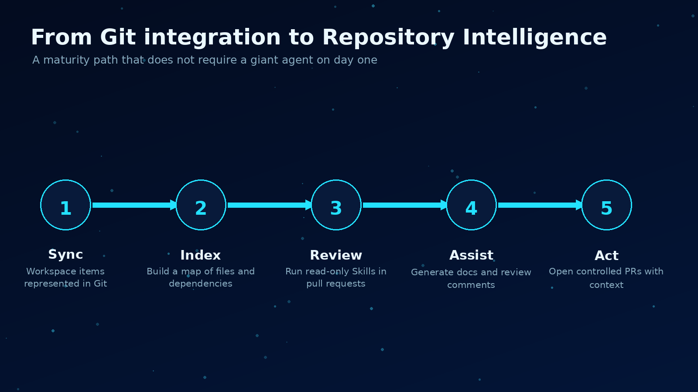
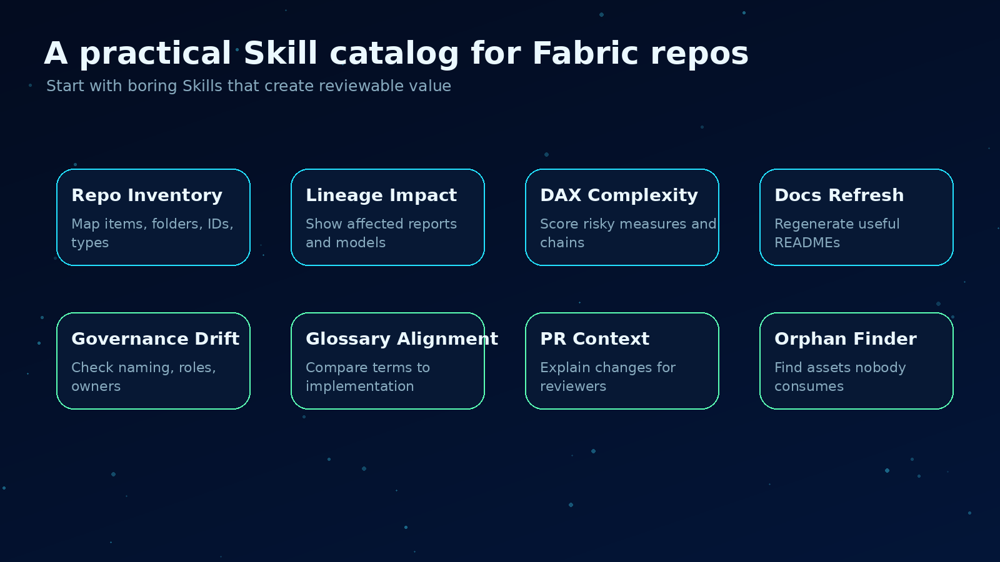

# Repository Intelligence: the real shift behind Microsoft Fabric + Git


*Repository Intelligence turns the Fabric repository into a reasoning surface for AI-assisted analytics engineering.*

Most teams still treat Microsoft Fabric + Git integration as a source control feature.

That is understandable. The obvious benefits are versioning, pull requests, rollback, branch-based development, and CI/CD. Those are useful. I want them. Any serious analytics engineering team should want them.

But I do not think that is the real shift.

The bigger change is what happens when a Fabric workspace stops being a collection of things inside a UI and starts becoming a machine-readable representation of the analytics platform.

That is a different category of value.

Once the workspace is represented as a repository, the repo is no longer just a backup of the workspace. It becomes a context layer. And once that context layer exists, AI can work against it in a much more useful way.

Not as a chatbot floating above the platform.
Not as a natural language interface on top of one semantic model.
Not as a one-time parser for a PBIX file.

As a set of repository-aware engineering Skills that understand the structure, relationships, naming conventions, business logic, and drift inside the analytics estate.

That is what I mean by Repository Intelligence.

## The mistake: stopping at source control

Fabric Git integration already gives teams a very practical foundation. Microsoft describes it as workspace-level integration with Git, where Fabric items are represented in a repository and the workspace structure, including folders, can be preserved. Supported items include semantic models, reports, notebooks, pipelines, lakehouses, warehouses, KQL assets, data agents, and more.

That matters because the repo is not just random exported files. Fabric items have a source format. For example, reports can include files like `definition.pbir` and `report.json`. Semantic models can include `definition.pbism` and a definition folder with TMDL files. Each item folder also includes system metadata such as `.platform`, with fields like type, display name, description, and logical ID.

That gives us something important: an analyzable surface.

Most teams use that surface for the normal ALM story:

- commit changes
- review diffs
- merge to main
- deploy through environments
- roll back when needed

Again, all good.

But if that is where the architecture stops, the team has only moved the workspace into Git. It has not made the workspace intelligent.

The more interesting question is this:

What can reason over the repository now that the repository contains enough structure to describe the analytics platform?

## The repository becomes the workspace's memory



*The useful unit is not one file. It is the connected graph across the workspace.*

A Fabric workspace has many kinds of knowledge hiding inside it:

- semantic model tables, columns, measures, relationships, roles, and perspectives
- report pages, visuals, filters, bookmarks, and dependencies
- pipelines, activities, parameters, connections, and schedules
- notebooks, Spark logic, lakehouse paths, and transformation patterns
- warehouse objects, views, procedures, and SQL logic
- data agents, instructions, examples, and configured sources
- naming conventions and folder structures
- business terms expressed across measures, reports, descriptions, and documentation

In the UI, those things feel separate.

In a repository, they can become connected.

A measure is not just a line of DAX. It belongs to a table. It uses columns. It may repeat business logic from another measure. It may feed visuals across several reports. Those reports may be used by a finance team. The same concept may also appear in a notebook, a pipeline name, a warehouse view, and a glossary entry.

That is the point.

The intelligence does not come from one file. It comes from the graph across files.

A single PBIX parser can tell you what is inside one report. Repository Intelligence should tell you what a change means across the workspace.

That is the difference between file inspection and platform understanding.

## What I mean by AI Skills



*A Skill is a controlled workflow over repository context, not a generic chatbot.*

I am using the word Skill very deliberately here.

A Skill is not a generic chatbot prompt. It is a structured, reusable agent workflow designed to perform a specific engineering task against repository context.

In practical terms, I would expect a Skill to live close to the repo, often as a `SKILL.md` file or similar definition, with clear instructions, required inputs, safety rules, expected outputs, and examples.

A simple repository Skill might define:

```text
Name: DAX Complexity Reviewer
Purpose: Identify measures that are too complex, duplicated, or risky to maintain.
Inputs: TMDL files, measure definitions, relationships, report dependencies.
Output: Markdown review with risk score, affected reports, and refactoring suggestions.
Allowed actions: Read files, write report, optionally open pull request.
Not allowed: Change business logic without human approval.
```

This is a different mental model than "ask my data a question."

Microsoft Fabric data agents are very useful for conversational Q&A over governed data sources like lakehouses, warehouses, semantic models, KQL databases, ontologies, and Microsoft Graph. They can generate SQL, DAX, or KQL under the user's permissions.

Repository-aware Skills solve a different problem.

They help engineers understand and improve the analytics platform itself.

The data agent answers business questions.
The repository Skill reviews the system that produces the answers.

Both matter. They are not the same thing.

## What Repository Intelligence can actually do

Here are examples that become much more realistic once the Fabric workspace is represented as code.

### 1. Trace lineage across the workspace

A Skill can inspect semantic models, reports, pipelines, notebooks, lakehouse paths, and warehouse objects to build lineage that is closer to how the platform is actually maintained.

Not just "this table feeds this report."

More useful questions are:

- Which reports would be affected if this column is renamed?
- Which measures depend on this calculated column?
- Which pipelines load the table used by this executive dashboard?
- Which notebooks write into lakehouse paths later used by a model?
- Which assets are disconnected from anything users actually consume?

This is where the repo becomes a map, not storage.

### 2. Detect duplicated business logic

Every mature BI estate eventually collects duplicate definitions.

Revenue appears in five measures.
Active customer logic appears in a notebook, a SQL view, and a DAX measure.
A margin calculation changes in one report and not another.

A repository-aware Skill can search across TMDL, SQL, notebooks, pipeline expressions, and documentation to find similar logic and flag drift.

The best version is not just text similarity. It should understand semantic similarity.

Two measures can look different and still mean the same business thing.
Two measures can look similar and mean something different.

That is exactly the kind of review where an AI workflow can help, as long as it has the right context and a human keeps final judgment.

### 3. Score DAX and model complexity

Complexity is not automatically bad. Some measures are complex because the business is complex.

But teams still need a way to see where maintenance risk is building up.

A DAX complexity Skill could score measures based on signals such as:

- length and nesting depth
- repeated patterns
- iterator usage
- dependency chain depth
- number of downstream visuals
- use of ambiguous naming
- duplicated logic across models
- missing descriptions

The output should not be "bad measure, rewrite it."

A better output is:

```text
Measure: Net Revenue YoY %
Risk: High
Why: deep dependency chain, repeated filter logic, used by 14 visuals across 3 reports.
Suggested next step: extract base revenue logic into a reusable measure and add a description.
```

That is actionable.

### 4. Identify governance drift

Governance problems usually show up slowly.

A workspace starts with clean naming. Then a few urgent reports get built. A pipeline is copied. A measure is created without a description. RLS roles drift. Sensitivity labels are not consistent. A notebook writes to a path nobody recognizes.

By the time someone notices, the workspace already feels messy.

A governance drift Skill can compare the repo against standards:

- naming conventions
- folder structure
- required descriptions
- semantic model role patterns
- report certification rules
- deployment rules
- forbidden shortcuts or connection patterns
- expected owner metadata

The Skill does not need to be dramatic. It just needs to be consistent.

Every pull request can get a small governance review before the mess becomes normal.

### 5. Regenerate useful documentation

Most documentation fails because it is detached from the system.

Someone writes it once. The model changes. The pipeline changes. The documentation becomes a museum.

The repository gives us a better option.

Documentation can be generated from the same files engineers are already changing.

A documentation Skill could maintain:

- README files for each workspace or domain
- semantic model dictionaries
- measure catalogs
- report inventories
- pipeline summaries
- data product ownership notes
- change summaries for business stakeholders

The important part is not generating pretty prose.

The important part is keeping the documentation close to the source of truth and refreshing it when the source changes.

### 6. Translate business glossary into implementation

This is where things get interesting.

Most organizations have business terms that live somewhere outside the model. Sometimes in SharePoint. Sometimes in Excel. Sometimes only in someone's head.

A Skill can compare glossary terms against the repository and ask practical questions:

- Is this term implemented as a measure?
- Is the definition consistent across models?
- Are the report labels aligned with the glossary?
- Is there a measure description users can trust?
- Does the DAX logic match the business definition closely enough to review?

It should not auto-create business logic and pretend it is correct.

But it can scaffold the work:

- proposed measure names
- draft descriptions
- candidate DAX patterns
- impacted reports
- questions for the business owner

That makes the human review sharper.

### 7. Open pull requests with context

The natural end state is not just analysis. It is controlled action.

A repository-aware Skill should be able to open a pull request that includes:

- the proposed file changes
- the reason for the change
- the affected Fabric items
- the lineage impact
- the test or validation notes
- the governance checks it performed
- questions that still require a human decision

This is where the repo becomes the operating surface for AI-assisted analytics engineering.

Not autonomous chaos.

Controlled, reviewable, auditable changes.

## A practical starter architecture



*The practical path is small: sync, index, review, assist, then controlled action.*

If I were starting this in a real Fabric environment, I would not try to build a giant agent first.

I would start small.

### Step 1: Connect the workspace to Git

Get the basics right first. Use Fabric Git integration at the workspace level. Keep folder structure intentional. Make sure the supported items that matter to your team are actually syncing.

Do not skip naming. AI depends heavily on names, descriptions, and structure. Bad naming is not just a human problem anymore. It becomes machine context debt.

### Step 2: Build a repository index

Create a lightweight index of the repo:

- item folders
- item types
- logical IDs
- display names
- semantic model files
- report files
- pipeline definitions
- notebook files
- dependency references
- descriptions and labels

This does not need to be perfect on day one.

The first version can be a simple JSON index generated on every commit.

### Step 3: Create three Skills, not thirty

I would start with three Skills that create obvious value:

1. **Workspace Documentation Skill**
   Regenerates README files, inventories, and semantic model summaries.

2. **Semantic Model Review Skill**
   Reviews measures, relationships, descriptions, naming, and obvious DAX risks.

3. **Lineage Impact Skill**
   Answers "what breaks or changes if this asset changes?" for pull requests.

These are boring in the best way. They help every team.

### Step 4: Run Skills in pull requests

Do not start by giving the agent write access to everything.

Start with read-only reviews in pull requests.

Let the Skill comment with findings. Let humans decide. Measure which findings are useful. Tune the Skill instructions. Add examples from real reviews.

Only after that should you allow limited write actions, like regenerating documentation or adding missing descriptions.

### Step 5: Keep the human in the loop

Repository Intelligence should reduce blind spots, not remove accountability.

If a Skill suggests a DAX refactor, a person still owns the business meaning.
If a Skill flags governance drift, a person still decides priority.
If a Skill opens a PR, a person still reviews and merges.

That boundary is not a weakness. It is the safety model.

## The real asset is context

Models will improve. APIs will change. Copilot features will keep moving. Fabric data agents will get better. The tooling around AI-assisted engineering will keep changing too.

But the durable asset is the context layer.

A clean, machine-readable repository that describes the analytics platform is valuable no matter which model or agent framework sits on top of it.

That is the part teams should pay attention to.

Not because Git is new.

Because Git turns the Fabric workspace into something AI can reason about.

Semantic models. Reports. Pipelines. Notebooks. KPIs. RLS roles. Naming conventions. Business logic. Documentation. All of it becomes part of the same graph.

That graph is where Repository Intelligence starts.

And I think that is the real shift behind Fabric + Git.

## Useful Skills to build first



*A starter catalog of repository-aware Skills for Fabric teams.*

If you want a practical starting backlog, I would build these in this order:

1. **Repo Inventory Skill**
   Creates a structured map of all Fabric items in the repository.

2. **Lineage Impact Skill**
   Explains downstream impact for changed tables, columns, measures, notebooks, and pipelines.

3. **DAX Complexity Skill**
   Scores risky measures and points reviewers to the right places.

4. **Documentation Refresh Skill**
   Updates READMEs, model dictionaries, and report inventories from the repo.

5. **Governance Drift Skill**
   Checks naming, descriptions, RLS patterns, owners, and folder standards.

6. **Glossary Alignment Skill**
   Compares business terms against measures, labels, and descriptions.

7. **Pull Request Context Skill**
   Summarizes what changed, why it matters, and what reviewers should check.

That is the path I would trust.

Small Skills. Clear boundaries. Real repository context. Human review.

That is how AI-native analytics engineering starts to become practical.

## Sources and notes

- Microsoft Fabric Git integration overview: https://learn.microsoft.com/en-us/fabric/cicd/git-integration/intro-to-git-integration
- Microsoft Fabric Git source code format: https://learn.microsoft.com/en-us/fabric/cicd/git-integration/source-code-format
- Microsoft Fabric data agents: https://learn.microsoft.com/en-us/fabric/data-science/concept-data-agent

---

**Shai Karmani**  
[Let’s connect on LinkedIn](https://www.linkedin.com/in/shai-kr)
