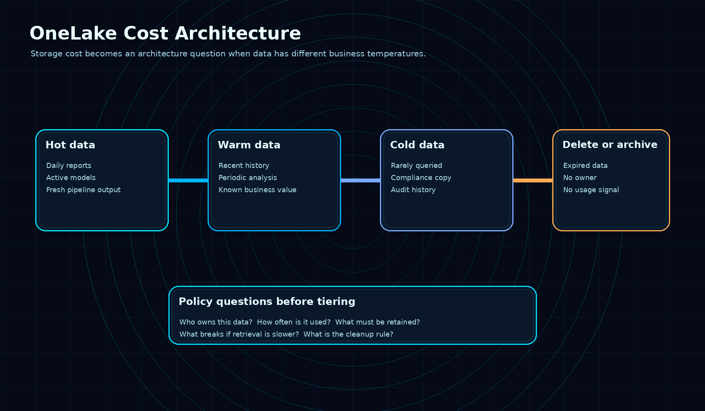
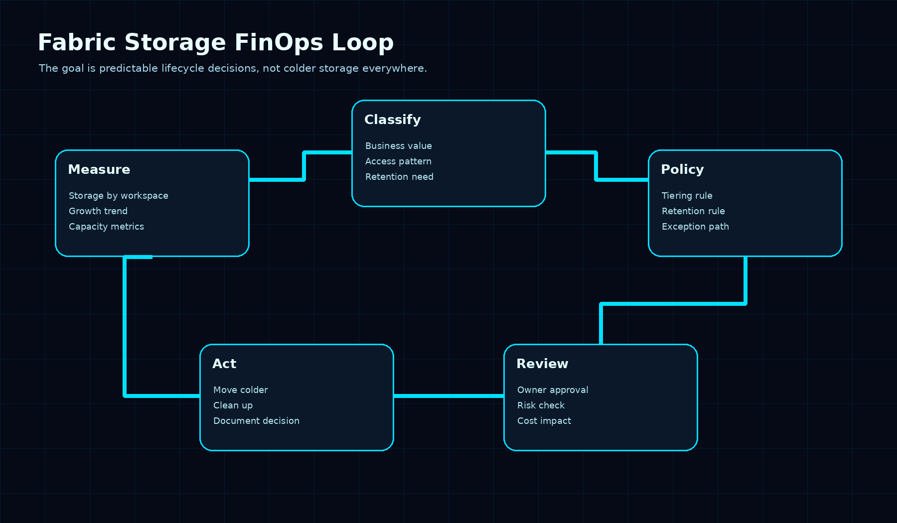

# Your Microsoft Fabric Bill Has a OneLake Problem

Most Fabric cost conversations start too late.

The bill shows up. Someone opens the Capacity Metrics app. A few workspaces look suspicious. Then the team starts asking the questions they should have asked months earlier:

Why is this data still here?

Who owns it?

Is anyone using it?

Can we move it to a cheaper tier?

Can we delete it safely?

That is not a storage problem. That is an architecture problem.

OneLake storage tiers and lifecycle management are interesting because they push Fabric teams toward a more mature operating model. Not “how much data can we land in the lake?” but “what should happen to this data after it stops being hot?”

## OneLake changes the storage conversation

OneLake is designed as the single logical data lake for a Fabric tenant. Microsoft describes it as the OneDrive for data: one place for analytics data across the organization, built on top of ADLS Gen2, used by Fabric experiences like lakehouses and warehouses.

That simplicity is useful. It also creates a trap.

When storage feels central and easy, teams can treat it like an infinite landing zone.

Raw files stay forever. Staging tables become permanent. Old extracts sit next to active analytical data. Development leftovers survive because nobody wants to break something. Warehouses and lakehouses grow quietly until cost becomes visible enough to hurt.

OneLake storage is billed by data stored, per GB. It does not consume Fabric CUs, but it is still a real cost line. And OneLake transactions consume existing Fabric capacity.

So the design question is not only “can Fabric store this?”

It is “what is the lifecycle of this data?”

## Data has temperature

A lot of BI teams already understand this concept informally.

Some data is hot:

- used in daily dashboards
- queried by semantic models
- refreshed often
- tied to executive reporting
- needed for operational decisions

Some data is warm:

- used for monthly or quarterly analysis
- relevant for trend comparison
- still valuable, but not constantly queried

Some data is cold:

- retained for audit
- rarely queried
- needed for compliance or reconstruction
- expensive to keep in the wrong place forever

And some data should not be stored at all anymore.

The mistake is treating all of these as the same class of data because they happen to live in the same lake.

Storage tiers force a better conversation. Lifecycle management makes that conversation operational.

The value is not only cheaper storage. The value is that someone has to define rules.

Who owns this dataset?

How long does it need to stay hot?

What is the retrieval expectation after it cools down?

What regulation or business process requires retention?

What is the cleanup rule when nobody owns it anymore?

Those are governance questions, not just admin settings.

## This is where Fabric FinOps becomes real

FinOps in analytics is often treated as capacity tuning.

Pause this. Scale that. Optimize a query. Move workloads away from peak hours.

All of that matters.

But storage lifecycle is a different layer of cost discipline. It is less about fixing an expensive day and more about preventing an expensive architecture.

A Fabric team should be able to answer a few basic questions for each important workspace:

1. What data is actively serving reports or models?
2. What data is kept only for history?
3. What data is duplicated because a pipeline was easier to build that way?
4. What data is retained because of policy?
5. What data has no owner and no clear use?

If the team cannot answer those questions, adding lifecycle rules later will be risky. You cannot safely automate movement or deletion when nobody understands what the data is doing.

That is why I would not start with “turn on tiering everywhere.”

I would start with classification.

A simple workspace review can expose most of the issue:

- active analytical data
- temporary processing data
- historical data
- compliance-retained data
- orphaned or unknown data

Only after that does tiering become useful.

## The practical operating model

For a Fabric-heavy organization, I would handle OneLake lifecycle as an operating model, not a one-time cleanup.

Start with these rules:

1. Every important dataset needs an owner.

If nobody owns it, nobody can approve tiering, retention, or deletion.

2. Every workspace needs a storage review rhythm.

Monthly for active production workspaces. Quarterly for slower domains. No review means no cost control.

3. Temporary data needs an expiry rule.

Staging and intermediate outputs are useful. They should not become permanent by accident.

4. Historical data needs a retrieval expectation.

If the business expects instant access, that is one decision. If slower access is acceptable, that is another. Cost follows that decision.

5. Retention needs to be explicit.

“Keep everything forever” is not a retention policy. It is usually a sign that nobody wants to make the decision.

6. Storage metrics need to be reviewed next to business context.

The Capacity Metrics app can show where storage is growing. It cannot tell you whether that growth is justified. That part still belongs to the team.

## What I would not do

I would not treat storage tiers as a magic cost button.

Moving data colder can reduce cost, but it can also create support problems if the team does not understand access patterns. Deleting data can be correct, but only when ownership and retention are clear. Automating lifecycle rules too early can turn a messy lake into a risky lake.

The better sequence is:

Measure first.

Classify second.

Apply lifecycle policies third.

Review continuously.

That is slower than a cleanup script, but it is much safer.

And for most organizations, the expensive part is not the storage itself. It is the lack of decisions around storage.

## The main takeaway

OneLake storage tiers are not just a cost feature.

They are a forcing function.

They force Fabric teams to define data temperature, ownership, retention, and cleanup rules. They turn storage from an invisible side effect into an architectural decision.

That is a good thing.

Because Fabric makes it very easy to centralize data.

The next maturity step is making sure the data does not stay hot, expensive, and ownerless forever.

## Sources

- [OneLake consumption](https://learn.microsoft.com/en-us/fabric/onelake/onelake-consumption)
- [OneLake capacity consumption](https://learn.microsoft.com/en-us/fabric/onelake/onelake-capacity-consumption)
- [What is OneLake?](https://learn.microsoft.com/en-us/fabric/onelake/onelake-overview)
- [OneLake costs simplified](https://blog.fabric.microsoft.com/en-us/blog/onelake-costs-simplified-lowering-capacity-utilization-when-accessing-onelake?ft=All)

---

**Shai Karmani**  
[Let’s connect on LinkedIn](https://www.linkedin.com/in/shai-kr)
