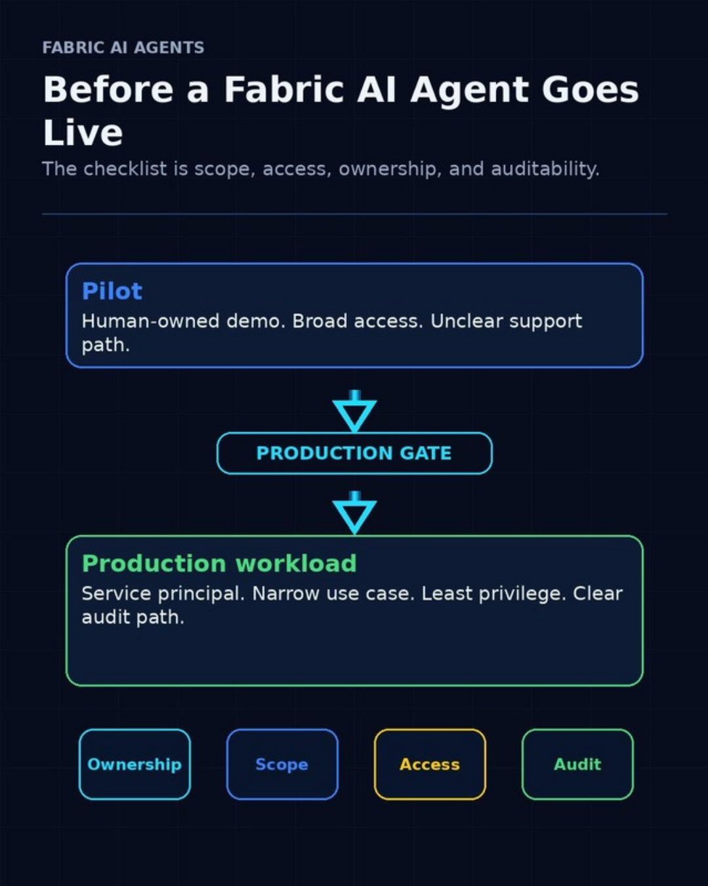
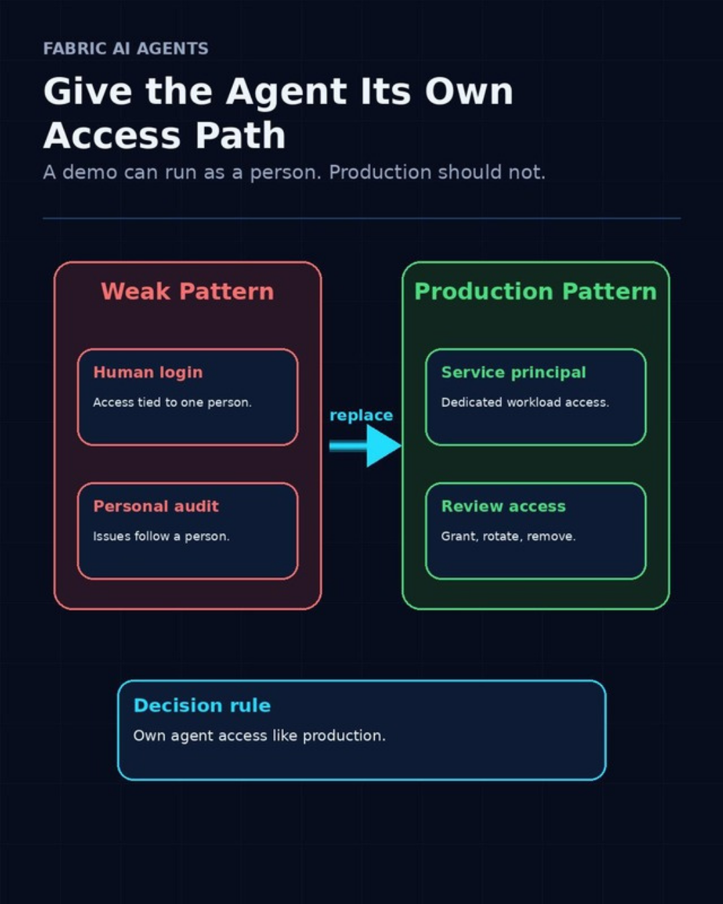
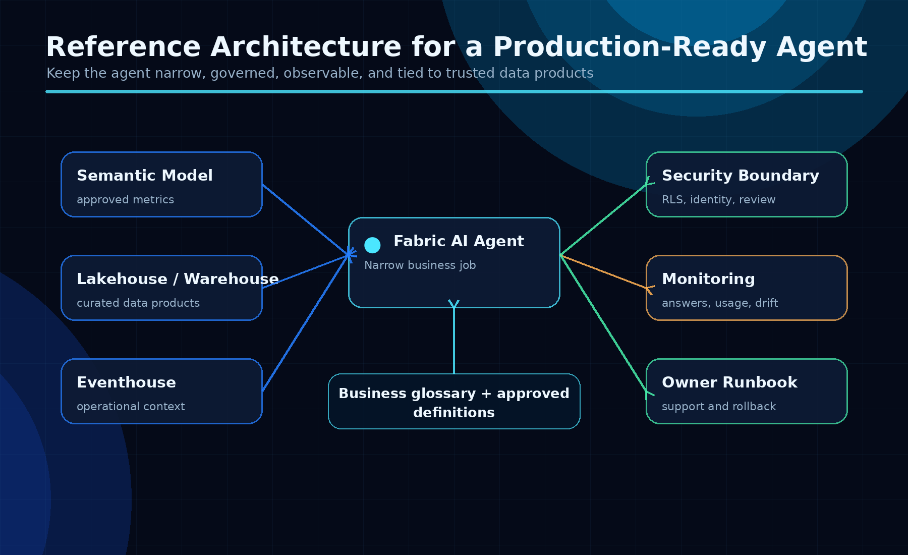
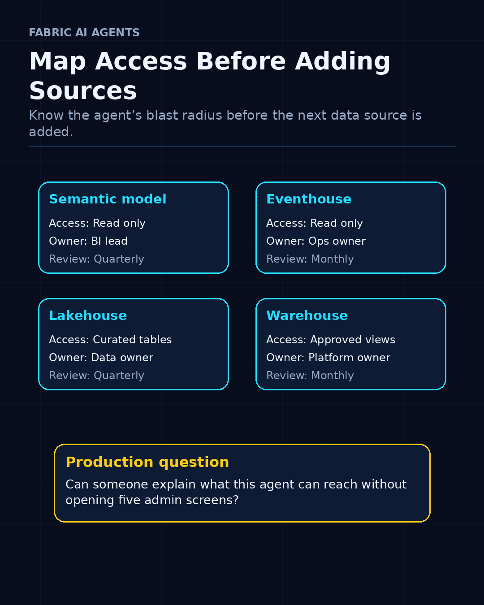
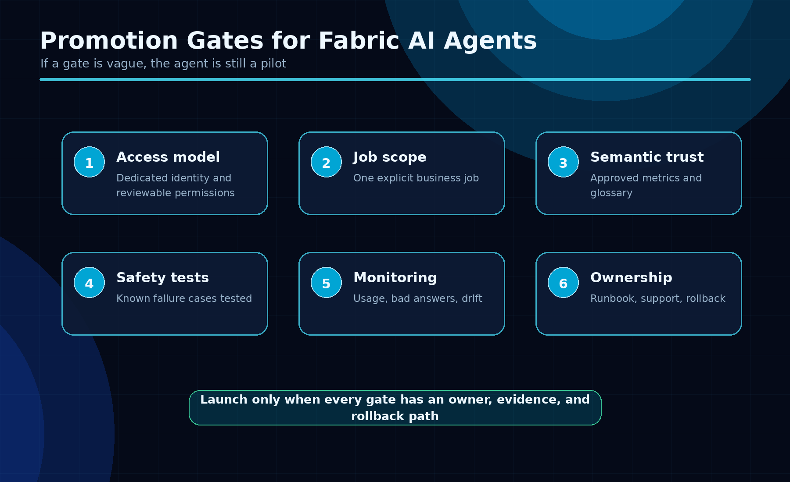

The demo is not the hard part. The hard part is making the agent safe enough to use with real business data.

A Fabric AI Agent demo can become useful faster than most teams expect.

Connect it to a semantic model. Add context from Eventhouse, a Lakehouse, or a Warehouse. Ask a few business questions. Suddenly the demo feels close to something people could actually use.

That is exactly where teams need to slow down for one hour.

Not to block the idea. To stop the first working demo from becoming a messy production workload.

*Pilot to production is a gate, not a vibe.*

## 1. Give the agent its own access path

A demo can run under a person’s access. Production should not.

If an agent depends on one user’s permissions, the operating model is fragile. Roles change. Ownership becomes unclear. Offboarding gets messy. Troubleshooting becomes personal instead of operational.

For production, the cleaner pattern is a dedicated workload access path. In Fabric, that means service-principal thinking: explicit permissions, reviewable access, and an owner who is not “whoever built the first demo.”

*Replace human-owned shortcuts with production-owned access.*

## 2. Start with one narrow job

The easiest way to make an AI agent hard to govern is to connect it to everything.

Start smaller.

A useful production candidate sounds like this:

- Explain sales variance from a governed semantic model
- Summarize operational events from Eventhouse
- Answer inventory questions for one operations team
- Help finance users understand reconciliation status
- Query approved warehouse views for one workflow

A weak production candidate sounds like this:

> Let it answer questions about our data.

That is too broad. It gives the agent no clean boundary and gives the team no clean way to review access.

*The useful version is narrow, governed, and explainable.*

## 3. Map the blast radius

For every source the agent can reach, write down why it needs it.

Not in a 20-page governance document. A short access inventory is enough:

- Workspace
- Source type: semantic model, Eventhouse, Lakehouse, or Warehouse
- Access level
- Business owner
- Approval date
- Review date

The point is simple: someone should be able to look at the agent and understand what it can reach.

If nobody can explain that, the agent is not ready.

*A small inventory is often enough to expose the real risk.*

## 4. Separate demo, test, and production

Most demos start in one workspace, with one setup, and one person who understands it.

That is fine for discovery.

Leaving it that way is the problem.

Before production, I would want a clean path across environments:

- Development for experimentation
- Test for validation
- Production for the restricted, supported version

The permissions do not always need to be complicated. They do need to be deliberate.

## 5. Confirm the audit path

If the agent gives a bad answer, uses the wrong source, or becomes part of a business process it was not designed for, you need evidence.

Before launch, answer these questions:

- Which access path did the agent use?
- Which data source was involved?
- Who can review activity?
- Who investigates issues?
- How do we separate an agent issue from a model issue?

This is where AI work gets uncomfortable. The demo focuses on the answer. Production needs the trail behind the answer.

*If a gate is vague, the agent is still a pilot.*

## The short version

Before a Fabric AI Agent goes live, I would want these checks done:

1. Dedicated workload access path
1. Narrow use case
1. Known data sources
1. Separated environments
1. Least-privilege permissions
1. Clear audit path and owner

If those answers are vague, the agent is still a pilot.

That is not a failure. It just means the platform work is not finished.

The goal is not to slow down AI agents. The goal is to make them safe enough to use with real business data.

---

**Shai Karmani**  
[Let’s connect on LinkedIn](https://www.linkedin.com/in/shai-kr)
