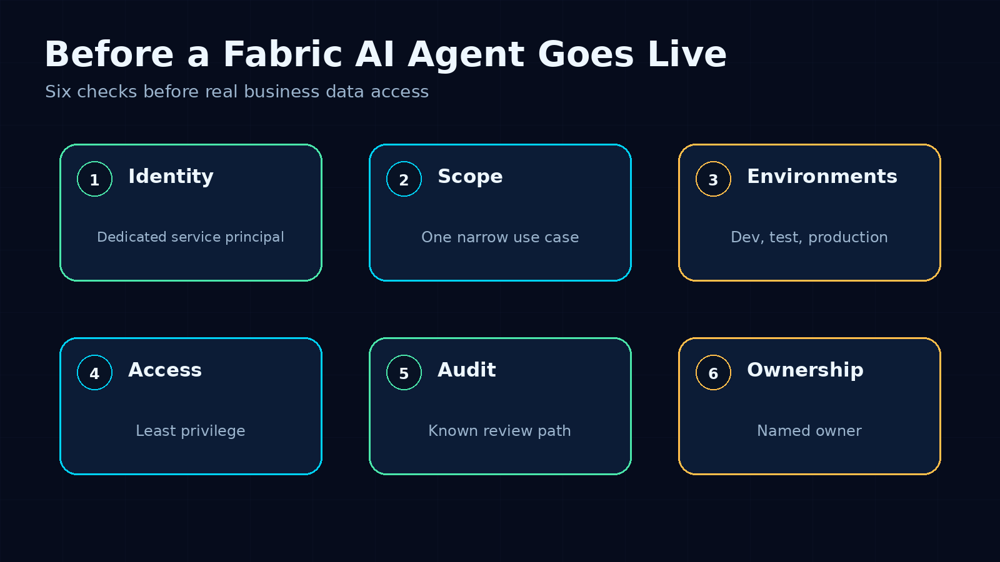
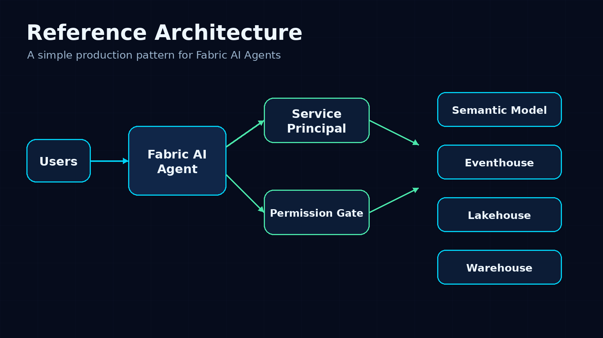
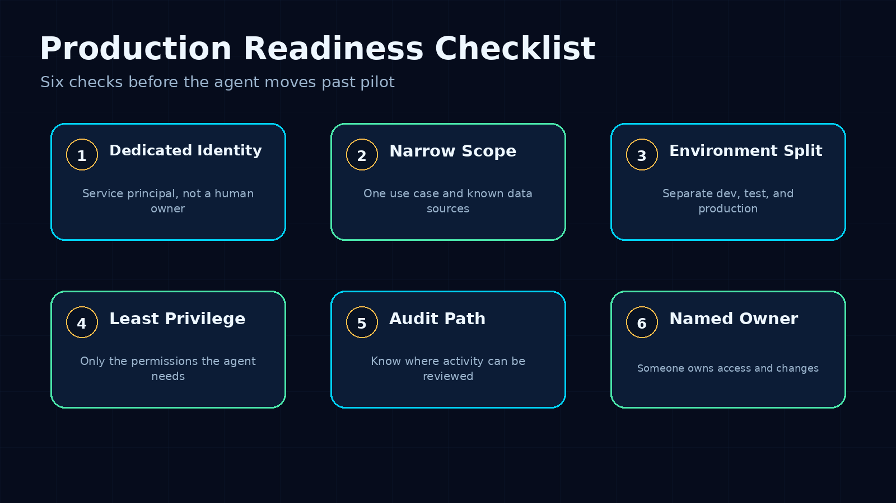
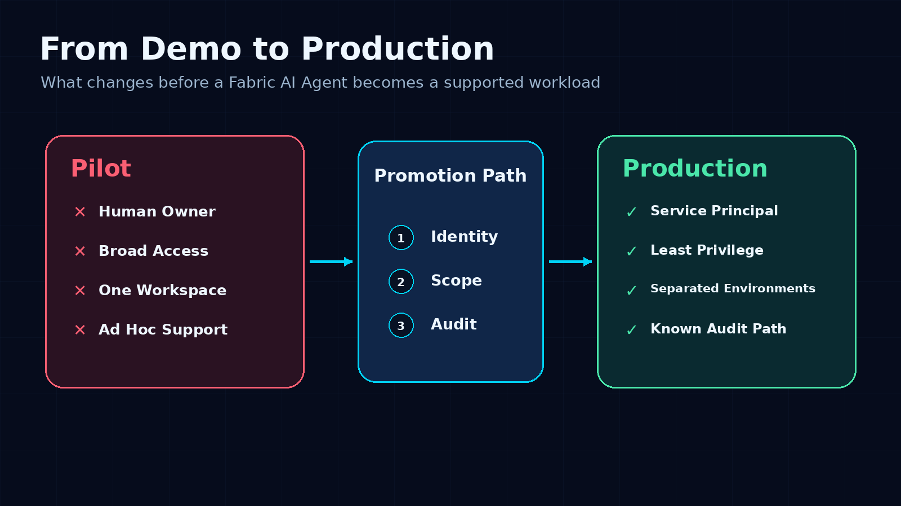

# Before You Put a Fabric AI Agent in Production, Steal This Checklist

A Fabric AI Agent demo can become useful faster than most teams expect.

Connect it to a semantic model. Ask a few business questions. Add context from Eventhouse, a Lakehouse, or a Warehouse. Suddenly the demo feels close to something people could use.

That is exactly where teams need to slow down for one hour.

Not to block the idea. To stop the first working demo from becoming a messy production workload.

This is the checklist I would use before moving a Fabric AI Agent past pilot stage.

## 1. Give the agent its own identity

A demo can run under a human account. Production should not.

If an agent depends on one person’s access, the operating model is fragile. Permissions change when that person changes role. Ownership becomes unclear. Offboarding becomes risky. Troubleshooting becomes personal instead of operational.

For a production agent, the better pattern is workload identity.

That means the agent has a dedicated service principal, with access that can be granted, reviewed, rotated, and removed without depending on someone’s user account.

This is the first line I would draw between a pilot and something ready for business users.

## 2. Start with one narrow use case

The easiest way to make an AI agent hard to govern is to connect it to everything.

Start smaller.

A useful production candidate sounds like this:

- Explain sales variance from a governed semantic model
- Summarize operational events from Eventhouse
- Answer inventory questions for a specific operations team
- Help finance users understand reconciliation status
- Query a curated warehouse table for one business workflow

A weak production candidate sounds like this:

“Let it answer questions about our data.”

That is too broad. It gives the agent no clear boundary and gives the team no clean way to review access.

## 3. Map the data sources before adding them

For every data source the agent can reach, write down why it needs it.

Not in a 20-page governance document. A short access inventory is enough:

- Workspace
- Semantic model, Eventhouse, Lakehouse, or Warehouse
- Read-only or operational access
- Business owner
- Approval date
- Review date

The point is simple: someone should be able to look at the agent and understand its blast radius.

If nobody can explain what the agent can reach, the agent is not ready.

## 4. Separate dev, test, and production

Most demos start in one workspace, with one identity, and one person who understands the setup.

That is normal.

Leaving it that way is the problem.

Before production, I would want a clean path across environments:

- Development for experimentation
- Test for validation
- Production for the restricted, supported version

The identities and permissions do not always need to be complicated. They do need to be deliberate.

If dev and production use the same broad access, every experiment becomes a production risk.

## 5. Confirm the audit path

If the agent gives a bad answer, uses the wrong source, or becomes part of a business process it was not designed for, you need evidence.

Before launch, answer these questions:

- Which identity did the agent use?
- Which data source was involved?
- Who can review activity?
- Who investigates issues?
- How do we separate an agent issue from a model issue?

This is where a lot of AI work gets uncomfortable. The demo focuses on the answer. Production needs the trail behind the answer.

## 6. Treat new data sources as a change request

The first agent will not stay still.

Someone will ask to add finance data. Then operations data. Then a shortcut. Then an Eventhouse function. Then a warehouse table.

Some of those requests will be valid.

They should still trigger a review.

Every new data source changes the agent’s scope. That means the identity, permissions, audit path, and owner should be checked again.

## The short version

Before a Fabric AI Agent goes live, I would want these six checks done:

1. Dedicated service principal
2. Narrow use case
3. Known data sources
4. Separated environments
5. Least-privilege permissions
6. Clear audit path and owner

If those answers are vague, the agent is still a pilot.

That is not a failure. It just means the platform work is not finished.

The goal is not to slow down AI agents. The goal is to make them safe enough to use with real business data.

---

**Shai Karmani**  
[Let’s connect on LinkedIn](https://www.linkedin.com/in/shai-kr)
