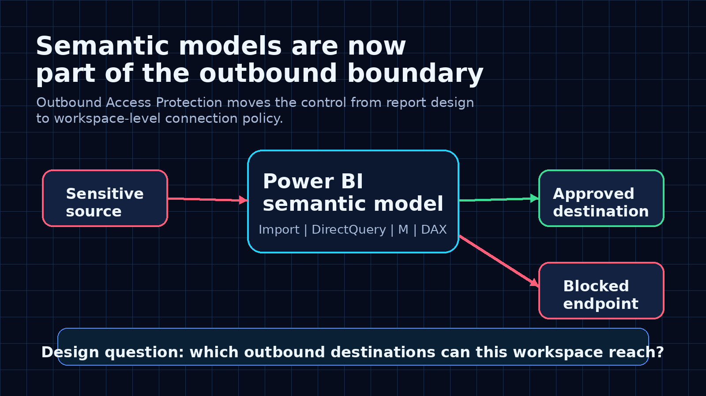
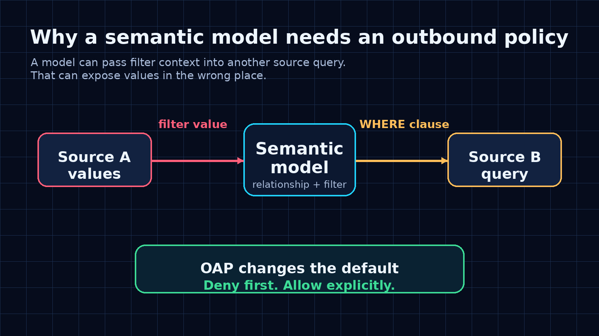
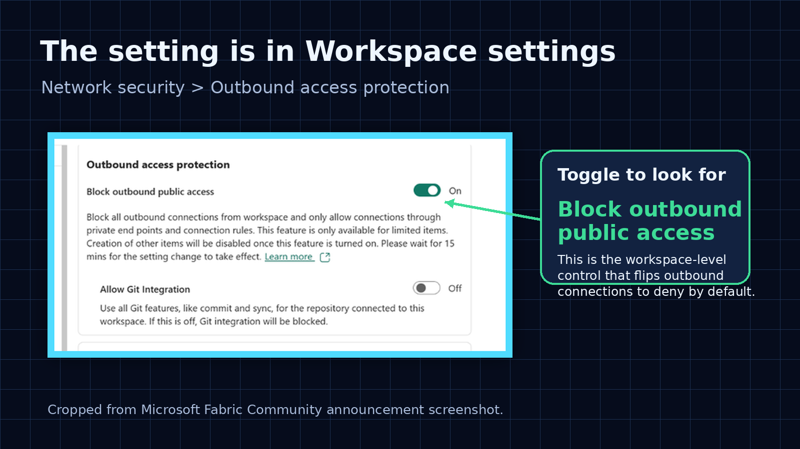
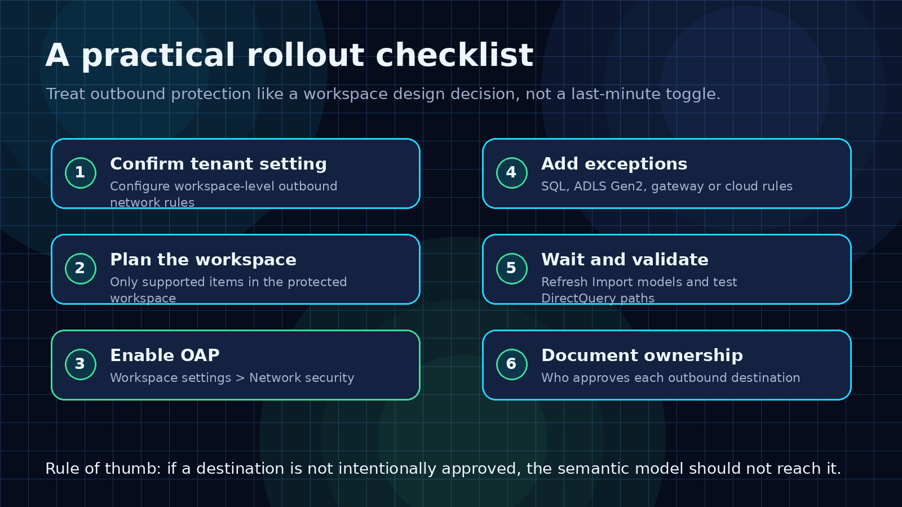

# The Power BI Setting That Makes Semantic Models Safer

Most Power BI security conversations stop at the report.

Who can open it?

Which workspace is it in?

Which RLS role applies?

Can users export data?

Those questions still matter. But they are no longer enough.

Microsoft's preview of Outbound Access Protection for semantic models is important because it treats the semantic model as something more than a reporting artifact. It treats it as part of the data movement boundary.

That is the right mental model.

A semantic model can connect to multiple sources. It can use Import. It can use DirectQuery. It can combine tables. It can pass filter context into source queries. It can reach across workspaces and external endpoints.

So the governance question is not only:

> Who can consume this model?

It is also:

> Where is this model allowed to connect?

## The risk is not theoretical

The uncomfortable part is that the semantic layer can become a path between sources.

Imagine a composite model with data from Source A and Source B. A user selects a value that comes from Source A. A visual or relationship pushes that value into a query against Source B.

The result does not have to be useful.

The problem is that a sensitive value may now appear in the wrong place, such as a query sent to another endpoint or a log outside the intended boundary.

That is the kind of risk many BI teams do not model explicitly.

They think about permissions on the report. They think about who can see the data. They think about gateway configuration.

But they do not always think about outbound movement from the workspace itself.

## What Outbound Access Protection changes

Outbound Access Protection is a workspace-level control in Microsoft Fabric.

When it is enabled, outbound public access is blocked by default. The workspace can only connect to destinations that have been explicitly allowed.

For semantic models, the important detail is where enforcement happens. According to Microsoft's announcement, enforcement happens on the model's bound data connection. That means Power Query transformations, M expressions, and model parameters should not be able to route around the policy because the connection itself is evaluated before data moves.

That is a much stronger control than hoping every model author makes the right choice manually.

It also changes the review process.

Before this kind of control, a workspace review might ask:

- Which reports are published here?
- Who has build permission?
- Which gateway is used?
- Which semantic models are certified?

Now the review also needs to ask:

- Which outbound destinations are allowed?
- Who approved each exception?
- Does the model really need that endpoint?
- Is the destination inside or outside the expected data boundary?
- What happens when a new source is added?

That is a better conversation.

## Where the setting lives

The setting is under the workspace network security configuration.

The relevant path is:

**Workspace settings > Network security > Outbound access protection > Block outbound public access**

The toggle is simple. The operating model behind it is not.

Turning it on without planning can break legitimate model refreshes or DirectQuery paths. Leaving it off in sensitive workspaces means the model can still be bound to destinations you may not want it to reach.

This is why I would not treat Outbound Access Protection as an admin checkbox.

I would treat it as a workspace design decision.

## The local workspace still needs to be allowed

One detail from the announcement is easy to miss.

The default configuration can block connections that are perceived as cross-workspace, including sources accessed through SQL, ADLS Gen2, and other non-Fabric connection kinds.

That can include data that feels local to the workspace.

For example, a semantic model may connect to a lakehouse in the same workspace through the SQL analytics endpoint or through the OneLake ADLS Gen2 path. From the policy point of view, those connection kinds may still need explicit exceptions.

That matters because a team can easily say:

> This model only connects to our own lakehouse.

But the implementation detail still matters.

For Import or DirectQuery, you may need the SQL endpoint fully qualified domain name. For Direct Lake style paths, you may need the ADLS Gen2 or OneLake URL pattern.

The governance takeaway is simple:

Do not only document the business source. Document the actual connection path.

## A practical rollout checklist

If I were enabling this for a real Fabric workspace, I would not start with the toggle.

I would start with an inventory.

The basic checklist:

1. Confirm the tenant setting is available and enabled.
2. Confirm the workspace is on the right capacity and contains supported items.
3. Inventory every semantic model connection.
4. Separate internal expected paths from external destinations.
5. Add explicit exceptions for required SQL, ADLS Gen2, cloud, or gateway connections.
6. Turn on **Block outbound public access**.
7. Wait for propagation.
8. Validate Import refreshes and DirectQuery queries.
9. Document the owner and reason for each exception.
10. Re-review the policy whenever a new source is added.

The important part is the review discipline.

A new source should not be a casual model change. If it changes where the workspace can send outbound traffic, it should trigger an access review.

## What BI teams should take from this

This preview is not only a security feature.

It is a sign that semantic model governance is getting more serious.

For years, many organizations treated semantic models as a trusted middle layer because they were built by BI teams and consumed through reports.

That assumption is weaker now.

Semantic models sit in the middle of more workflows:

- Power BI reports
- Excel connections
- DirectQuery chains
- composite models
- Fabric workspaces
- Copilot and AI experiences
- automation and API-driven scenarios

As the semantic model becomes more central, it also becomes more important to control what it can reach.

That is the part I like about Outbound Access Protection.

It forces a better architecture question:

> Should this workspace be allowed to send data or queries to that destination?

If the answer is yes, make it explicit.

If the answer is no, the platform should block it.

That is how semantic models move from useful BI assets to governed platform components.

## Sources

- [Outbound Access Protection for semantic models, Microsoft Fabric Community](https://community.fabric.microsoft.com/t5/Power-BI-Updates-Blog/Outbound-Access-Protection-for-semantic-models-Preview/ba-p/5184917)
- [Workspace outbound access protection overview, Microsoft Learn](https://learn.microsoft.com/en-us/fabric/security/workspace-outbound-access-protection-overview)
- [Workspaces: Set Network Communication Policy REST API, Microsoft Learn](https://learn.microsoft.com/en-us/rest/api/fabric/core/workspaces/set-network-communication-policy)

---

**Shai Karmani**  
[Let’s connect on LinkedIn](https://www.linkedin.com/in/shai-kr)
