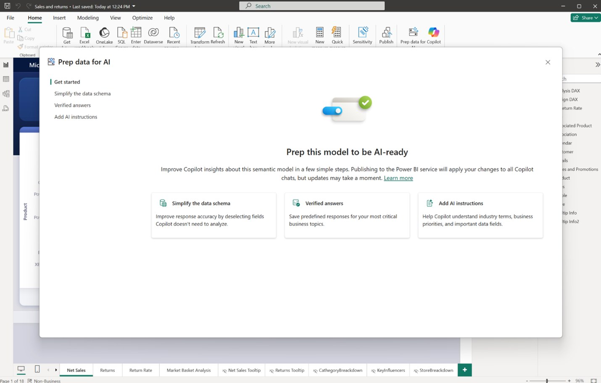
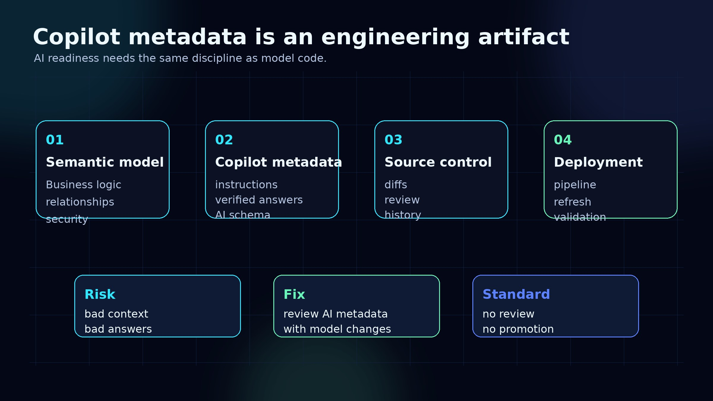
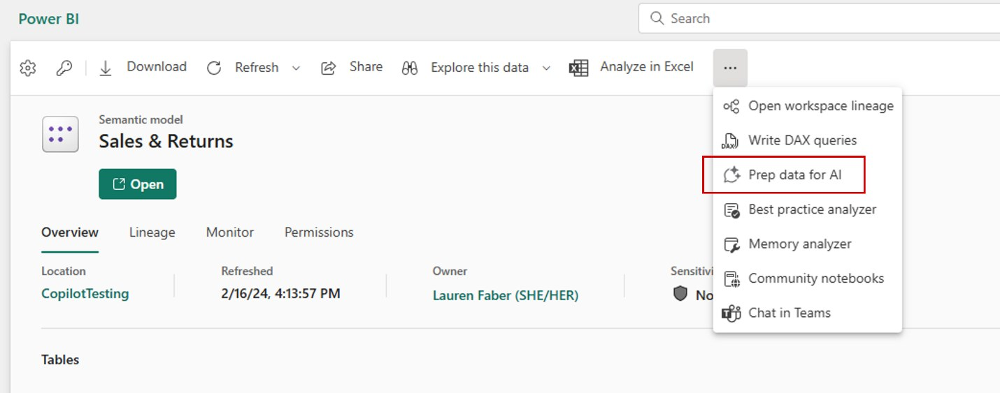
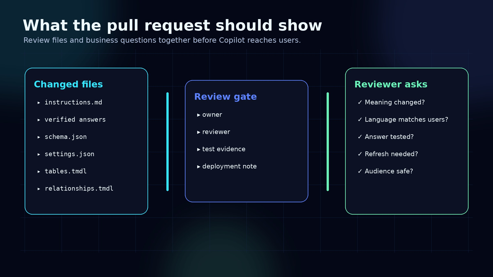
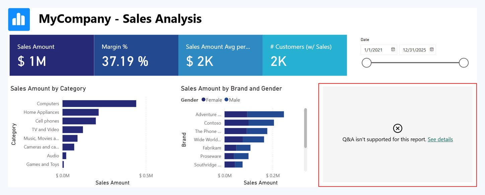
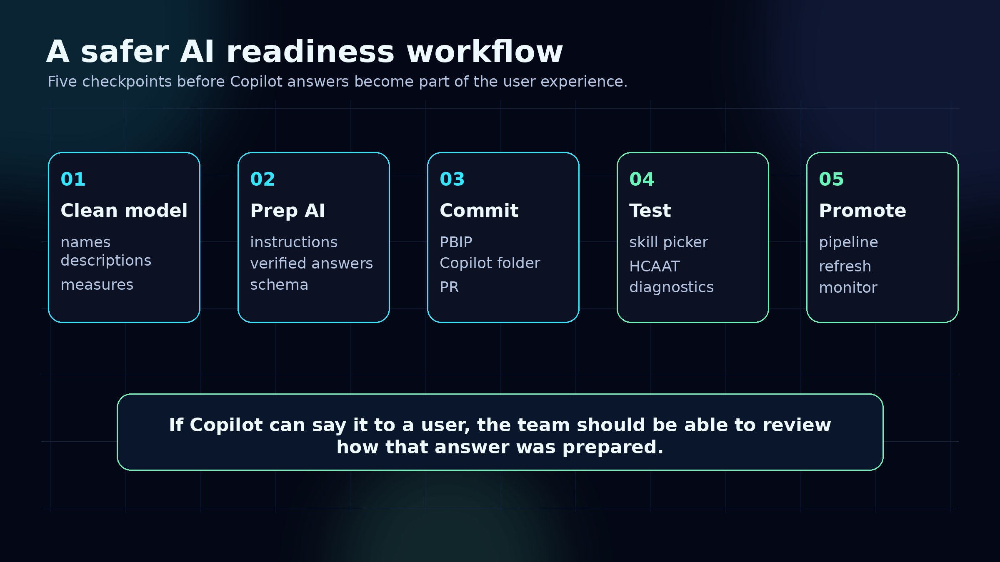

Copilot in Power BI is moving the semantic model into a new role.

It is no longer only the layer that stores measures, relationships, tables, and security rules.

It is also becoming the place where teams define how AI should understand the business.

That changes the engineering standard.

If Copilot uses metadata to answer business questions, that metadata should not live as invisible configuration edited by one report author on a good day.

It should be reviewed.

It should be versioned.

It should be tested.

And in serious Power BI environments, it belongs in source control.

## The feature is not the point

The easy version of this story is:

> Power BI now has tools to prepare semantic models for AI.

That is true, but it is not the useful lesson.

The more important shift is that Copilot readiness is becoming part of the semantic model lifecycle.

Power BI now gives model owners tools such as:

- AI instructions
- AI data schema context
- verified answers
- trigger phrases
- Copilot testing workflows
- an approved-for-Copilot model setting
- PBIP storage for Copilot metadata



This is not report polish.

This is semantic engineering.

## The metadata now lives with the model

The detail that matters most for engineering teams is simple:

When a Power BI project is saved as PBIP, Copilot metadata is stored in a `Copilot/` folder inside the semantic model project.

The structure looks roughly like this:

```text
PBIP/
├── Model.SemanticModel/
│   ├── definition/
│   ├── Copilot/
│   │   ├── Instructions/
│   │   │   ├── instructions.md
│   │   │   ├── version.json
│   │   ├── VerifiedAnswers/
│   │   │   ├── definitions/
│   │   │   ├── version.json
│   │   ├── schema.json
│   │   ├── examplePrompts.json
│   │   ├── settings.json
│   │   └── version.json
│   └── definition.pbism
```

That means Copilot behavior can become part of the same workflow as model changes.

A pull request can now include:

- a measure change
- a relationship change
- a description update
- a verified answer definition
- an instruction change
- a Copilot schema update

Those changes should be reviewed together because users experience them together.



## Why this matters

Most Power BI teams already know that bad semantic models create bad reports.

Copilot adds another layer:

Bad semantic metadata creates bad AI answers.

A vague measure name is no longer just annoying for developers.

A weak description is no longer just documentation debt.

A poorly governed synonym or verified answer can steer users toward the wrong interpretation of the business.

This is especially important for models used across multiple reports or apps. When the model becomes approved for Copilot, the risk is not isolated to one page. It can affect every experience that depends on that semantic model.



## What should go through review

If a team is using PBIP and Git, Copilot metadata should not be treated as noise in the repo.

At minimum, I would review these changes before promotion:

1. **Instructions**

   Do the instructions reflect how the business actually talks about the data?

   If finance calls it “net revenue” and sales calls it “bookings”, the model needs to make that distinction clear.

2. **Verified answers**

   A verified answer should be tied to a known, trusted interpretation.

   It should not become a workaround for a weak model.

3. **Trigger phrases**

   The phrasing should match real user language, not developer language.

   “Show customer churn by cohort” and “why did retention drop last month?” are not the same question.

4. **Schema changes**

   Copilot schema updates should be reviewed with table, column, relationship, and measure changes.

   Otherwise the AI context can drift away from the model.

5. **Promotion requirements**

   Some tooling changes require a model refresh after deployment before they sync into the service.

   That should be part of the deployment checklist, not something discovered after users start asking questions.



## The migration from Q&A is a governance moment

There is another detail teams should not ignore.

Power BI can migrate older Q&A tooling metadata into the newer Copilot tooling format, but this is not a harmless cosmetic migration.

After the upgrade, Q&A features are permanently disabled for the model and connected reports. Some Q&A metadata migrates, such as synonyms and suggested questions. Other metadata does not.

That means the migration should be planned like a model change.

Not like a dialog box someone clicks through.


Before upgrading a production model, I would check:

- which reports still use Q&A visuals
- whether linguistic metadata is valid
- which synonyms and suggested questions are worth keeping
- whether business users depend on Q&A today
- how Copilot answers will be tested after migration
- whether the team can roll back through version history or backups if needed



## A practical workflow

The best pattern is not complicated.

For production semantic models, treat AI readiness as a normal engineering workflow:

1. Clean up the model
2. Add descriptions, synonyms, instructions, and verified answers
3. Save the project as PBIP
4. Review the `Copilot/` folder in Git
5. Test with Copilot in Desktop or the service
6. Check how Copilot arrived at the answer
7. Promote through the deployment path
8. Refresh the model if the deployment requires it
9. Monitor feedback from real users



This gives the team a simple standard:

If the change can affect what Copilot tells a user, it deserves the same discipline as a DAX or model change.

## What I would add to a PR checklist

For a Power BI team using Copilot, I would add these checks to the semantic model review process:

- Did any files under `Copilot/` change?
- Did any measure, table, or column descriptions change?
- Did the change affect a verified answer?
- Are trigger phrases business-readable?
- Did someone test the answer in the Copilot pane?
- Did someone check how Copilot arrived at the answer?
- Does the model need a refresh after deployment?
- Are there reports or apps that inherit the approved-for-Copilot status?
- Is any Q&A migration involved?
- Is the change safe for every audience that can access the model?


## The real shift

The real shift is not that Power BI added more AI buttons.

The real shift is that AI behavior is becoming part of the analytics system.

That means BI teams need to stop treating Copilot readiness as a last-mile report setting.

It belongs with the semantic model.

It belongs in Git.

It belongs in code review.

And it belongs in the same quality process as every other change that can affect business interpretation.

That is how Power BI teams move from “we turned Copilot on” to “we can trust what Copilot is allowed to say.”

## Useful references

- Prepare Your Data for AI in Power BI
- Power BI Projects and PBIP
- Copilot for Power BI overview
