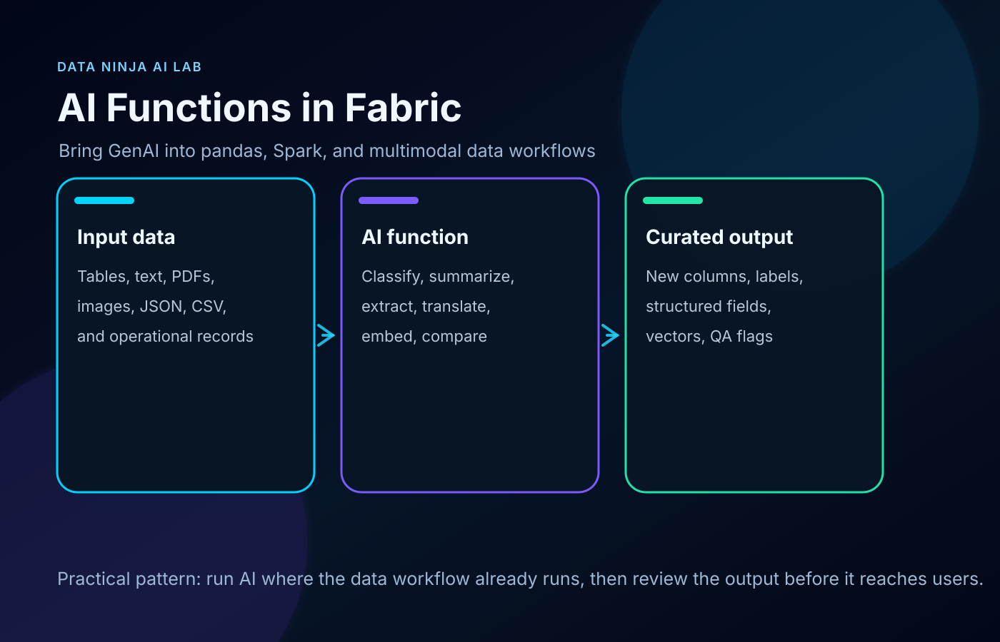
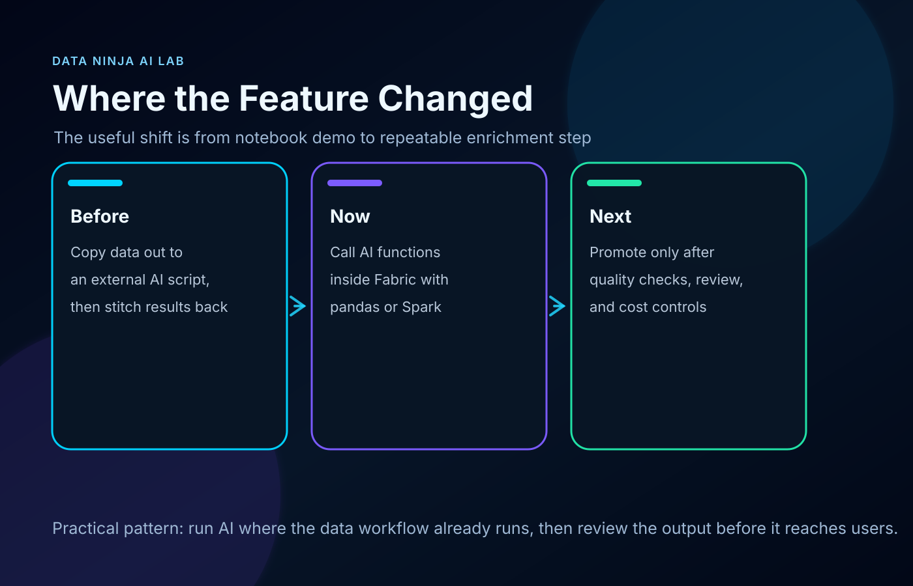
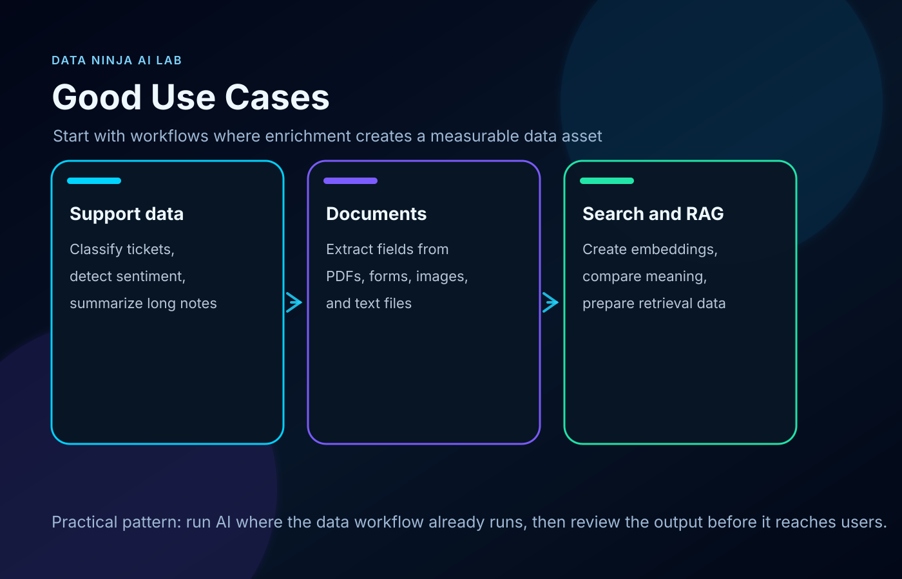

Most enterprise GenAI demos start in the wrong place.

They start with a chat window.

The more useful place is usually earlier: inside the data workflow, before the dashboard, before the semantic model, before the analyst has to clean the same messy text for the tenth time.

That is why Fabric AI Functions are worth paying attention to.

They let data teams use GenAI directly inside pandas and Spark workflows in Microsoft Fabric. Not as a separate app. Not as a one-off script sitting outside the platform. As a transformation step inside the work data teams already do.

That changes the shape of the use cases.

Instead of asking “how do we add a chatbot?”, the better question becomes:

Where is language, document mess, or unstructured content slowing down our data pipeline?

## What you can actually do with it

Fabric AI Functions expose common GenAI operations as DataFrame-friendly functions.

You can use them to:

- classify support tickets, survey responses, incidents, or customer feedback
- summarize notes, long text fields, operational logs, and service records
- extract fields from documents or semi-structured text
- translate records as part of a data preparation flow
- fix grammar or normalize messy text before reporting
- create embeddings for search, RAG, and semantic retrieval
- compare similarity between text values
- generate structured responses from instructions
- enrich rows in pandas or Spark without moving the workflow outside Fabric

That sounds simple, but it is a useful shift.

For years, a lot of GenAI work around data platforms has looked like this:

1. Export data from the platform.
2. Send it to a separate script or service.
3. Call an AI model.
4. Stitch the result back into the data estate.
5. Hope the process is governed enough to survive production.

Fabric AI Functions make a cleaner pattern possible.

The AI step can live closer to the lakehouse, notebook, Spark job, data science workflow, Power BI preparation layer, and downstream semantic model.

That is a much better starting point for teams that want AI to improve real data work, not just demo well.

## The big changes that make this interesting

There are a few parts that matter more than the feature list.

### 1. GenAI becomes part of the pipeline

The most important change is architectural.

AI enrichment can become a normal transformation step.

A notebook can read raw records, apply an AI function, store the output as another column or table, and send that enriched dataset into the next layer of the platform.

That means AI output can be reviewed, versioned, refreshed, tested, governed, and consumed like other data assets.

That is very different from treating GenAI as a sidecar experiment.

### 2. Multimodal input makes the use cases much better

Text classification is useful, but many business workflows are not clean text.

They are PDFs.

Screenshots.

Images.

CSV files.

JSON files.

Markdown notes.

Operational documents that never quite made it into a table.

Microsoft documents AI Functions support for image files such as JPG, PNG, GIF, and WebP, documents such as PDF, and common text formats such as MD, TXT, CSV, JSON, and XML.

That opens better Fabric workflows.

A team can bring files into the lakehouse, use AI to extract or summarize what matters, and store the result in structured tables for review and reporting.

That is the kind of AI use case that can save real operational time.

### 3. Embeddings can be created where the content already lives

`ai.embed` is one of the more important functions because it connects Fabric directly to search and RAG preparation.

A team can take product documentation, policy files, support resolutions, internal wiki pages, field notes, or knowledge base articles and create embeddings as part of the data workflow.

That creates a cleaner path from raw business content to retrieval-ready datasets.

The useful part is not just the embedding itself. It is that the data team can decide what content is approved, what should be excluded, how often embeddings refresh, and what downstream applications are allowed to use.

### 4. The model/provider configuration is becoming more serious

The documentation now covers configuration details around providers and models, including the default model behavior.

That matters because production teams eventually need answers to basic governance questions:

- Which model is being used?
- Who approved it?
- Which data can be sent to it?
- Which capacity pays for it?
- Which workloads are allowed to use it?
- What happens when the output is wrong?

This is where Fabric AI Functions become more than a notebook convenience. They become part of the data platform operating model.

### 5. The best output is not “AI magic”. It is a reviewable data asset.

The mistake is to take AI output and treat it as automatically trusted.

The better pattern is to produce reviewable enrichment.

Keep the original value.

Add the AI-generated label, summary, extracted field, or embedding.

Add review flags where needed.

Store the result in a table with ownership and downstream rules.

Then decide what is safe enough for reporting, automation, search, or user-facing apps.

That is how this becomes useful without becoming sloppy.

## Three practical things I would build first

### 1. Support ticket enrichment

Most support datasets contain useful signal, but the text is messy.

A Fabric notebook can add AI-generated columns for:

- topic classification
- urgency
- sentiment
- short summary
- product area
- likely ownership team

The key is not to pretend the model is perfect. The key is to create a reviewable enrichment layer that helps analysts and operations teams move faster.

A good output table might include the original text, AI-generated labels, confidence or review flags where available, and a human-reviewed status column.

That gives Power BI a better dataset without hiding the uncertainty.

### 2. Document extraction into structured tables

A lot of business data is trapped in semi-structured documents.

Invoices, forms, reports, agreements, field notes, inspection PDFs, and vendor files often contain fields that teams later retype manually.

With AI Functions, the useful pattern is:

1. Store the files in the lakehouse.
2. List file paths as input.
3. Use extraction or generation instructions to pull out the fields.
4. Store the result as a structured table.
5. Review exceptions before the data becomes trusted.

That does not replace proper document processing for every scenario. It does make small and medium internal automation projects much easier to test inside Fabric.

### 3. Embeddings for search and RAG preparation

A team can take approved internal content and create embeddings as part of the Fabric workflow.

That content might include:

- product documentation
- policy files
- support resolutions
- internal wiki pages
- knowledge base articles
- implementation notes

The output can become a governed retrieval layer instead of a random pile of files passed into an AI app.

That matters because RAG quality starts before the chat interface. It starts with content selection, metadata, refresh rules, ownership, and preparation.

## Where I would be careful

Positive does not mean careless.

AI Functions make enrichment easier, but the usual production questions still matter:

- Which data is allowed to be sent to the model?
- Is the Fabric tenant setting for Copilot and Azure OpenAI enabled intentionally?
- Does the workload require cross-geo processing approval?
- Which Fabric capacity will pay for the work?
- Which model/provider is configured?
- How will output quality be reviewed?
- Which outputs are allowed to flow into reports or user-facing apps?
- How will failures, blanks, and hallucinated values be handled?

Microsoft notes that Fabric AI Functions require a paid Fabric capacity, F2 or higher, or any P capacity. The documentation also states that AI Functions are supported in Fabric Runtime 1.3 and later, and that the default model is `gpt-4.1-mini` unless a different model is configured.

Those details matter. They turn this from a cool notebook feature into a platform decision.

## My take

Fabric AI Functions are useful because they move GenAI into the unglamorous part of AI work.

The pipeline.

The notebook.

The enrichment step.

The document cleanup.

The semantic preparation layer.

That is where a lot of business value actually sits.

Not every AI feature needs to become a chat window. Some of the most valuable AI work will happen quietly inside pipelines, quality checks, enrichment jobs, and retrieval preparation steps.

The practical opportunity is simple:

Take the data you already manage in Fabric. Add AI where language, documents, and meaning slow the team down. Store the result as a governed data asset. Review it before it reaches users.

That is a much better direction than treating AI as a separate island next to the data platform.

## When did this become available?

The official Microsoft Learn page for Fabric AI Functions currently has a documentation date of **November 13, 2025** and an updated timestamp of **May 7, 2026**.

The GitHub history for the Fabric documentation shows the AI Functions overview page existed by **February 28, 2025**. A later documentation commit on **November 24, 2025** is titled “Update AI Functions documentation for GA release with enhancements.” Recent documentation updates in February, March, and May 2026 added more coverage around multimodal input, schema extraction, configuration, providers, and file workflows.

So the short version is:

- The documentation trail starts in early 2025.
- The GA documentation update appears in November 2025.
- The more interesting expansion for practical teams is the 2026 work around multimodal inputs, broader model/provider configuration, schema extraction, and file workflows.

## Sources

- [Microsoft Learn: Transform and Enrich Data with AI Functions](https://learn.microsoft.com/en-us/fabric/data-science/ai-functions/overview)
- [MicrosoftDocs Fabric commit history for the AI Functions overview](https://github.com/MicrosoftDocs/fabric-docs/commits/main/docs/data-science/ai-functions/overview.md)

**Shai Karmani**  
[Let’s connect on LinkedIn](https://www.linkedin.com/in/shai-kr)
