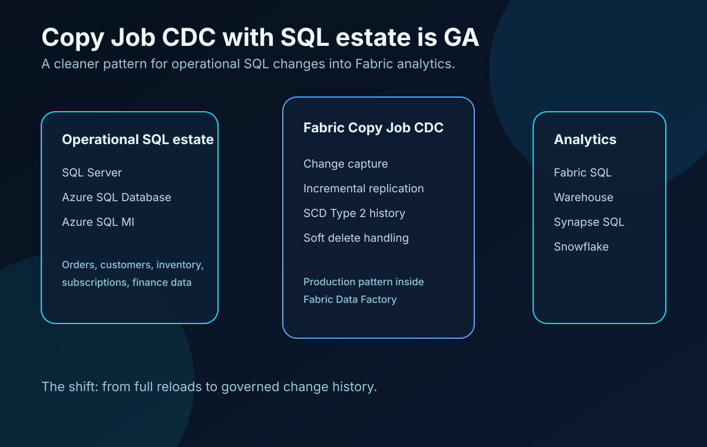
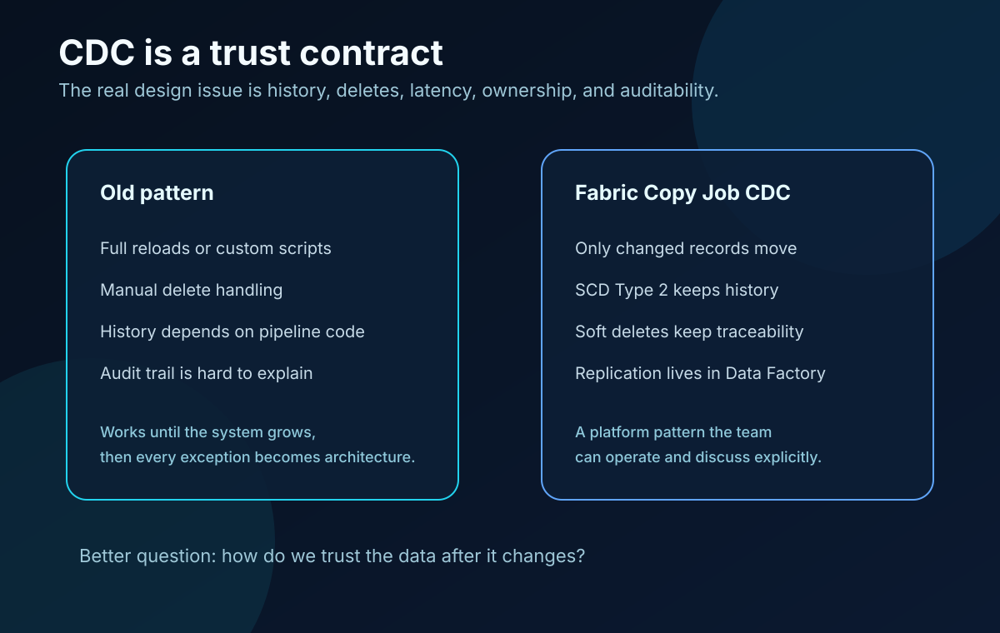

Copy Job CDC with SQL estate is now generally available in Microsoft Fabric Data Factory.

That sounds like a data movement update.

It is more useful than that.

For many BI and data engineering teams, the hard part is not copying data once. The hard part is keeping analytical data aligned with operational systems after the business changes.

A customer address is updated.

An order status changes.

A subscription is canceled.

Inventory moves.

A record is deleted in the source system, but the reporting layer still needs to explain what happened.

Those are not edge cases. They are normal business behavior. If the analytical platform cannot handle them clearly, trust starts to leak out of the reporting layer.

That is why CDC matters.

## What became generally available

Microsoft announced that **Change Data Capture support for SQL estate in Copy Job is now generally available**.

The generally available SQL estate sources include:

- SQL Server
- Azure SQL Database
- Azure SQL Managed Instance
- SAP Datasphere

The generally available destinations include:

- SQL Server
- Azure SQL Database
- Azure SQL Managed Instance
- Fabric SQL
- Snowflake

Microsoft is also moving more CDC connectors through preview, including Fabric Lakehouse table, Google BigQuery, Snowflake, Oracle, SQL database in Fabric, and Fabric Data Warehouse scenarios.

The important part is not the connector list by itself. The important part is that CDC is becoming a normal Data Factory pattern inside Fabric, not a side script that each team has to invent again.

Source: [Microsoft Fabric Updates Blog: Simplify your data movement with Copy job: CDC with SQL estate](https://community.fabric.microsoft.com/t5/Fabric-Updates-Blog/Simplify-your-data-movement-with-Copy-job-CDC-with-SQL-estate/ba-p/5184211)

## What you can actually do with it

### 1. Stop rebuilding full loads when only changes matter

Full refresh is simple until it is not.

It works when the tables are small, the source systems can handle the load, and nobody cares about latency. That changes quickly with operational SQL systems.

CDC lets the pipeline focus on what changed. That can reduce load on the source system, reduce movement volume, and make analytical updates closer to operational reality.

This is especially useful for tables such as orders, customers, products, subscriptions, transactions, inventory, service tickets, and account status history.

### 2. Bring SQL estate replication closer to Fabric Data Factory

A lot of organizations already have replication logic around their SQL estate. Some of it is mature. Some of it is a set of custom jobs nobody wants to touch.

Copy Job CDC gives Fabric teams a cleaner option for the right workloads.

Instead of maintaining another custom replication layer, a team can move more of the pattern into Fabric Data Factory, where the data movement is visible as part of the platform.

That does not mean every existing pipeline should be replaced tomorrow. It does mean new Fabric architecture decisions should consider CDC as a first-class option.

### 3. Preserve history with SCD Type 2

For reporting, the latest value is often not enough.

If a customer changed region last month, some reports need the current region. Other reports need the region that was true when the order happened.

That is where slowly changing dimension Type 2 patterns matter.

Microsoft also highlighted extended SCD Type 2 support for Fabric Warehouse and Synapse SQL Pool. With native SCD Type 2 in Copy Job, teams can preserve historical versions of records with effective dating and soft delete handling.

That is not just a data warehouse modeling detail. It is the difference between a report that shows the current answer and a report that can explain the historical answer.

### 4. Treat deletes as audit events, not disappearing rows

Deletes are dangerous in analytics.

If a source record disappears and the destination simply removes it, the reporting layer may lose the ability to explain prior results.

Soft delete handling is useful because the destination can mark a record as inactive instead of physically deleting it. That keeps the history visible for audit, reconciliation, and operational reporting.

For finance, subscriptions, customer lifecycle, compliance, and operational analytics, that distinction matters.

## The architecture conversation gets better

The real value is not that Fabric can copy data from A to B.

Teams have had ways to copy data for years.

The value is that Fabric is making change capture, history, deletes, latency, and ownership easier to discuss as platform concerns.

That changes the conversation from:

> How do we move the data?

To:

> How do we trust the data after it changes?

That is a better architecture question.

## Where I would use this first

I would look for workloads with these signals:

- Operational SQL source systems
- Tables that change frequently
- Reports that need fresher data than a nightly full load
- Business processes where historical state matters
- Deletes that need traceability
- Custom replication jobs that are becoming hard to maintain
- Fabric adoption where Data Factory is already part of the platform

Good candidates are customer dimension sync, order status tracking, subscription lifecycle reporting, inventory movement, financial transaction replication, and support or case management analytics.

## Where I would still be careful

GA does not remove design responsibility.

Before moving a production workload, I would still define:

- Source ownership
- Expected latency
- Initial load strategy
- Change tracking assumptions
- Delete behavior
- SCD Type 2 rules
- Failure handling
- Reconciliation checks
- Security and access model
- Monitoring and support ownership

CDC makes the movement pattern easier. It does not automatically make the architecture clean.

## My takeaway

Copy Job CDC with SQL estate becoming GA is a practical Fabric milestone.

It gives BI and data engineering teams a stronger native option for moving operational SQL changes into analytical systems, while preserving history and making deletes more traceable.

The best use of this feature is not to treat it as another ETL checkbox.

Use it to make change history, auditability, and trust explicit in the Fabric architecture.

That is where the feature starts to matter.
