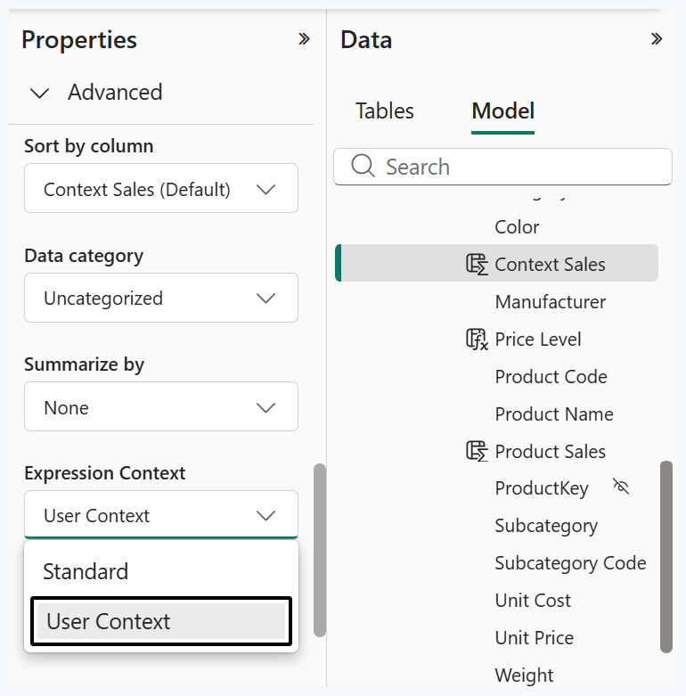
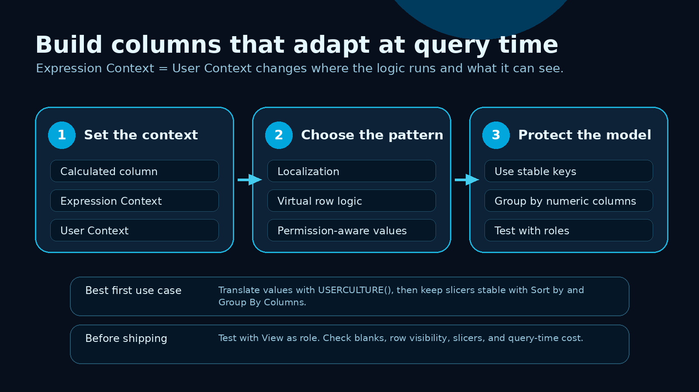
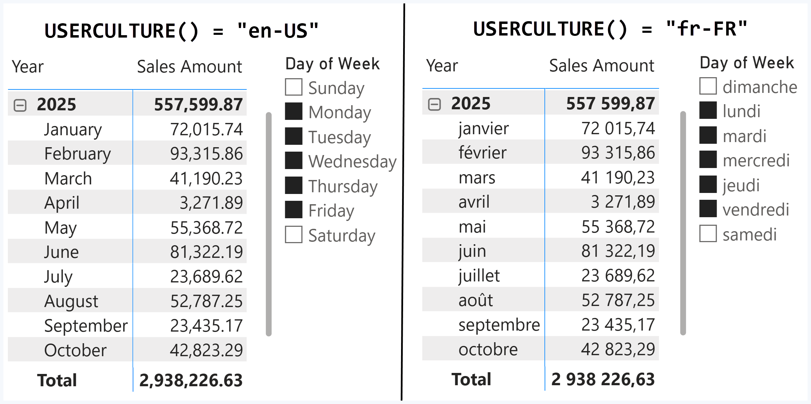
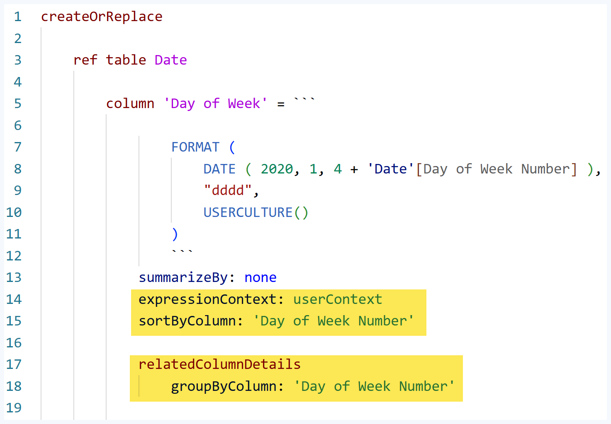
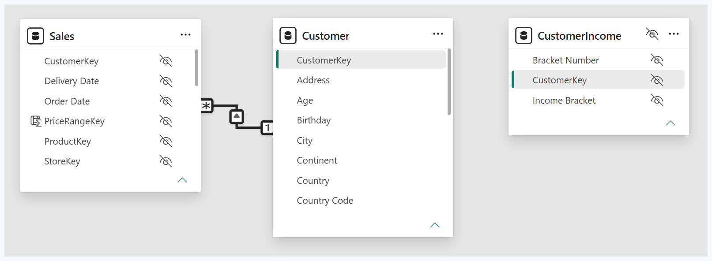
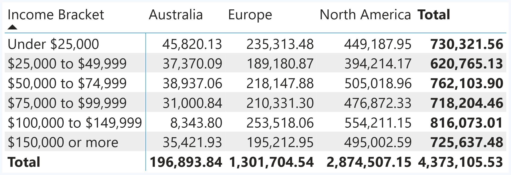
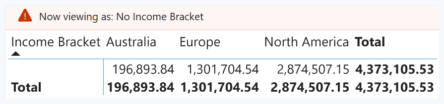

Power BI calculated columns are getting a new design option that is easy to underestimate.

The setting is called **Expression Context**.

The option is **User Context**.

The result is a calculated column that can be evaluated at query time, under the security context of the user who is running the report.

That opens a useful set of patterns for semantic model authors:

- values that change by user culture
- row-level calculations that do not need to be stored as physical columns
- sensitive values that can stay visible to admins and blank for restricted users
- Direct Lake and Import models that need cleaner control over calculated column materialization

The feature is still preview territory, so I would not treat it as a casual modeling shortcut. But it is already worth understanding because it changes how we think about calculated columns in Power BI.

Source: [SQLBI: Introducing user-aware calculated columns in Power BI](https://www.sqlbi.com/articles/introducing-user-aware-calculated-columns-in-power-bi/)

## What changes with User Context

A standard calculated column is evaluated when the table is processed.

In Import mode, the result is stored in the semantic model. Once it is processed, the value is the same for every user who queries the model.

A user-aware calculated column changes that behavior.

When **Expression Context** is set to **User Context**, the expression is evaluated at query time. It runs under the active user security context, and it can use user-aware DAX functions such as:

- `USERCULTURE()`
- `USERPRINCIPALNAME()`
- `USEROBJECTID()`
- `USERNAME()`
- `CUSTOMDATA()`

That means the column can still behave like a column in the model, but the value can depend on who is asking the question.



I would think about it as a semantic model design tool, not only as a localization feature.

## Pattern 1: build reports that speak the user language

The cleanest first use case is localization.

A Date table can expose month names or day names that change based on the user's culture. For example:

```DAX
Month =
FORMAT (
    DATE ( 2020, 'Date'[Month Number], 1 ),
    "mmmm",
    USERCULTURE()
)
```

If the user culture is English, the report can show January.

If the user culture is French, the same column can show janvier.

The model does not need separate month-name columns for every language. The expression can return the correct value at query time.




This is where the feature becomes practical. Many organizations serve the same report to users in different regions. The metadata translation story already exists for names of tables, columns, and measures. User-aware calculated columns add another piece: values inside the model can adapt too.

## The slicer detail that matters

Localization creates a subtle modeling problem.

If a slicer stores the selected value as translated text, that selection may not survive when the same report is viewed in another culture.

For example, a slicer selection of `Sunday` does not match `dimanche`.

The better design is to let the user see the translated label but keep the selection anchored to a stable key, such as `Day of Week Number`.

That is where **Sort by Column** and **Group By Columns** matter.

SQLBI shows the TMDL version clearly:




The principle is simple:

- display the user-aware text column
- sort it by a numeric column
- group it by the stable numeric identifier
- avoid storing report selections as translated strings

That is the difference between a nice demo and a report that behaves correctly across languages.

## Pattern 2: create virtual columns for row-level calculations

The second pattern is less obvious and probably more important for model design.

A user-aware calculated column is not materialized in Import mode. It exists in the model, but its values are not stored as a physical column in memory.

That can be useful for simple row-level expressions.

A common example is line amount:

```DAX
Line Amount = Sales[Quantity] * Sales[Net Price]
```

As a standard calculated column, that expression creates another stored column. If the table is large and the value has high cardinality, the column can add memory and processing cost.

As a User Context column, the same expression can behave more like a virtual column. It remains available to visuals, filters, slicers, and measures, but it does not need to be stored in the model.

This is useful when the expression is simple enough for the engine to compute efficiently during query execution.

Good candidates:

- arithmetic on columns from the same table
- simple classifications with stable input columns
- labels or helper columns that are useful to report authors
- logic that benefits from being a field, not only a measure

Poor candidates:

- complex row-by-row DAX
- expressions that call expensive table functions
- logic that triggers formula engine callbacks at scale
- anything that has not been tested with realistic data volume

The practical takeaway: User Context can reduce stored model bloat, but it moves work to query time. That tradeoff needs measurement.

## Pattern 3: keep one report layout while hiding sensitive values

The third pattern is security-aware modeling.

Object-level security can hide a column completely. That is sometimes the right answer, but it can break report visuals that reference the hidden column.

User-aware calculated columns give another option for some scenarios: keep the column available in the report, but return blank values for restricted users.

SQLBI demonstrates this with income bracket data.

The supporting table stores the sensitive value. RLS blocks that table for restricted users. A user-aware calculated column uses `LOOKUPVALUE()` to bring the value into the visible table.




The key design choice is that the sensitive lookup table stays disconnected from the main customer table.

That matters because the RLS filter should block the lookup result. It should not propagate through relationships and remove the customer rows or sales rows from the report.

For an admin user, the report can show the income bracket values:




For a restricted user, the same report still renders, but the sensitive values become blank:




This is not a replacement for every object-level security scenario. Restricted users can still see that the column exists. But for reports where the layout must keep working while sensitive values are redacted, it is a useful pattern to test.

## How I would evaluate this in a real model

I would not start by asking, "Can this replace my calculated columns?"

I would start with these questions:

### 1. Does the value need to change by user?

If the expression depends on culture, identity, role, or security context, User Context may be the right design.

If every user should see the same value, be more careful. The only benefit may be avoiding materialization, and that creates a query-time cost tradeoff.

### 2. Is this a value users need as a field?

Measures are great for aggregations.

Columns are useful when report authors need a field for slicers, filters, grouping, or visual axes.

User-aware calculated columns can fill a gap where the logic needs to live as a field, but the model author does not want to store another physical column.

### 3. Can the expression run cheaply at query time?

Simple arithmetic is a better candidate than complex DAX.

A virtual column that saves memory but slows every report page is not a win.

### 4. Have you tested role behavior?

For security-aware patterns, test with **View as role** before trusting the design.

Check that restricted users see blanks where expected, and that the rest of the report still returns the correct rows.

### 5. Are selections stable across languages?

If the value is localized, do not let the visible label become the identity of the selection.

Use stable keys for grouping and sorting.

## Where this fits with the May 2026 Power BI update

The May 2026 Power BI update includes several modeling and reporting changes around Copilot, visual calculations, custom totals, report summaries, and locale behavior.

One line in the Microsoft update is especially relevant here: default format string locale affects visual display, while `USERCULTURE()` and metadata translations still use the viewer's browser locale.

That distinction matters.

Power BI is giving model authors more control over where logic lives:

- visual layer logic with visual calculations
- semantic model logic with DAX, TMDL, and PBIP
- AI readiness metadata with Prep data for AI
- user-aware values with Expression Context and User Context

The direction is clear: the semantic model is becoming more programmable, more reviewable, and more sensitive to the context of the person consuming the report.

Source: [Microsoft Learn: May 2026 Power BI Update](https://learn.microsoft.com/en-us/power-bi/fundamentals/desktop-latest-update)

## A practical checklist before using it

Before I would ship a user-aware calculated column, I would check this:

- Is the feature supported in the target Power BI Desktop and service environment?
- Is the table storage mode compatible with the intended behavior?
- Does the expression use user-aware DAX functions intentionally?
- Is the expression simple enough to evaluate at query time?
- Are translated labels grouped by stable keys?
- Are RLS and View as role tests clean?
- Are report visuals still valid for restricted users?
- Is the behavior documented in the model repository or TMDL?

If the answer is yes, User Context becomes a powerful tool.

Not because it makes calculated columns more clever.

Because it lets the semantic model respond to the user, while keeping the logic in one place.

That is a useful direction for serious Power BI models.

## Sources

- [SQLBI: Introducing user-aware calculated columns in Power BI](https://www.sqlbi.com/articles/introducing-user-aware-calculated-columns-in-power-bi/)
- [Microsoft Learn: See What's New in the May 2026 Power BI Update](https://learn.microsoft.com/en-us/power-bi/fundamentals/desktop-latest-update)

<div class="article-signature">
  <p>Written by <a href="https://www.linkedin.com/in/shai-kr">Shai Karmani</a></p>
</div>
