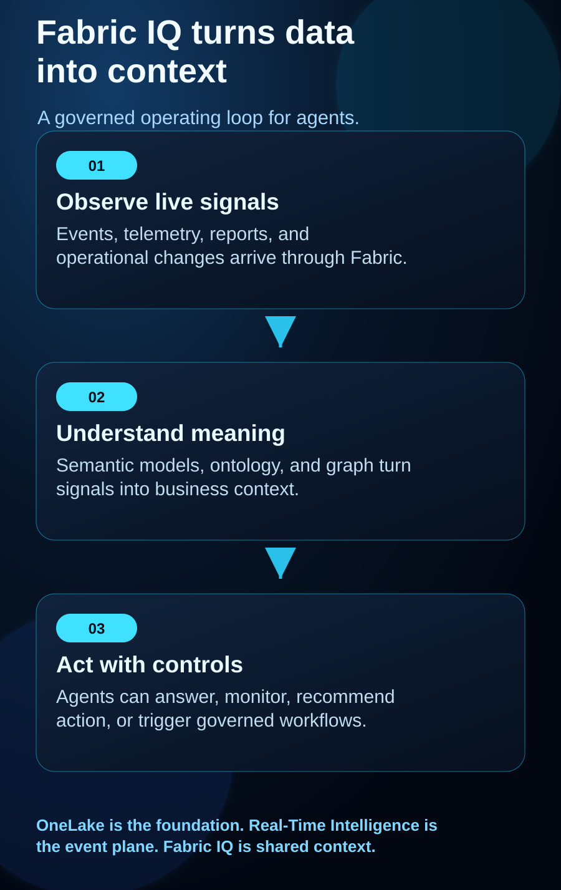
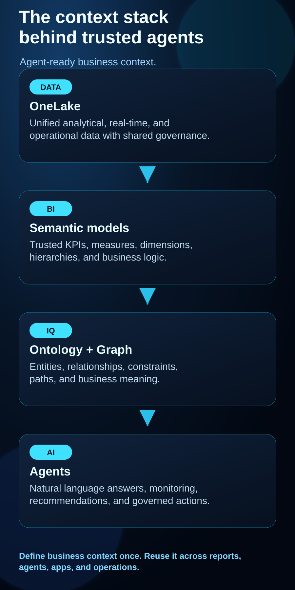
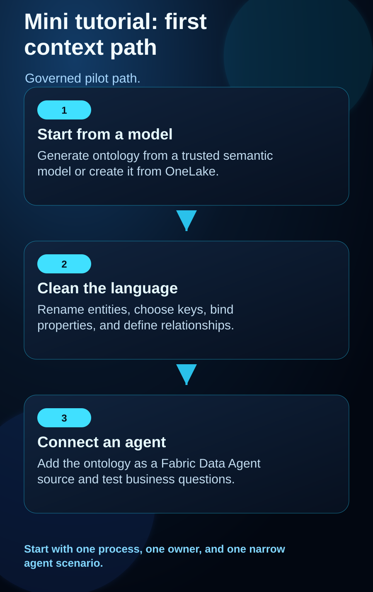

Fabric IQ becoming generally available is one of the Fabric milestones I was waiting for.

Not because the industry needed another AI announcement.

Because production AI agents have been missing something very basic: a shared, governed understanding of the business.

Most AI agent demos can answer a question if the prompt is clean, the data source is obvious, and the scope is small. That is useful for a demo. It is not enough for an enterprise workflow where the same customer, shipment, asset, incident, product, or KPI can mean different things across systems.

Microsoft is positioning Fabric IQ as the shared context layer for people, applications, and AI agents. The GA announcement includes Fabric IQ as the production context layer, with Graph and Operations Agents generally available and Ontology continuing in preview.

That nuance matters. The whole direction is production-facing, but not every individual piece has the same maturity label yet.

My take: this is the moment where Fabric starts looking less like a reporting platform with AI features and more like an operating layer for business context.

## Why this is strategically important

AI agents do not fail only because the model is weak.

They fail because the business context is scattered.

One team defines active customer one way. Finance defines revenue another way. Operations tracks incidents in a different system. A report hides business logic in measures. A warehouse stores clean tables but not the real meaning behind the process. Then an agent is expected to reason across all of it.

That is where things get risky.

A production agent needs to know more than where the data lives. It needs to know what the business entities are, how they relate, which metrics are trusted, what rules apply, and which source owns the truth.

Fabric IQ is Microsoft’s answer to that problem.

The strategic shift is simple:

> Stop asking every agent, report, app, and workflow to rediscover business meaning from scratch.

Define the context once. Govern it. Reuse it.

## What Fabric IQ actually does

Fabric IQ sits on top of the Fabric data foundation and gives business meaning to data that would otherwise live as tables, streams, events, reports, and models.

Microsoft describes three connected layers.

### 1. Unified data in OneLake

OneLake gives Fabric IQ the common data foundation. Analytical data, operational data, real-time data, shortcuts, lakehouses, eventhouses, warehouses, and semantic models can participate in the same platform story.

### 2. Business intelligence through semantic models

Power BI semantic models already hold a lot of trusted business logic: measures, hierarchies, dimensions, relationships, and KPI definitions.

Fabric IQ does not throw that away. It uses semantic models as part of the context layer. You can generate or align ontology from semantic models so the business language used in reports can also ground agents and applications.

Many companies already spent years building trusted semantic models. The smart move is to reuse that logic, not rebuild it in prompts.

### 3. Operational intelligence through ontology and graph

This is the part that gets interesting.

Ontology defines business entities, properties, relationships, rules, and actions. Think Customer, Shipment, Store, Sensor, Order, Contract, Incident, and Asset.

Graph makes connected data explicit and queryable. Instead of asking an agent to guess how things relate through joins and table names, relationships can become first-class business context.



## The part I like most: agents can stop guessing relationships

Graph in Fabric is now generally available. Relationship-first modeling is no longer just a nice preview idea sitting outside the core platform conversation.

For AI agents, relationships are not decoration.

They are the difference between:

- “Show sales by customer”
- “Which customers are affected by a supplier delay through the products they bought and the shipments currently in transit?”

The first question is normal BI.

The second question needs relationships, paths, dependencies, and business meaning. It needs to understand how entities connect across domains.

Traditional joins can answer some of this, but they usually hide the relationship logic in technical implementation. Graph and ontology make those relationships explicit enough for humans to review and for agents to use.

## A mini tutorial: how I would start small

I would not start a Fabric IQ pilot by modeling the whole company.

That is how architecture diagrams become shelfware.

I would start with one narrow process where the relationships matter.

Example: retail inventory risk.

The business question could be:

> Which stores are at risk because a high-revenue product has low inventory, recent demand is increasing, and the supplier is already delayed?

That is a good Fabric IQ candidate because it crosses entities and systems: Store, Product, Inventory, SaleEvent, Supplier, Shipment, and DelayReason.

Here is the smallest practical path I would use.

### Step 1: start from a trusted semantic model or OneLake data

If a Power BI semantic model already has clean relationships and trusted measures, use it as the starting point and generate an ontology from it. If not, create the ontology directly from OneLake sources.

Do not bring every table. Pick the few entities needed for the first business question.

### Step 2: rename technical objects into business language

This is not cosmetic.

An agent should not reason over `dimproducts`, `factsales`, and `store_id` as the primary business language.

Rename entity types into business terms such as Product, Store, SaleEvent, Supplier, and Shipment. Choose stable keys. Bind properties from source data. Define relationships like Store sells Product, Supplier ships Product, Shipment supplies Store.

### Step 3: bind data and verify relationships

Data binding connects the ontology definitions to real OneLake data.

Before connecting an agent, I would check:

- Are entity keys correct?
- Are the important properties bound?
- Are relationship directions understandable?
- Are source systems documented?
- Is there an owner for each business concept?

### Step 4: connect a Fabric Data Agent

Create a Fabric Data Agent and add the ontology as a source.

Then test questions that force relationship reasoning, not just lookup behavior:

```text
Which stores have low inventory for products with rising revenue in the last 14 days?

Which delayed shipments affect high-revenue products?

Which suppliers are connected to the most at-risk stores this week?
```

The goal is to prove that the agent is using governed business context instead of guessing from table names.



## The governance question teams should ask first

Fabric IQ will be powerful for teams that treat it like infrastructure.

It will become confusing for teams that treat it like another AI feature.

Before I would let an ontology-backed agent near production, I would want clear answers to these questions:

- Which business concepts are in scope?
- Who owns each entity definition?
- Which semantic model or source system is trusted?
- Which relationships are reviewed by the domain owner?
- Which agents can use this context?
- What actions are allowed?
- How do we test whether the agent used the right definition?
- What changes when the ontology changes?

This is the same lesson as semantic models, but with higher stakes.

A bad measure can create a bad report. A bad ontology can create a bad agent decision.

## My takeaway

Fabric IQ going GA is not just another Fabric announcement.

It is a signal that Microsoft is building the missing layer between data platforms and production AI agents: business context that can be modeled, governed, queried, reused, and connected to action.

That is why I was waiting for this milestone.

Semantic models gave BI teams a trusted language for reporting.

Fabric IQ pushes that idea further: a trusted context layer for agents, real-time operations, planning, graph reasoning, and applications.

The opportunity is huge, but the implementation discipline matters.

Start with one business process, one ontology, one trusted semantic model or OneLake source, one narrow agent scenario, and one owner who can say whether the answer makes sense.

That is how Fabric IQ becomes useful infrastructure instead of another impressive demo.

## Sources

- [Microsoft Learn: What is Fabric IQ?](https://learn.microsoft.com/en-us/fabric/iq/overview)
- [Microsoft Learn: What is Ontology in Fabric IQ?](https://learn.microsoft.com/en-us/fabric/iq/ontology/overview)
- [Microsoft Learn: Consume Ontology from Agents](https://learn.microsoft.com/en-us/fabric/iq/ontology/tutorial-4-create-data-agent)
- [Microsoft Learn: What is Graph in Microsoft Fabric?](https://learn.microsoft.com/en-us/fabric/graph/overview)
- [Microsoft Fabric Updates Blog: Fabric IQ, the shared context layer for AI agents and real-time applications](https://community.fabric.microsoft.com/t5/Fabric-Updates-Blog/Fabric-IQ-The-shared-context-layer-for-AI-agents-and-real-time/ba-p/5191678)
- [Microsoft Fabric Updates Blog: Fabric IQ, the semantic layer powering trusted AI agents at enterprise scale](https://community.fabric.microsoft.com/t5/Fabric-Updates-Blog/Fabric-IQ-The-semantic-layer-powering-trusted-AI-agents-at/ba-p/5190739)
- [Microsoft Fabric Updates Blog: Graph in Fabric Generally Available](https://community.fabric.microsoft.com/t5/Fabric-Updates-Blog/Graph-in-Fabric-Generally-Available/ba-p/5190748)

---

**Shai Karmani**  
[Let’s connect on LinkedIn](https://www.linkedin.com/in/shai-kr)
