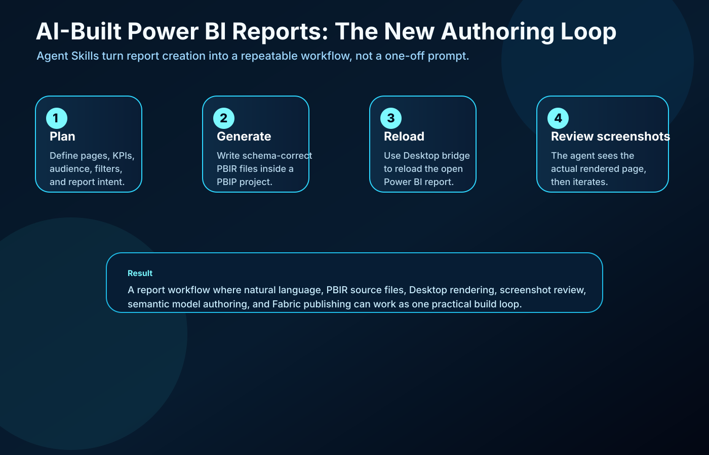
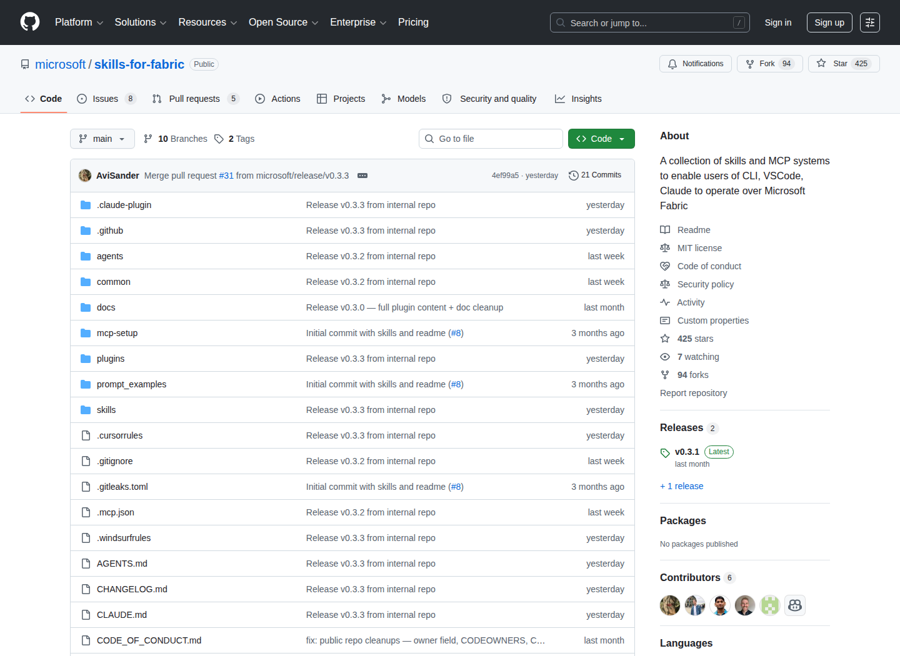
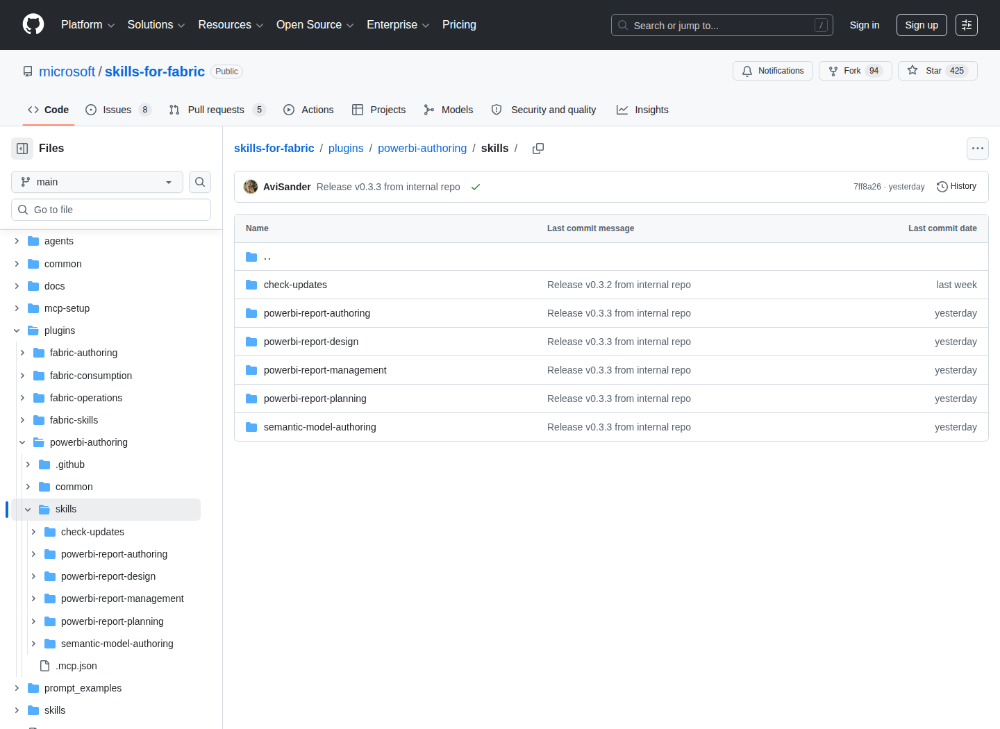
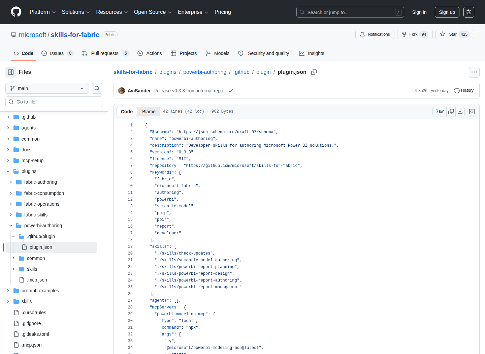
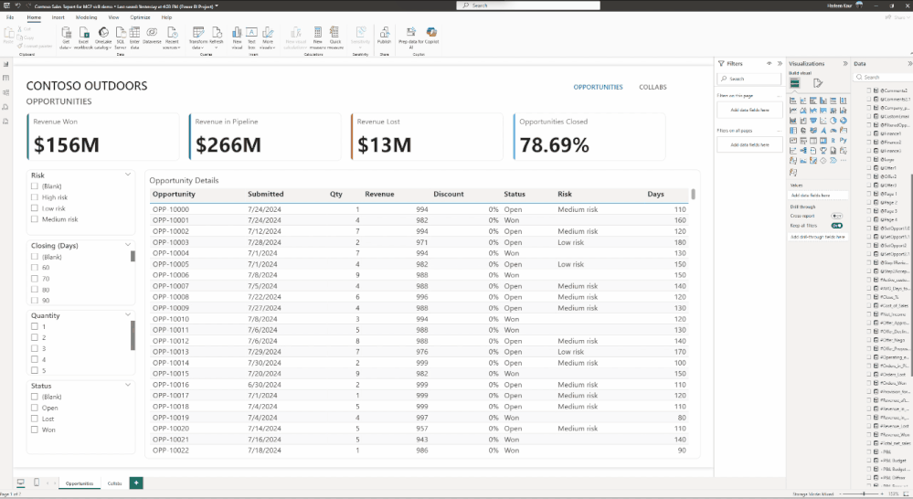
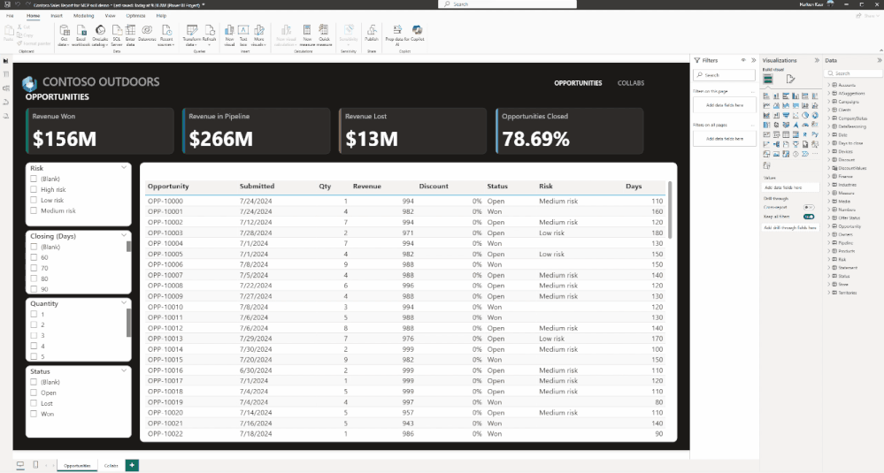
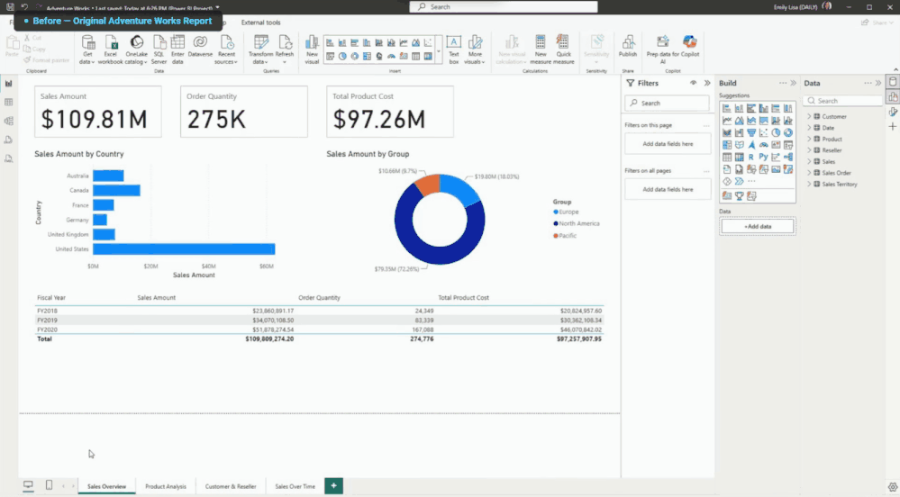
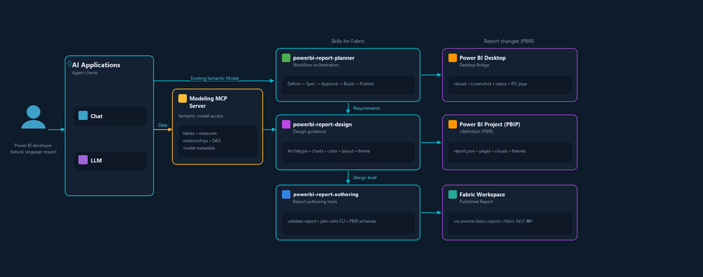
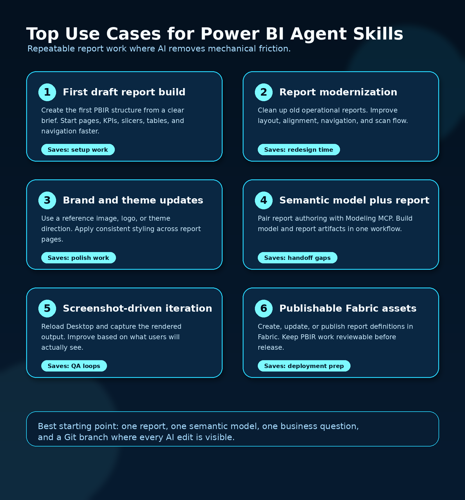
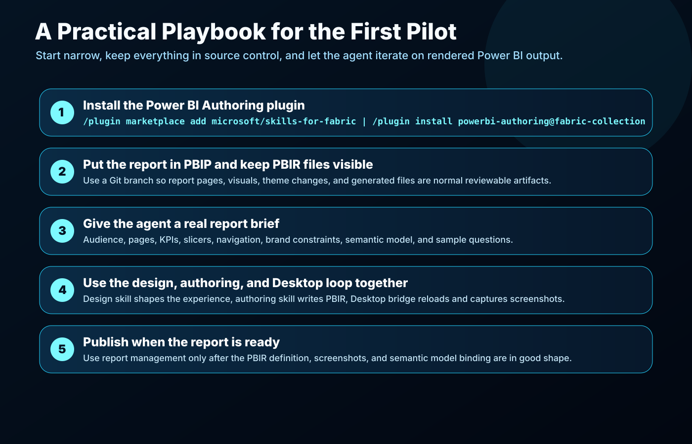

Microsoft just opened a very interesting door for Power BI teams.

AI-powered Power BI reporting with agent skills is now in preview, and this is one of the most practical AI announcements in the Power BI space right now.

The reason is simple: this is not only chat over a report. This is AI helping with the actual report-building workflow.

Design pages. Generate PBIR files. Work inside a PBIP project. Reload Power BI Desktop. Capture screenshots. Improve the report based on what was actually rendered. Publish to Fabric when the report is ready.

That is a very different thing from asking Copilot to summarize a visual.

This is closer to giving an AI agent a real Power BI workbench.

## What Microsoft released

Microsoft announced **AI-powered Power BI reporting: From design to deployment with agent skills** as part of the Power BI authoring plugin in [Skills for Fabric](https://github.com/microsoft/skills-for-fabric).

The core idea: install a first-party Power BI authoring plugin, then use compatible AI tools, currently optimized for GitHub Copilot CLI, to build and modify Power BI reports through natural language.

The plugin can help an agent:

- create report pages from a prompt
- write schema-correct PBIR files
- work with PBIP projects
- reload an open Power BI Desktop report
- capture screenshots from the rendered report
- improve the report based on the screenshot output
- coordinate with semantic model authoring and Modeling MCP
- publish or manage reports in Fabric through companion skills

That last part is the important shift.

A lot of AI reporting demos stop at “generate a report.” This one is being designed around the artifacts Power BI developers already care about: PBIR, PBIP, semantic models, Desktop rendering, and Fabric publishing.



The repository behind this is public: [microsoft/skills-for-fabric](https://github.com/microsoft/skills-for-fabric).

At the time I checked it, the repo was created on **February 17, 2026**, had **425 stars**, **94 forks**, and was still active, with a latest main-branch commit on **June 7, 2026**. The Power BI Authoring plugin manifest in the repo is at version **0.3.3**.

This matters because it shows the direction clearly: Microsoft is not treating these as a throwaway demo prompt pack. This is a first-party skills catalog that can be installed, versioned, inspected, improved, and contributed to.

## The Power BI Authoring plugin

The Power BI Authoring plugin lives under:

[plugins/powerbi-authoring](https://github.com/microsoft/skills-for-fabric/tree/main/plugins/powerbi-authoring)

The plugin currently includes these skills:

- `check-updates`
- `semantic-model-authoring`
- `powerbi-report-planning`
- `powerbi-report-design`
- `powerbi-report-authoring`
- `powerbi-report-management`



That split is smart.

Report building is not one task. It is a chain of decisions and artifacts.

You plan the report. You design the experience. You create or connect the semantic model. You author the PBIR files. You reload and inspect the report. You manage the Fabric item.

The plugin structure reflects that workflow instead of pretending one mega-prompt can do everything well.

The plugin also declares a local MCP server for Power BI Modeling:

```json
"powerbi-modeling-mcp": {
  "type": "local",
  "command": "npx",
  "args": [
    "-y",
    "@microsoft/powerbi-modeling-mcp@latest",
    "--start"
  ]
}
```



That is where the ecosystem starts to become powerful.

Skills provide the operating instructions. MCP gives the agent live tool access. PBIP and PBIR give the work a file-based shape. Git gives the work history. Power BI Desktop gives the rendered output. Fabric gives the deployment target.

Put together, this becomes a real authoring loop.

## How to install it

The install flow from Microsoft is short.

First, register the Skills for Fabric marketplace in GitHub Copilot CLI:

```bash
/plugin marketplace add microsoft/skills-for-fabric
```

Then install the Power BI Authoring plugin:

```bash
/plugin install powerbi-authoring@fabric-collection
```

If you want the broader Fabric bundle, Microsoft also documents:

```bash
/plugin install fabric-skills@fabric-collection
```

For a focused Power BI report pilot, I would start with `powerbi-authoring@fabric-collection` first. Keep the test narrow, prove the loop, then expand.

## What this can actually do

Microsoft showed three practical examples in the announcement.

### 1. Create a report from scratch

You can ask the agent to create report pages with KPIs, slicers, tables, branding, and page structure.

For example, Microsoft’s demo prompt asks for an Opportunities page with revenue KPIs, slicers, and a table, then a Collabs page with offer status KPIs and filters.

The agent uses the `powerbi-report-authoring` skill to create Power BI report definitions in PBIR format.



This is a strong use case for the first draft of a report.

Not the final report. The first structured draft.

That alone can save a lot of time. Page scaffolding, KPI placement, slicer setup, table layout, and basic branding are not usually the highest-value part of BI work. They are necessary, but repetitive.

If an agent can get the first 60 percent into a usable PBIR structure, the developer can spend more time on business logic, model quality, visual clarity, and stakeholder feedback.

### 2. Modify an existing report from a prompt or reference image

The announcement also shows the agent updating an existing report based on a reference image and logo.

That means the workflow is not limited to greenfield reports.

You can point the agent at an existing PBIP project, describe the visual change, provide a reference image, and let it apply the style to the report pages.



This is where I see a lot of practical value.

Every BI team has reports that are useful but visually inconsistent. Different fonts. Random colors. Misaligned objects. Slicers in five different places. KPI cards that grew organically over time.

A good AI report assistant can help normalize those reports faster.

### 3. Modernize a messy report

Microsoft’s third example is the one that will probably resonate with the most Power BI teams: modernize a report with better design.

The prompt asks the agent to create a cleaner landing page, improve navigation, apply a consistent theme, reduce clutter, and make insights easier to scan.

Behind the scenes, Microsoft says the agent uses the `powerbi-report-design` skill to create a structured design brief, then passes that to the authoring skill for implementation.



This is exactly the kind of work where agent skills make sense.

The work has patterns. The output is visible. The files are structured. The result can be reloaded and checked. The agent can iterate.

That is a much better fit than asking an AI model to “make a dashboard better” with no real access to the report definition or rendered page.

## The part that makes this different: screenshots in the loop

The feature I like most is the Desktop bridge.

Microsoft describes a loop where the agent can reload the report in an already-open Power BI Desktop instance, capture screenshots of the latest report pages, inspect the rendered output, and make another pass.

That changes the quality of the workflow.

Without screenshots, an agent is editing JSON and hoping the report looks right.

With screenshots, the agent can see the actual page.

That matters for:

- overlapping visuals
- bad alignment
- poor spacing
- unreadable labels
- broken image placement
- inconsistent card sizes
- visual clutter
- theme mismatch
- navigation layout

This is the same reason designers do not approve a report by reading JSON. They look at the rendered page.

Giving the agent access to that rendered page is a big practical step.



## Top use cases that can save real time

Here are the use cases I would prioritize first.



### 1. First draft report generation

Give the agent a clear brief:

- audience
- pages
- KPIs
- slicers
- tables
- navigation
- required branding
- source semantic model
- examples of questions the report must answer

Then let it generate the first PBIR structure.

This is useful when the report shape is known but the build work is repetitive.

Example prompt:

```text
Create a Power BI report for an executive sales pipeline review.

Use the Sales semantic model.

Page 1: Executive Overview
- KPI cards: Revenue Won, Revenue in Pipeline, Win Rate, Open Opportunities
- Trend: Revenue Won by Month
- Bar chart: Pipeline by Region
- Slicers: Region, Sales Owner, Close Month

Page 2: Opportunity Detail
- Table: Opportunity, Account, Owner, Stage, Risk, Expected Close Date, Revenue
- Add slicers for Stage and Risk
- Use a clean executive layout with strong navigation between pages
```

The point is not to make the prompt poetic. The point is to make it operational.

### 2. Report modernization backlog

Most organizations have a long tail of reports that people still use but nobody wants to redesign manually.

This is a perfect pilot category.

Pick five reports that are useful but ugly. Save them as PBIP. Ask the agent to improve one report at a time.

Good prompts here are direct:

```text
Modernize this report for a monthly operations review.

Keep the same business meaning, but improve page structure, spacing, alignment, navigation, and visual hierarchy.

Create a cleaner landing page with the most important KPIs at the top.
Use a consistent theme across all pages.
Reduce clutter and make the page easier to scan in under 30 seconds.
```

This is where the `powerbi-report-design` skill should shine.

### 3. Brand and theme standardization

If a company has many reports across teams, style drift becomes real.

The agent can help apply a reference design, logo, color palette, or layout style more consistently.

This is not only about making reports pretty. Consistent design reduces cognitive load. Users know where to look. Filters behave more predictably. Navigation feels familiar.

### 4. Semantic model plus report creation

The Power BI report authoring skill can work with the Modeling MCP server and the semantic model authoring skill.

That means the bigger workflow can become:

1. inspect or create the semantic model
2. define measures and relationships
3. create report pages over that model
4. reload in Desktop
5. capture screenshots
6. refine the report
7. publish when ready

This is where the long-term value is.

A report without a good semantic model is just a nice-looking surface over weak logic. Pairing report authoring with semantic model authoring is the right direction.

### 5. Screenshot-driven report QA

The screenshot loop can save a lot of back-and-forth.

A normal report iteration might look like this:

1. change PBIR files
2. open or reload Power BI Desktop
3. check the page visually
4. fix spacing or formatting
5. repeat

If the agent can reload, screenshot, inspect, and adjust, it can take over a chunk of that mechanical loop.

That does not remove the BI developer. It gives the developer a faster loop.

### 6. Fabric publishing preparation

The `powerbi-report-management` skill is aimed at managing Power BI report workspace items in Microsoft Fabric through the Fabric REST API.

That includes creating, updating, downloading, and managing report definitions.

For teams already using PBIP, Git, deployment pipelines, and Fabric workspaces, this could become part of a more automated report release workflow.

## My first pilot: a practical playbook

If I were testing this inside a real Power BI team, I would not start with the biggest executive dashboard in the company.

I would start with one report that is valuable, visible, and safe to iterate on.



### Step 1: choose the right report

Pick a report with these traits:

- already has a working semantic model
- has 2 to 4 pages
- needs layout or usability improvement
- has clear business questions
- does not require complex custom visuals for the first test
- can be saved as PBIP

Good pilot examples:

- sales pipeline report
- inventory risk report
- operations review report
- finance month-end variance report
- support tickets and SLA report
- project portfolio status report

Avoid the monster report with 19 pages, 47 bookmarks, custom visuals, hidden pages, and years of business politics. That can come later.

### Step 2: save the report as PBIP

The agent skills work with file-based Power BI report definitions. PBIP and PBIR are the important pieces here.

That means the report should live in a project folder where the report definition can be edited, inspected, and committed.

A simple structure might look like this:

```text
sales-pipeline-report/
  Sales Pipeline.pbip
  Sales Pipeline.Report/
  Sales Pipeline.SemanticModel/
  briefs/
    report-brief.md
```

Create a Git branch for the experiment:

```bash
git checkout -b ai-report-skills-sales-pipeline
```

Now every change the agent makes has a place to live.

### Step 3: write a real report brief

The quality of the output will depend heavily on the quality of the brief.

I would create a short `report-brief.md` file before asking the agent to touch anything.

Example:

```markdown
# Sales Pipeline Report Brief

Audience: VP Sales, Sales Directors, Revenue Operations

Business goal:
Show pipeline health, revenue at risk, and opportunities that need attention this month.

Pages:
1. Executive Overview
2. Pipeline Detail
3. Risk Review

Required KPIs:
- Revenue Won
- Revenue in Pipeline
- Win Rate
- Open Opportunities
- At-Risk Revenue

Required slicers:
- Region
- Sales Owner
- Close Month
- Stage

Design direction:
Clean executive report. Strong KPI row. Simple navigation. Low clutter.
Use brand colors from theme.json.

Success criteria:
A VP should understand the pipeline status in 30 seconds.
A Sales Director should find at-risk opportunities without opening another report.
```

That kind of brief gives the agent something useful to work with.

### Step 4: ask the agent to plan first

I would not start with “build the report.”

I would start with planning:

```text
Use the Power BI report planning skill.
Read briefs/report-brief.md.
Inspect the semantic model metadata.
Propose the report page plan, required visuals, navigation structure, and any missing fields or measures.
Do not edit files yet.
```

This uses the planning skill for what it is good at: turning a request into a report specification.

### Step 5: use design before authoring

Then I would ask for a design brief:

```text
Use the Power BI report design skill.
Create a design brief for this report.
Prioritize executive scanning, clean page hierarchy, consistent navigation, readable KPI cards, and low visual clutter.
```

This is important because “create a report” and “create a good report experience” are not the same request.

The design skill gives the authoring skill a better target.

### Step 6: let the authoring skill create or modify PBIR

Once the plan and design are clear:

```text
Use the Power BI report authoring skill.
Implement the approved report plan in PBIR.
Create the pages, visuals, slicers, navigation, and theme updates described in the design brief.
Validate the report definition after the first implementation pass.
```

This is where the agent writes or updates the report files.

### Step 7: reload Desktop and capture screenshots

Now the loop becomes visual:

```text
Reload the report in Power BI Desktop.
Capture screenshots of each page.
Inspect the screenshots for layout, spacing, readability, navigation, and visual hierarchy.
Make one improvement pass based on the rendered output.
```

This is the part I would test hardest.

If the screenshot loop works well, this becomes much more than a prompt-to-JSON tool.

### Step 8: publish only after the artifact is clean

When the report is in good shape, the management skill can help create or update report items in Fabric.

That publishing step should come after the PBIR files, semantic model binding, screenshots, and report behavior are ready.

A clean local loop first. Fabric publish second.

## What I would measure in the pilot

I would measure this like an engineering workflow, not like a novelty demo.

For one report, track:

- time to first useful draft
- number of manual layout fixes needed
- number of agent screenshot iterations
- PBIR validation issues
- semantic model issues discovered
- how much of the report structure was reusable
- whether the final output was easier to maintain than a manual build

The best result is not “AI built everything.”

The best result is this:

> The team got to a useful, file-based, maintainable Power BI report faster, with more of the repetitive work handled by the agent.

That is a practical win.

## Where I think this goes next

This is still preview, but the direction is obvious.

Power BI development is moving toward a more code-aware, agent-aware workflow:

- PBIP makes reports file-based.
- PBIR makes report definitions more editable.
- TMDL makes semantic models more inspectable.
- MCP gives agents access to real tools.
- Skills give agents the right operating instructions.
- Desktop screenshots give agents feedback from rendered output.
- Fabric APIs give the workflow a deployment path.

That combination is much more interesting than isolated AI features.

It means a future Power BI workflow could look like this:

1. A business owner writes a report brief.
2. An agent proposes the page plan.
3. The agent creates the semantic model and report draft.
4. Desktop screenshots drive the first visual refinement pass.
5. The BI developer improves the model, measures, layout, and usability.
6. The report is published to Fabric.
7. The report definition remains in source control for future changes.

That is a strong direction for teams that already want better engineering discipline around Power BI.

## My take

I am very excited about this direction.

Power BI teams spend too much time on repetitive report setup, redesign cleanup, visual alignment, theme drift, and the boring mechanics around first drafts.

Agent skills are a good fit for that work because the work is structured, file-based, visible, and iterative.

The big idea is not “AI replaces Power BI developers.”

The big idea is better:

AI agents can now participate in the same report-building loop that Power BI developers already use: model, files, Desktop, screenshots, Git, and Fabric.

That is where this becomes useful.

Start with one PBIP report. Install the Power BI Authoring plugin. Give the agent a real report brief. Let it plan, design, author, reload, screenshot, and improve.

If the loop works, you have something much more valuable than a demo.

You have the beginning of an AI-assisted Power BI development workflow.

## Sources

- [Microsoft Power BI Updates Blog: AI-Powered Power BI reporting: From design to deployment with agent skills (Preview)](https://community.fabric.microsoft.com/t5/Power-BI-Updates-Blog/AI-Powered-Power-BI-reporting-From-design-to-deployment-with/ba-p/5190703)
- [Microsoft Fabric Updates Blog: Fabric Skills for GitHub Copilot, Claude, and CLI](https://community.fabric.microsoft.com/t5/Fabric-Updates-Blog/Fabric-Skills-for-GitHub-Copilot-Claude-and-CLI-built-by/ba-p/5190188)
- [GitHub: microsoft/skills-for-fabric](https://github.com/microsoft/skills-for-fabric)
- [GitHub: Power BI Authoring plugin](https://github.com/microsoft/skills-for-fabric/tree/main/plugins/powerbi-authoring)
- [GitHub: Power BI report authoring skill](https://github.com/microsoft/skills-for-fabric/blob/main/plugins/powerbi-authoring/skills/powerbi-report-authoring/SKILL.md)
- [GitHub: Power BI report design skill](https://github.com/microsoft/skills-for-fabric/blob/main/plugins/powerbi-authoring/skills/powerbi-report-design/SKILL.md)
- [Power BI Modeling MCP documentation](https://learn.microsoft.com/power-bi/developer/mcp/)

---

**Shai Karmani**
[Let’s connect on LinkedIn](https://www.linkedin.com/in/shai-kr)
