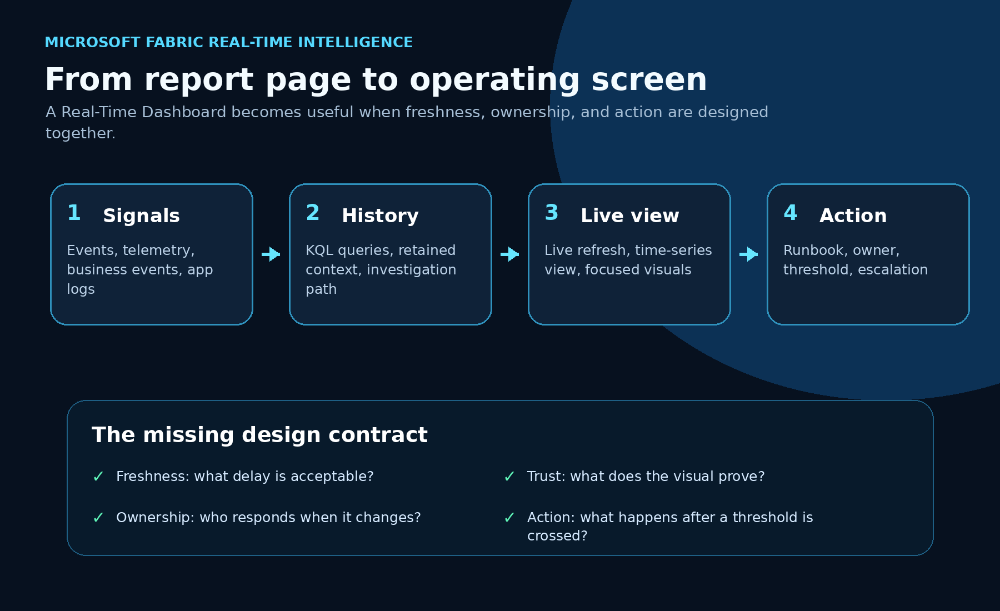
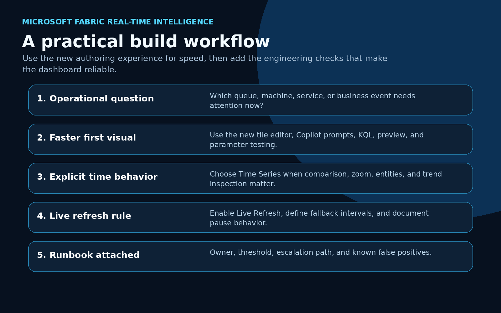
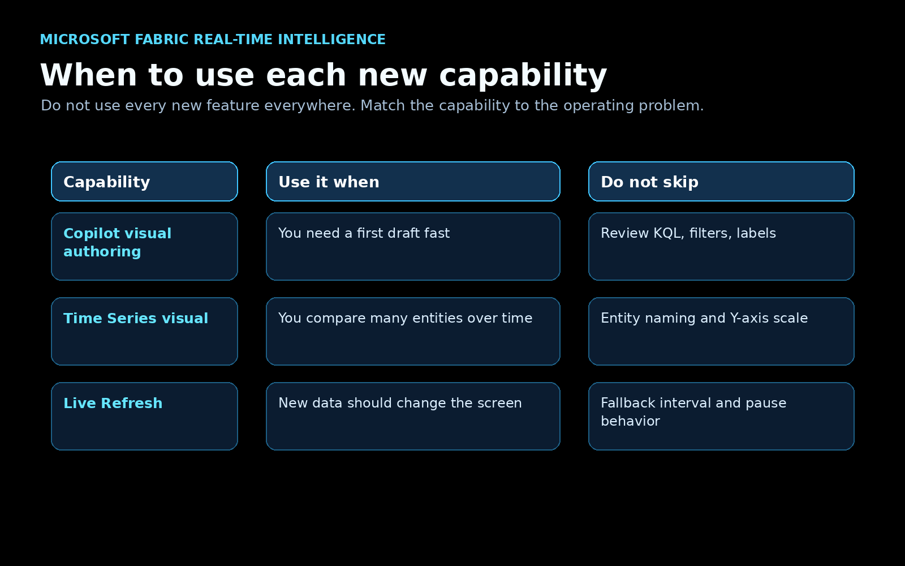

Microsoft just shipped a set of Real-Time Dashboard updates that are easy to underestimate.

On their own, each feature sounds useful:

- a redesigned tile editing experience with AI-assisted authoring
- a dedicated Time Series visual
- Live Refresh becoming generally available

Together, they point to something bigger.

Real-Time Dashboards in Fabric are starting to look less like report pages and more like operational screens. Not because the visuals are nicer. Because the loop is getting tighter between live data, visual authoring, time-based analysis, and refresh behavior.

That matters for teams that monitor systems, processes, events, queues, machines, applications, capacity, business events, or anything else where the question is not “what happened last month?”

The question is “what is happening now, and what should someone do about it?”

## The practical shift

Most dashboards fail as operating tools for one of three reasons.

First, the visual is hard to build, so only a few technical people can create or maintain it.

Second, the time dimension is treated like a normal chart axis, even though real-time data needs zooming, comparison, entity selection, and synchronized timelines.

Third, refresh is either manual or interval-based. That means the dashboard can be stale, noisy, expensive, or all three.

The new Fabric updates attack those three problems directly.



The important point is not “Fabric has more dashboard features.”

The important point is that Real-Time Dashboards are becoming easier to build, easier to inspect, and easier to keep current without hammering the backend unnecessarily.

That is what moves a dashboard from reporting into operations.

## 1. Faster visual authoring with AI and KQL still in the loop

Microsoft’s new Real-Time Dashboard tile editing experience adds a cleaner authoring flow with AI-assisted visual creation, a larger preview area, and more flexible editing, as shown in Microsoft’s official update post.

You can start from a visual type, describe what you need in a prompt, review what Copilot generates, refine the output, and still work directly with KQL when needed.


This is the part I like: it does not remove the technical workflow.

For business users, the prompt path lowers the barrier to creating a first useful visual. For technical users, the editor still supports KQL, preview, schema inspection, parameters, and iterative refinement.

That is the right model.

Real-time dashboards need speed, but they also need control. A generated visual is only useful if the query, filters, time window, grouping, and labels are correct.

A good workflow looks like this:

1. Start with the operational question.
2. Let Copilot help produce the first visual or query shape.
3. Review the generated KQL and visual behavior.
4. Test parameters and edge cases.
5. Apply only when the visual answers the actual operating question.

The win is not that AI creates the dashboard for you.

The win is that AI can shorten the first-draft loop while the builder still owns the logic.

## 2. Time Series visualization makes real-time data easier to investigate

The new Time Series visual is more important than it looks.

A normal line chart is fine when you have one or two clean measures. Real operational data is rarely that polite.

You may have many sensors, services, queues, regions, SKUs, applications, machines, or business event types. You need to search through series, hide and show entities, compare measures, zoom into a time range, and keep the timeline aligned across views.

That is exactly the gap the Time Series visual is trying to close. Microsoft’s official preview post shows the visual with entity navigation, measures, synchronized timelines, and a focused time range.


Microsoft describes capabilities such as:

- legend search for specific data series
- entity and measure panels
- hierarchical grouping
- synchronized time sliders
- separate charts for multiple measures
- flexible Y-axis scaling
- color assignment
- zoom controls
- linear and logarithmic axis options

That sounds like UI detail, but it changes the practical use case.

If I am monitoring application latency, I do not only want one average response time line. I want to compare services, regions, endpoints, time windows, and outliers.

If I am monitoring equipment, I do not only want a single sensor value. I want to isolate one machine, compare it to a peer group, zoom into the suspicious interval, and see whether the pattern repeats.

If I am monitoring business events, I do not only want a count. I want to see event volume, error patterns, processing lag, and unusual spikes in the same time context.

That is where a dedicated Time Series visual becomes useful.

It helps the viewer investigate without changing the underlying query every time.

## 3. Live Refresh changes the refresh contract

Live Refresh is now generally available for Real-Time Dashboards, with Microsoft documenting both the refresh status behavior and the settings pane for dashboard editors.

This is the feature that makes the operational story much stronger.

Traditional refresh creates a tradeoff. Short intervals keep the dashboard fresher, but they create more query load. Longer intervals reduce cost, but the screen can lag behind the event stream.

Live Refresh uses a different model. It detects when new data has been ingested and refreshes the dashboard visuals when there is something new to show. If no new data arrived, it avoids unnecessary visual refresh work.


That is a better fit for real monitoring.

Dashboards should update when the underlying state changes, not just because a timer fired again.

Microsoft also includes useful operational controls, such as pausing Live Refresh while investigating a data point and configuring dashboard refresh behavior from the settings pane.

For production use, I would treat Live Refresh as a contract, not a checkbox.

Before enabling it everywhere, answer these questions:

- What is the acceptable delay between ingestion and visual update?
- Which visuals support ingestion detection cleanly?
- What fallback refresh interval is acceptable?
- When should users pause refresh during investigation?
- Which dashboard owner watches capacity impact?
- What happens when the dashboard changes state?

That last question is the one teams often skip.

If a screen turns red and nobody owns the next action, it is not an operational dashboard. It is expensive wallpaper.

## A simple architecture pattern

Here is the pattern I would use for a real implementation.



Start with the event source.

That might be an application log, IoT stream, business event, capacity event, queue, support workflow, or operational system. Land the data in Eventhouse where KQL can give you both current-state queries and historical context.

Then design the Real-Time Dashboard around one operating question.

Not ten questions. One.

Examples:

- Are any order processing events stuck right now?
- Which service tier is producing abnormal latency?
- Which machines are drifting out of tolerance?
- Is capacity pressure rising before users complain?
- Which business event type needs human review?

Then choose the right dashboard capability:

- Use AI-assisted visual authoring when you need a faster first visual.
- Use Time Series when the investigation depends on comparing entities over time.
- Use Live Refresh when new data should update the screen quickly and efficiently.

Finally, attach the operational layer:

- owner
- threshold
- runbook
- escalation path
- known false positives
- audit or investigation link

That is the difference between a dashboard people glance at and a screen people can actually operate from.

## Example KQL shape

A Real-Time Dashboard visual usually lives or dies by the query shape. Here is a simplified example pattern for monitoring events by status over a short rolling window:

```kql
BusinessEvents
| where Timestamp > ago(30m)
| summarize EventCount = count() by bin(Timestamp, 1m), EventType, Status
| order by Timestamp asc
```

For a Time Series visual, I would usually make the entity and measure decisions explicit:

```kql
ServiceTelemetry
| where Timestamp > ago(2h)
| summarize
    AvgLatencyMs = avg(DurationMs),
    ErrorCount = countif(StatusCode >= 500)
  by bin(Timestamp, 1m), ServiceName, Region
| order by Timestamp asc
```

The query should tell the visual what the viewer is allowed to compare.

If the dashboard depends on a business concept like “delayed,” “failed,” “healthy,” or “at risk,” define that logic in the query or upstream model. Do not leave the viewer to infer it from raw lines.

## My recommended build checklist

If I were building a Real-Time Dashboard for a real team, I would use this checklist before calling it done.

### 1. Define the operating question

Write the dashboard’s job in one sentence.

If the sentence is “monitor everything,” the dashboard is already too broad.

### 2. Define freshness

Decide how current the screen needs to be.

A factory safety signal, application outage, and executive sales trend do not need the same refresh behavior.

### 3. Design the time model

Pick the time window, bin size, timezone behavior, and comparison pattern.

This is where Time Series visualization can help, but it cannot fix a weak time model.

### 4. Validate the query

Review the KQL. Test empty data, late-arriving events, duplicate events, high-volume spikes, and unusual entity names.

### 5. Configure Live Refresh deliberately

Use Live Refresh where event-driven updates are useful. Set fallback behavior. Document when manual refresh or pause behavior is expected.

### 6. Add the action layer

Every important state needs an owner and next step.

If nobody knows what to do after the visual changes, the dashboard is unfinished.

## The positive read

I like this direction because it makes Real-Time Dashboards more practical for real teams.

AI-assisted authoring helps more people get started.

Time Series visualization helps users investigate data that changes over time.

Live Refresh helps the dashboard stay current without turning refresh into a constant polling tax.

That combination is exactly what operational analytics needs.

The opportunity now is to stop treating Real-Time Dashboards as prettier report pages and start designing them as live operating surfaces.

That means better questions, better queries, better refresh contracts, and better runbooks.

The feature set is getting there.

The implementation discipline still matters.

## Sources

- Microsoft Fabric Updates Blog: [A new way to create visuals on Real-Time Dashboards](https://community.fabric.microsoft.com/t5/Fabric-Updates-Blog/A-new-way-to-create-visuals-on-Real-Time-Dashboards-Preview/ba-p/5194484)
- Microsoft Fabric Updates Blog: [Time Series Visualization in Real-Time Dashboard](https://community.fabric.microsoft.com/t5/Fabric-Updates-Blog/Time-Series-Visualization-in-Real-Time-Dashboard-Preview/ba-p/5194571)
- Microsoft Fabric Updates Blog: [Live refresh for Real-Time Dashboards](https://community.fabric.microsoft.com/t5/Fabric-Updates-Blog/Live-refresh-for-Real-Time-Dashboards-Generally-Available/ba-p/5194911)
- Microsoft Learn: [Create Real-Time Dashboards](https://learn.microsoft.com/fabric/real-time-intelligence/dashboard-real-time-create)
- Microsoft Learn: [Customize Real-Time Dashboard visuals](https://learn.microsoft.com/fabric/real-time-intelligence/dashboard-visuals-customize)

<div class="signature-block">
  <p><strong>Shai Karmani</strong></p>
  <p>Senior data, BI, and AI practitioner focused on Microsoft Fabric, Power BI, analytics engineering, and practical AI systems.</p>
  <p><a href="https://www.linkedin.com/in/shai-kr">Connect with me on LinkedIn</a></p>
</div>
