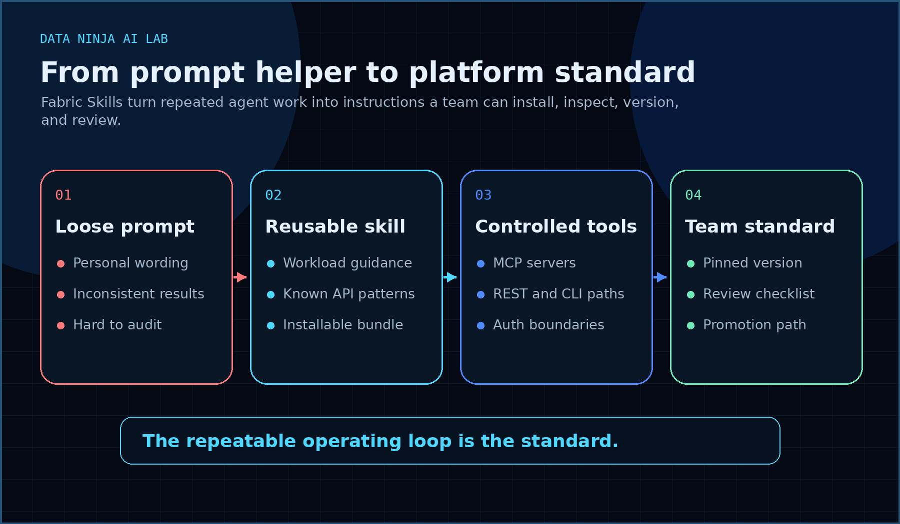
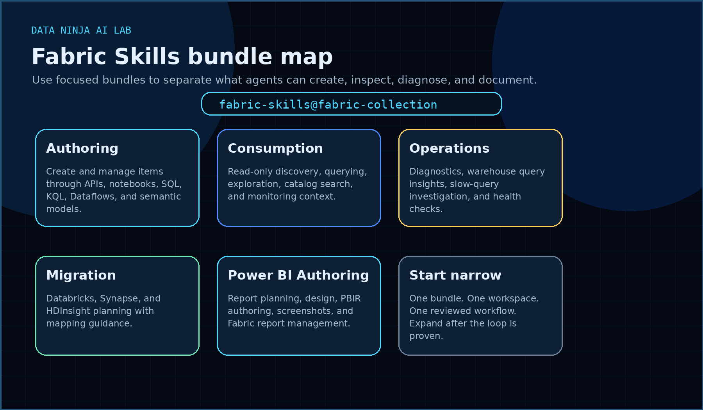
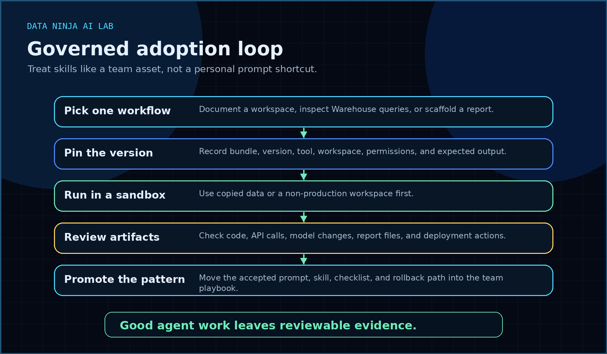

Microsoft Fabric Skills look like a prompt library at first glance.

That is the least interesting way to read the announcement.

The more useful interpretation is this: Microsoft is starting to formalize how AI coding agents should work with Fabric. Not by giving them a vague “be helpful with data” instruction, but by packaging workload-specific guidance, API patterns, authentication context, MCP setup, and operational playbooks into reusable skills.

That changes the conversation.

For most teams, the AI problem is no longer “can the model answer a question?” The harder problem is “can the model follow the way our platform is supposed to be used?”

Fabric Skills are a step toward answering that second question.

## What Microsoft released

Microsoft published [Skills for Fabric](https://github.com/microsoft/skills-for-fabric), a public GitHub repository described as reusable AI assistant instructions for working with Microsoft Fabric.

The repo is designed for GitHub Copilot CLI and compatible AI coding tools. Microsoft also includes root-level configuration files for tools such as Claude Code, Cursor, Windsurf, Codex, Jules, and OpenCode.

The install path is straightforward.

```bash
/plugin marketplace add microsoft/skills-for-fabric
/plugin install fabric-skills@fabric-collection
```

Teams can also install focused bundles instead of the full package:

```bash
/plugin install fabric-authoring@fabric-collection
/plugin install fabric-consumption@fabric-collection
/plugin install fabric-operations@fabric-collection
```

There are workload filters too:

```bash
/plugin install fabric-skills@fabric-collection --filter "sqldw-*"
/plugin install fabric-skills@fabric-collection --filter "spark-*"
/plugin install fabric-skills@fabric-collection --filter "eventhouse-*"
```

That bundle structure is the important part.

It means Fabric agent work can be scoped. A developer can install authoring guidance when the agent needs to create or change artifacts. An analyst can use consumption guidance when the agent should inspect and query. An admin can use operations guidance when the task is diagnostic.

That is a better pattern than giving every AI tool broad instructions and hoping the user remembers the boundaries.



## Why this is not just prompt engineering

Prompt engineering is usually personal.

One person finds a good wording pattern. Another person saves it in a note. A third person rewrites it for a slightly different tool. Six weeks later, nobody knows which version produced the working result.

That is fine for experimentation. It is not good enough for platform work.

Fabric work touches real assets:

- Warehouse objects
- Lakehouse files and tables
- Eventstreams
- Eventhouse and KQL databases
- Dataflows Gen2
- Semantic models
- Power BI reports
- Workspace items
- REST API calls
- Authentication and deployment steps

If AI agents are going to help with that work, the instructions need to become inspectable team assets.

A skill can define:

- what workload the agent is working with
- which API patterns are valid
- which authentication flow is expected
- what commands or MCP servers are relevant
- which artifacts should be created or changed
- what should be checked before the result is trusted

That is closer to an operating standard than a prompt trick.

## The real value: shared instructions for repeatable work

The best use case is not asking an agent to “build something in Fabric.”

That prompt is too broad.

A better workflow sounds like this:

> Use Fabric authoring skills to create a medallion architecture plan for this ingestion scenario. Produce the item list, workspace assumptions, API steps, and review checklist before any implementation work.

Or:

> Use Fabric operations skills to investigate slow Warehouse queries. Summarize the evidence, likely bottlenecks, and the next safe actions. Do not change production objects.

Those are different jobs. They need different boundaries.

The skill layer helps put those boundaries where the agent can see them.

For a senior data team, that matters more than speed. Speed without repeatability creates a support problem. Repeatability creates a playbook.

## Skills plus MCP is where this gets practical

The repository separates two ideas that should stay separate.

Skills provide guidance and patterns. MCP servers provide live tool access to data sources and APIs.

That separation is healthy.

A skill can teach the agent how to approach a Fabric task. An MCP server can give the agent a controlled way to inspect metadata, query data, or call a tool. The skill should not be treated as permission. The tool layer should still enforce what the agent can actually do.

This gives teams a cleaner mental model:

- Skills are the instructions.
- MCP servers are the tools.
- Authentication is the gate.
- Git is the history.
- Pull requests or review checklists are the human control point.
- Fabric is the target platform.

That model is much easier to govern than a chat window with a powerful account behind it.

## Where I would start

I would not roll this out broadly on day one.

I would start with one narrow workflow where the output is useful but low-risk.

Good candidates:

1. **Document a workspace**

   Let the agent inspect workspace structure and produce a readable inventory. This is useful, easy to review, and unlikely to damage anything if access is read-only.

2. **Generate a medallion architecture plan**

   Use the skills to produce a proposed Fabric item design, naming convention, ingestion path, and validation checklist. Review the plan before any build work.

3. **Investigate Warehouse performance**

   Use operations skills to collect evidence and recommend next steps. Keep the first pilot advisory only.

4. **Create a first draft of implementation steps**

   Ask the agent to produce API calls, CLI commands, or notebooks as draft artifacts. Review before execution.

The pattern is the same in every case: advisory first, execution later.

That is how teams learn where the skills help, where the agent guesses, and what needs a local team standard layered on top.



## The governance checklist I would use

Before I let agent skills near a real Fabric workspace, I would want a small checklist.

### 1. Pin the version

Record which skill bundle and version were used. The Skills for Fabric repo has a public changelog, and the skills are moving quickly. That is good, but it also means results can change.

If the agent produced a useful pattern, capture the version that produced it.

### 2. Separate read-only from authoring

Consumption and authoring are different risk levels.

A read-only agent that documents a workspace is not the same as an agent that creates or updates Fabric items. Treat those as different permission profiles.

### 3. Keep prompts with the output

If the output matters, the prompt matters.

Save the prompt, the skill used, the tool used, the workspace context, and the result. Otherwise the team cannot reproduce or audit the work.

### 4. Review changed artifacts, not just the summary

AI summaries can sound confident while hiding bad implementation details.

Review the actual output: notebooks, PBIP or PBIR files, semantic model changes, API payloads, KQL, T-SQL, Dataflow definitions, deployment commands, and workspace item changes.

### 5. Add local standards on top

Microsoft can provide the Fabric patterns. Your team still owns naming conventions, workspace design, security rules, deployment process, cost controls, and rollback paths.

The skill should be the starting point. The internal platform standard is the finished version.

## What this says about the direction of Fabric

This release fits a broader pattern.

Fabric is becoming more agent-addressable.

We already see the pieces forming:

- APIs for workspace and item operations
- OneLake and catalog discovery
- semantic model and Power BI artifact formats
- MCP servers for controlled tool access
- skills that teach agents how to work with Fabric workloads
- Git-friendly artifacts and reviewable project structures

That combination is more important than any single AI demo.

The long-term shift is not “AI can write a query.” That is already normal.

The shift is that AI agents are being given a more structured way to participate in platform work: understand the workload, use the right API, produce reviewable artifacts, and operate inside a workflow a team can govern.

That is where the value is.

## The risk

The risk is teams treating skills as a shortcut around engineering discipline.

They are not.

A Fabric skill can make an agent more useful. It does not automatically make the agent safe, correct, or aligned with your environment.

The same old questions still apply:

- Which account is the agent using?
- What workspace can it access?
- Can it create or delete items?
- Are generated artifacts reviewed?
- Are API calls logged?
- Is there a rollback path?
- Who owns the result after the agent is done?

If those questions are missing, skills will only make bad automation faster.

## My take

Fabric Skills are worth paying attention to because they move AI work closer to how serious platform teams actually operate.

Not one-off prompts.

Reusable instructions. Scoped bundles. MCP-aware workflows. API patterns. Versioned guidance. Reviewable artifacts.

That is the shape enterprise AI agents need.

The teams that get value from this will not be the ones that ask the biggest prompt. They will be the ones that turn useful agent behavior into small, governed, repeatable platform standards.

That is where Fabric Skills become interesting.

---

**Sources**

- [Microsoft Skills for Fabric GitHub repository](https://github.com/microsoft/skills-for-fabric)
- [Skills for Fabric changelog](https://github.com/microsoft/skills-for-fabric/blob/main/CHANGELOG.md)
- [MCP setup for Skills for Fabric](https://github.com/microsoft/skills-for-fabric/tree/main/mcp-setup)

If this was useful, you can also connect with me on [LinkedIn](https://www.linkedin.com/in/shai-kr).
