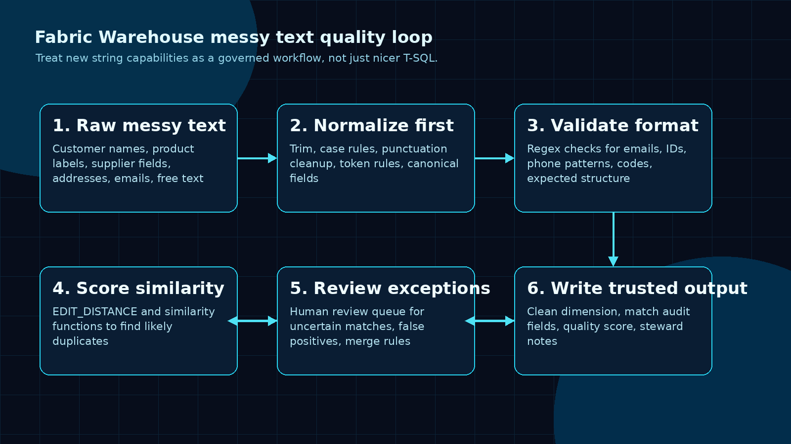
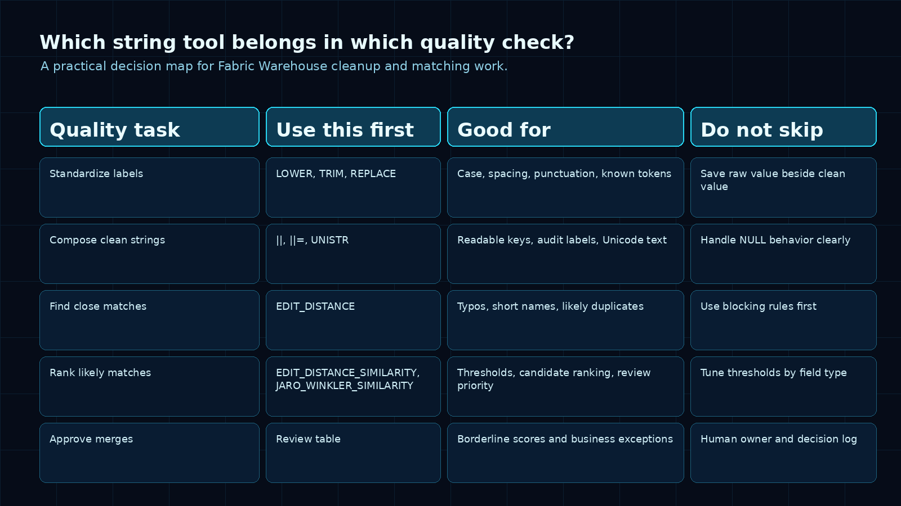
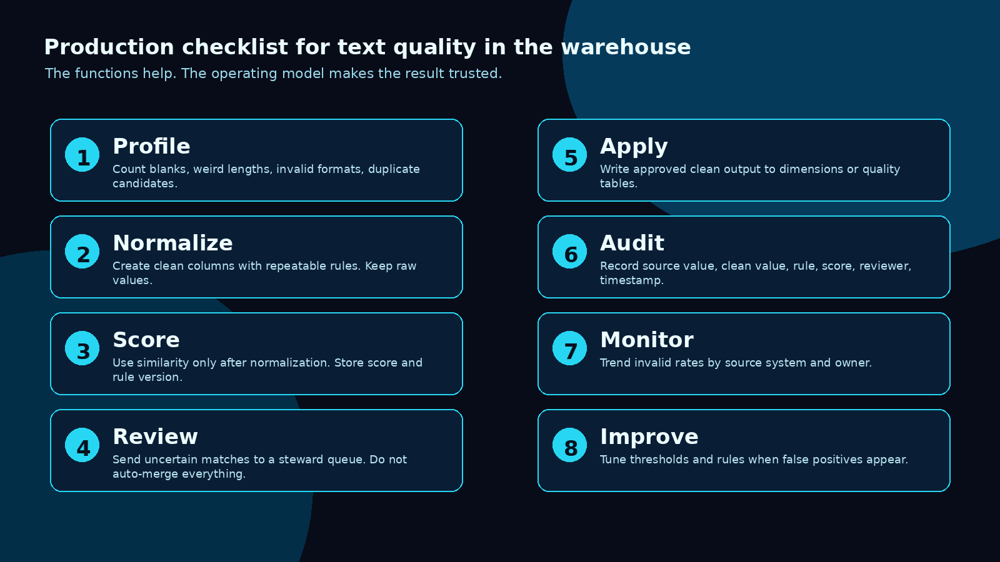

Microsoft Fabric Data Warehouse just got a set of preview string-processing capabilities that sound small until you think about where data quality work usually gets stuck.

Approximate string matching. Modern string functions. ANSI-style string concatenation. Better ways to validate and compare messy text directly in T-SQL.

The practical win is that a painful class of data quality work can move closer to the warehouse, where the data already lives and where the review trail can be governed.

I like this update because it solves a real problem that shows up in almost every data estate:

- the same customer appears under five slightly different names
- product descriptions arrive with inconsistent punctuation
- supplier records use different naming conventions
- free-text fields hide useful matching signals
- email, phone, SKU, and reference fields need validation before reporting
- deduplication logic lives in a notebook, spreadsheet, or one-off script nobody owns

The opportunity is simple: use these functions to build a repeatable text quality workflow, not a clever SQL trick.

## What changed

Microsoft’s Fabric update describes new preview capabilities in Fabric Data Warehouse for approximate string matching, modern string-processing functions, and string operators. The stated goal is to make everyday string processing easier in T-SQL, improve query clarity, and improve portability.

That includes `EDIT_DISTANCE`, `EDIT_DISTANCE_SIMILARITY`, `JARO_WINKLER_DISTANCE`, and `JARO_WINKLER_SIMILARITY` for approximate matching. It also includes `||`, `||=`, and `UNISTR` for clearer string composition and Unicode handling.

For teams working with messy warehouse data, this matters because string cleanup is often treated as side work. It happens in Power Query, in a notebook, in a source-system export, in a temporary SQL script, or manually in Excel.

That works once. It does not scale as a governed data process.

A better model is to make text quality part of the warehouse pipeline.

## The pattern I would use

I would not start by throwing fuzzy matching at every column.

That creates false positives fast.

Start with a controlled workflow.



The pattern is:

1. Profile the raw text.
2. Normalize the obvious variation.
3. Compose readable clean keys and audit labels.
4. Score likely matches.
5. Review uncertain cases.
6. Write trusted output with audit fields.

That sounds heavier than just writing a query, but it is what makes the result usable by business teams.

If a report says two customer records were merged, someone needs to know why.

If a pipeline says a supplier name is invalid, someone needs to know which rule failed.

If an executive dashboard depends on a cleaned product hierarchy, someone needs to know whether that hierarchy came from deterministic rules, similarity scoring, or manual approval.

## Step 1: Profile the messy field first

Before cleaning a text field, profile it.

For example, if you are working with customer names, start with basic shape checks:

```sql
SELECT
    COUNT(*) AS row_count,
    COUNT(NULLIF(TRIM(CustomerName), '')) AS populated_count,
    MIN(LEN(CustomerName)) AS min_length,
    MAX(LEN(CustomerName)) AS max_length,
    COUNT(DISTINCT CustomerName) AS distinct_raw_names,
    COUNT(DISTINCT LOWER(TRIM(CustomerName))) AS distinct_normalized_names
FROM staging.Customer;
```

This tells you whether the issue is mostly blanks, inconsistent casing, punctuation, real duplication, or something stranger.

Do not skip this step. The right matching rule depends on the kind of mess you have.

## Step 2: Normalize before you match

Approximate matching works better after basic normalization.

If you compare raw strings, you waste effort on differences that do not matter:

- leading and trailing spaces
- casing
- dots and commas
- legal suffixes like Ltd, Inc, Corp, LLC
- repeated whitespace
- known spelling variants

A simple normalized projection might look like this:

```sql
WITH normalized AS (
    SELECT
        CustomerId,
        CustomerName,
        LOWER(
            REPLACE(
                REPLACE(
                    REPLACE(TRIM(CustomerName), '.', ''),
                ',', ''),
            ' inc', '')
        ) AS CustomerNameClean
    FROM staging.Customer
)
SELECT *
FROM normalized;
```

This is not perfect. It is not meant to be.

The goal is to remove noise before using more expensive or less deterministic matching.

Also, keep the raw value. Always.

A cleaned value without the original value is hard to audit later.

## Step 3: Compose clean keys and audit labels clearly

String quality work usually produces more than one output column.

You often need a normalized match key, a display value, a failure reason, a rule label, and a review note. This is where the new string operators matter. They make the SQL easier to read, especially when you are composing values that will be inspected by another human.

Example pattern:

```sql
SELECT
    CustomerId,
    CustomerName,
    LOWER(TRIM(CustomerName)) AS CustomerNameClean,
    SourceSystem || ':' || CAST(CustomerId AS VARCHAR(50)) AS SourceRecordKey,
    'customer_name_normalization_v1' AS QualityRule
FROM staging.Customer;
```

The `||` operator is not the headline feature, but readability matters in data quality code. If a steward or another engineer needs to review the logic, clear composition beats a long chain of string handling that hides intent.

`UNISTR` is useful when your cleanup or labeling work needs explicit Unicode characters. That matters in international data, symbols, and cases where the literal value should be reviewable in SQL instead of being hidden in application code.

## Step 4: Use similarity scoring for likely duplicates

This is where approximate string matching becomes useful.

`EDIT_DISTANCE` can help identify records that are close enough to review.

Example:

```sql
WITH candidates AS (
    SELECT
        a.CustomerId AS CustomerIdA,
        b.CustomerId AS CustomerIdB,
        a.CustomerNameClean AS NameA,
        b.CustomerNameClean AS NameB,
        EDIT_DISTANCE(a.CustomerNameClean, b.CustomerNameClean, 4) AS NameDistance
    FROM curated.CustomerNameNormalized a
    JOIN curated.CustomerNameNormalized b
        ON a.CustomerId < b.CustomerId
       AND LEFT(a.CustomerNameClean, 1) = LEFT(b.CustomerNameClean, 1)
)
SELECT *
FROM candidates
WHERE NameDistance BETWEEN 1 AND 4
ORDER BY NameDistance;
```

A few practical points matter here.

First, avoid comparing every row to every other row unless the dataset is tiny. Use blocking rules, such as same first character, same country, same postal prefix, same source system group, or same cleaned token.

Second, thresholds should be field-specific. A distance of 2 may be meaningful for a short product code and meaningless for a long company name.

Third, do not auto-merge everything with a close score. Similarity is a signal. It is not a business decision.

## Step 5: Create a review queue for uncertain matches

The biggest mistake in fuzzy matching is pretending the function knows the business meaning.

It does not.

It can tell you two strings are close. It cannot tell you whether two customers should be merged, whether two suppliers are legally the same entity, or whether a product alias is approved.

So I would create a review table.

```sql
CREATE TABLE dq.CustomerMatchReview
(
    ReviewId INT,
    CustomerIdA INT,
    CustomerIdB INT,
    NameA VARCHAR(300),
    NameB VARCHAR(300),
    MatchScore INT,
    MatchRule VARCHAR(100),
    ReviewStatus VARCHAR(30),
    ReviewedBy VARCHAR(200),
    ReviewedAt DATETIME2(6),
    ReviewerNotes VARCHAR(1000)
);
```

Then route borderline matches into that table:

```sql
INSERT INTO dq.CustomerMatchReview
(
    ReviewId,
    CustomerIdA,
    CustomerIdB,
    NameA,
    NameB,
    MatchScore,
    MatchRule,
    ReviewStatus
)
SELECT
    ROW_NUMBER() OVER (ORDER BY NameDistance, CustomerIdA, CustomerIdB) AS ReviewId,
    CustomerIdA,
    CustomerIdB,
    NameA,
    NameB,
    NameDistance,
    'customer_name_edit_distance_v1' AS MatchRule,
    'Pending' AS ReviewStatus
FROM dq.CustomerNameMatchCandidates
WHERE NameDistance BETWEEN 2 AND 4;
```

That one table changes the conversation.

Now the quality process has ownership, status, and history. The warehouse produces cleaned data with evidence behind it.

## Step 6: Write the trusted result with audit fields

The final clean output should not be a mystery.

A practical trusted dimension or quality output should include fields like:

- raw value
- normalized value
- approved value
- quality status
- match rule
- match score
- reviewer
- reviewed timestamp
- source system
- rule version

That gives report owners and downstream users a way to understand what happened.

Example:

```sql
SELECT
    c.CustomerId,
    c.CustomerName AS RawCustomerName,
    n.CustomerNameClean,
    COALESCE(r.ApprovedCustomerName, n.CustomerNameClean) AS TrustedCustomerName,
    CASE
        WHEN r.ReviewStatus = 'Approved' THEN 'Reviewed match'
        WHEN n.CustomerNameClean IS NULL THEN 'Missing name'
        ELSE 'Rule-based clean'
    END AS CustomerNameQualityStatus,
    r.MatchRule,
    r.MatchScore,
    r.ReviewedBy,
    r.ReviewedAt
FROM staging.Customer c
LEFT JOIN curated.CustomerNameNormalized n
    ON c.CustomerId = n.CustomerId
LEFT JOIN dq.CustomerNameApprovedMatch r
    ON c.CustomerId = r.CustomerId;
```

This is the part that makes the approach safe for analytics.

The business gets more than a prettier name. It gets a traceable decision.

## A simple checklist before production



Before I would let a text matching process feed a production semantic model, I would check these items:

1. Have we profiled the raw field and measured the real problem?
2. Are normalization rules stored in SQL, source control, or another reviewable place?
3. Do we keep raw values beside cleaned values?
4. Are match and cleanup rules named and versioned?
5. Are similarity thresholds different by field type?
6. Do uncertain matches go to human review?
7. Do approved matches produce audit fields?
8. Can a report owner explain why a value changed?
9. Can we measure false positives and false negatives?
10. Is this preview capability acceptable for the workload and release stage?

That last one matters.

These new capabilities are preview. Preview is fine for exploration, pilots, internal quality workflows, and controlled adoption. I would be more careful before using them as the only control behind a critical production merge process.

## Where this is useful immediately

I would look at these use cases first:

### Customer and supplier deduplication

Use normalized names, geography, tax IDs, domains, and similarity scoring to find likely duplicates. Send uncertain records to review.

### Product catalog cleanup

Clean product labels, remove punctuation noise, compare descriptions, and flag suspicious near-duplicates.

### Reference data validation

Check whether codes, IDs, email fields, phone fields, and source-system references follow expected patterns.

### Migration cleanup

Before moving data into Fabric, profile messy source text and create a visible cleanup backlog.

### Semantic model trust

Feed Power BI with fields that carry quality status alongside cleaned labels. That lets report builders expose quality context where needed.

## The bigger point

The best part of this update is not that Fabric Warehouse can do more string work.

The best part is that teams can bring more of the text quality process into the same governed place where they already model, query, and serve analytical data.

That is a cleaner operating model than hiding business-critical cleanup logic in a spreadsheet, one notebook, or one person’s local script.

My recommended starting point:

Pick one painful text field. Profile it. Normalize it. Add one validation rule. Add one similarity rule. Create one review table. Publish one trusted output with audit fields.

Small enough to finish.

Structured enough to scale.

That is how this update turns from “new SQL syntax” into a real data quality improvement.

## Sources

- [New string functions and operators in Fabric Data Warehouse (Preview)](https://community.fabric.microsoft.com/t5/Fabric-Updates-Blog/New-string-functions-and-operators-in-Fabric-Data-Warehouse/ba-p/5195232)
- [T-SQL surface area in Fabric Data Warehouse](https://learn.microsoft.com/en-us/fabric/data-warehouse/tsql-surface-area)
- [EDIT_DISTANCE (Transact-SQL)](https://learn.microsoft.com/en-us/sql/t-sql/functions/edit-distance-transact-sql?view=fabric)
- [EDIT_DISTANCE_SIMILARITY (Transact-SQL)](https://learn.microsoft.com/en-us/sql/t-sql/functions/edit-distance-similarity-transact-sql?view=fabric)
- [JARO_WINKLER_SIMILARITY (Transact-SQL)](https://learn.microsoft.com/en-us/sql/t-sql/functions/jaro-winkler-similarity-transact-sql?view=fabric)
- [String concatenation pipes operator (Transact-SQL)](https://learn.microsoft.com/en-us/sql/t-sql/language-elements/string-concatenation-pipes-transact-sql?view=fabric)
- [UNISTR (Transact-SQL)](https://learn.microsoft.com/en-us/sql/t-sql/functions/unistr-transact-sql?view=fabric)
