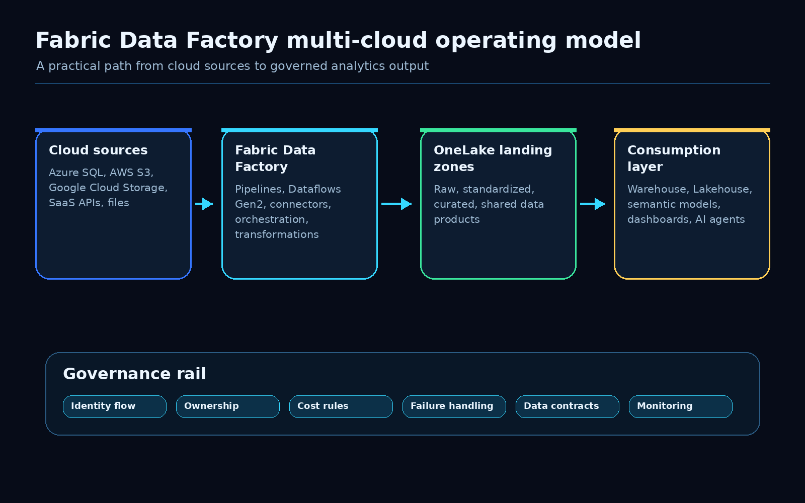
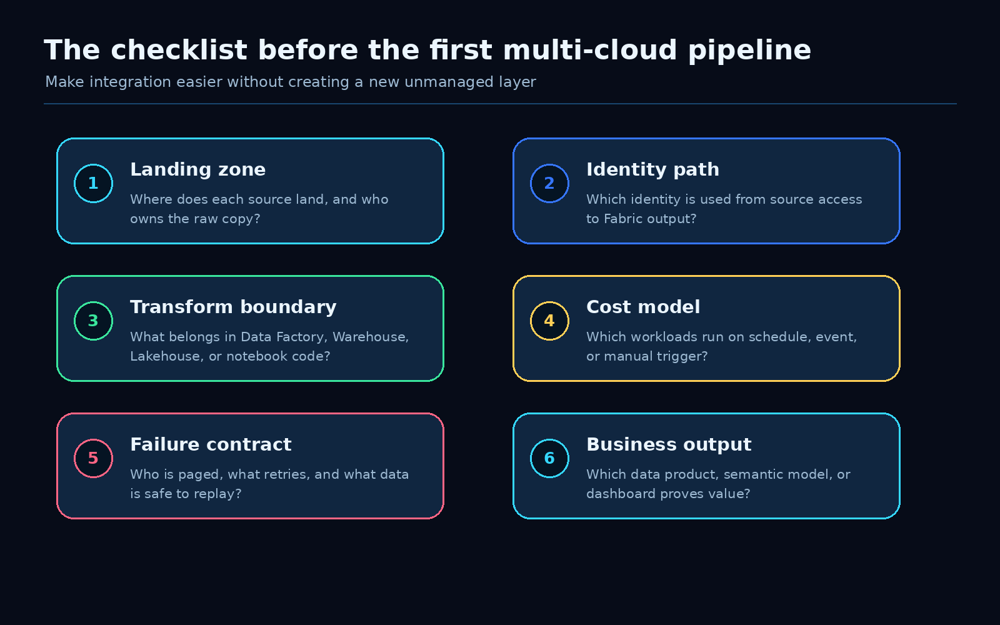
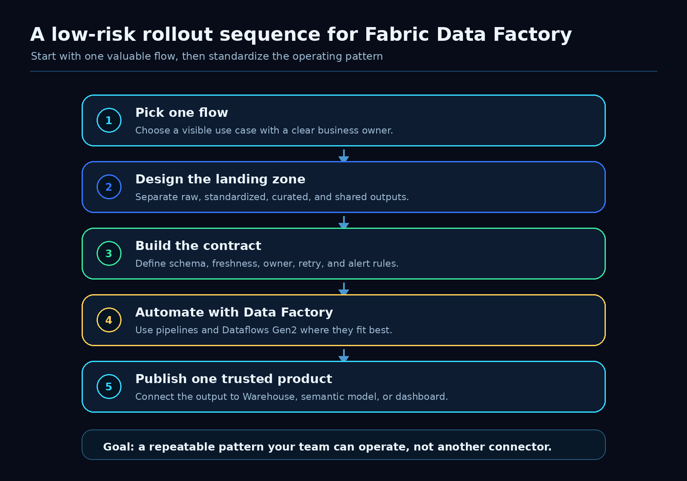

Microsoft Fabric Data Factory just made a useful multi-cloud pattern generally available.

That matters because most companies do not live in one clean cloud. They have Azure, AWS, Google Cloud, SaaS platforms, vendor drops, legacy databases, and business-critical files that somehow need to become reliable analytics data.

The exciting part is not only that Fabric can connect across clouds. The practical win is that teams can now treat multi-cloud data movement as part of a governed Fabric architecture instead of another side integration project.

That is the angle I would focus on.

Use Fabric Data Factory to make multi-cloud integration easier, but build the ownership model around it from day one.

Microsoft’s update positions Fabric Data Factory as a way to make multi-cloud data integration and transformation easier. I agree with the direction. The question for data teams is how to turn that capability into a pattern they can operate safely.

## The opportunity

Multi-cloud data work usually starts with a simple request:

- bring S3 files into the analytics platform
- combine Azure SQL data with Google Cloud Storage exports
- pull SaaS data into OneLake
- standardize vendor feeds before they hit Power BI
- create one governed data product from systems that live in different places

The first pipeline is rarely the problem.

The problem appears when the fifth, tenth, or fiftieth pipeline shows up. Suddenly nobody is sure who owns the raw copy, where schema changes are detected, which capacity pays for the workload, what happens after a failed run, or whether downstream teams trust the curated output.

Fabric Data Factory helps with the integration layer. Architecture still has to handle the operating model.

That is where this update becomes useful for real teams.

## The architecture pattern I would use

I would keep the pattern simple and explicit.

For every multi-cloud data flow, define six things before you scale it.

### 1. Landing zone

Decide where each source lands in Fabric.

I like separating the flow into clear zones:

- raw copy from the external source
- standardized data with basic type and naming cleanup
- curated data that is ready for shared use
- published data products used by reports, semantic models, AI agents, or downstream systems

This sounds obvious, but it prevents a lot of future pain.

If raw S3 files, curated tables, and report-ready outputs all land in the same place, every downstream consumer starts depending on internal pipeline details. That makes change management harder than it needs to be.

A clean landing model lets teams change ingestion logic without breaking everything that consumes the output.

### 2. Identity path

Multi-cloud does not remove identity design. It makes it more important.

For each source, document which identity accesses the source, which Fabric connection is used, where secrets or credentials are managed, and how access is reviewed.

The key question is simple:

Can you explain the identity path from the external source to the Fabric output?

If the answer is no, the pipeline is not ready for production.

This is especially important when the output feeds Power BI or an AI workflow. Users may only see a friendly report or agent response, but the data path behind it still needs to be governed.

### 3. Transform boundary

Fabric gives teams several places to transform data: Data Factory pipelines, Dataflows Gen2, notebooks, Lakehouse SQL, Warehouse SQL, and semantic model logic.

That flexibility is useful, but it can become messy fast.

Before building the pipeline, decide what belongs where.

My default rule:

- use Data Factory for orchestration and movement
- use Dataflows Gen2 for repeatable shaping where the team benefits from a visual transformation layer
- use Warehouse or Lakehouse logic for shared data products and reusable business rules
- use notebooks when code-based transformation is genuinely the better fit
- keep report-specific logic out of the ingestion layer unless it is truly only for that report

The point is not to create a perfect rulebook. The point is to avoid spreading the same business logic across four different tools.

### 4. Cost model

Multi-cloud pipelines can hide cost in several places.

There is source-side cost, Fabric capacity usage, storage growth in OneLake, refresh frequency, retry behavior, and sometimes network movement. A pipeline that looks small in development can become expensive when it runs every 15 minutes across several regions or business units.

Before promoting a flow, define:

- how often it runs
- what triggers it
- which Fabric capacity it uses
- how retries behave
- how much data is expected per run
- who owns the cost if the workload grows

This is not finance theater. It is architecture hygiene.

If the business wants fresher data, the cost conversation should be attached to the value of that freshness.

### 5. Failure contract

A multi-cloud flow needs a failure contract.

Not a vague “monitor the pipeline” statement. A real contract.

For example:

- what counts as failed, delayed, or degraded
- which failures retry automatically
- which failures require human review
- who gets notified
- where failed records are stored
- how replay is handled
- what downstream consumers see when the latest load is incomplete

This is where many analytics pipelines become fragile. They work until they do not, then the business finds out from a stale dashboard.

A failure contract turns the pipeline into something the team can operate.

### 6. Business output

Do not end the design at ingestion.

The real test is whether the pipeline produces a useful, trusted output:

- a Warehouse table used by several teams
- a Lakehouse data product
- a Power BI semantic model
- a Real-Time Dashboard
- an AI agent context source
- an operational extract for another system

If nobody owns the output, the pipeline is just movement.

The strongest Fabric Data Factory use cases will be the ones where a multi-cloud flow lands as a governed data product, not as another pile of copied files.

## A low-risk rollout sequence

I would not start by trying to standardize every cloud source in the company.

Start with one valuable flow.

Pick a use case where the business value is clear and the source complexity is manageable. Then build the operating pattern around it.

A good first candidate has:

- one or two external sources
- a clear business owner
- a visible reporting or operational outcome
- enough pain that the current process is worth replacing
- limited blast radius if the first version needs adjustment

Examples:

- daily vendor files from cloud storage into a curated Power BI model
- SaaS operational exports into a Fabric Warehouse table
- cross-cloud product usage data into OneLake for customer analytics
- finance or planning extracts into a governed reporting layer

Build the first pipeline. Document the contract. Prove the output. Then reuse the pattern.

That is how multi-cloud architecture becomes repeatable instead of heroic.

## What I would avoid

I would avoid three traps.

First, do not let every team create its own connector pattern. You will get speed for a month and cleanup work for a year.

Second, do not treat OneLake as a dumping ground. Landing everything is not the same as governing anything.

Third, do not move business rules into whichever tool the first developer prefers. Decide where shared logic belongs and keep it reviewable.

Fabric makes the technical path easier. That should give teams more room to design the operating model, not less.

## The practical takeaway

The GA update is good news for teams building analytics across messy real-world estates.

Fabric Data Factory can make multi-cloud integration more approachable. The win is bigger when teams pair it with a clear architecture checklist:

- define the landing zone
- trace the identity path
- choose the transform boundary
- model the cost
- write the failure contract
- publish a trusted business output

That is the version of multi-cloud data architecture I want to see more often.

Not a collection of connectors.

A repeatable Fabric pattern the team can actually operate.

## Source

Microsoft Fabric Updates Blog: [Multi-cloud data architecture patterns using Fabric Data Factory (Generally Available)](https://community.fabric.microsoft.com/t5/Fabric-Updates-Blog/Multi-cloud-data-architecture-patterns-using-Fabric-Data-Factory/ba-p/5217279)
