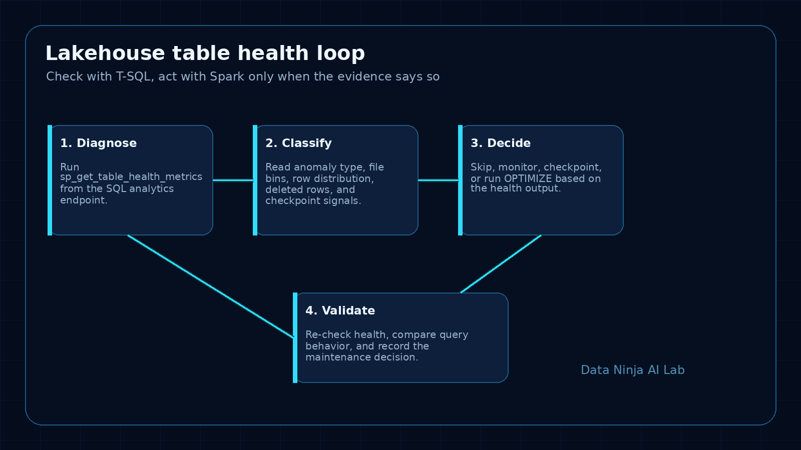
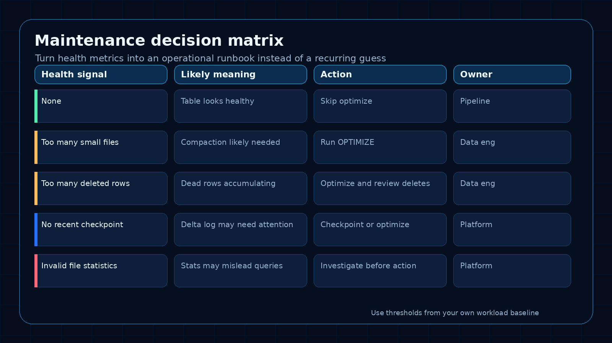
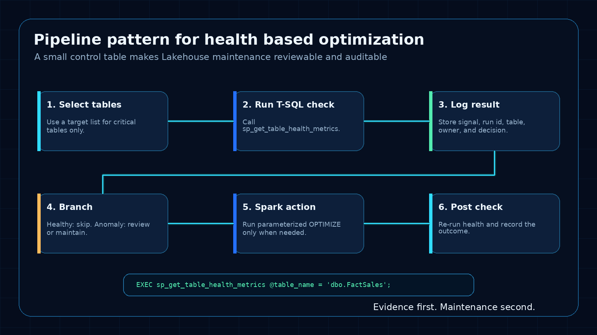

Microsoft Fabric just added a small feature that can change how teams maintain Lakehouse tables.

The new `sp_get_table_health_metrics` stored procedure gives SQL analytics endpoint users a T-SQL way to inspect Lakehouse table health before deciding whether Spark maintenance is needed.

That sounds narrow. It is not.

For teams serving Power BI, SQL users, downstream data products, or AI workflows from Lakehouse tables, this closes an annoying operational gap: the place where users feel the slowdown is often SQL, but the maintenance action usually happens in Spark.

Until now, a lot of teams handled that gap with guesswork.

Run `OPTIMIZE` every night. Compact everything on a schedule. Wait until dashboards get slow. Open a notebook. Inspect Delta files. Ask support. Hope the maintenance job was worth the compute.

The better pattern is simple:

Check table health first. Optimize only when the evidence says to.

That is the practical win here.

## The problem this solves

Lakehouse tables can look fine logically while becoming less efficient physically.

The schema is still valid. The row counts still make sense. The reports still refresh. But over time the physical layout can drift:

- too many small files
- too many deleted rows
- stale or missing checkpoints
- uneven row distribution
- invalid or weak file statistics
- fragmented table layout after frequent writes, deletes, or merges

Users usually experience this as slower SQL queries or lagging Power BI reports.

Data engineers experience it as a vague support problem:

> The dashboard is slow. Can you check the Lakehouse?

That is a bad starting point. It pushes the team into reactive troubleshooting instead of evidence-based maintenance.

`sp_get_table_health_metrics` gives the SQL side a diagnostic step. It does not replace Spark maintenance, but it gives teams a better way to decide when Spark maintenance is actually justified.

## What the stored procedure gives you

Microsoft’s announcement describes a built-in stored procedure for the SQL analytics endpoint that returns table health signals for Lakehouse tables.

The useful part is not just one metric. It is the mix of signals:

- `PotentialAnomalyType`
- `PotentialAnomalyDescription`
- snapshot and checkpoint versions
- physical row counts
- deleted row counts
- file size distribution
- row count distribution
- deleted row distribution

That gives you a much better conversation than “the table feels slow”.

You can ask more specific questions:

- Is this a small-file problem?
- Are deleted rows accumulating?
- Is the table missing a recent checkpoint?
- Are file statistics valid?
- Is this table actually healthy and the issue is somewhere else?

That last point matters.

A health check can save capacity by proving that a maintenance job is not needed.

## The runbook I would use

I would not treat this as a one-off troubleshooting command. I would turn it into a small operational runbook.



### 1. Start with the critical tables

Do not begin by checking every table in the Lakehouse.

Start with tables that actually matter:

- tables behind important Power BI semantic models
- tables queried heavily through the SQL analytics endpoint
- fact tables with frequent incremental writes
- tables touched by merge, delete, or update patterns
- tables used as context for AI agents or downstream apps
- tables with known performance complaints

This keeps the first version focused.

A table nobody queries does not need the same operational attention as the table behind the CFO dashboard.

### 2. Run the health check before maintenance

The basic pattern is straightforward.

```sql
EXEC sp_get_table_health_metrics @table_name = 'schema.YourTable';
```

In a real runbook, I would capture the output instead of only looking at it manually.

For example, create a control table that stores:

- run timestamp
- workspace or environment
- Lakehouse name
- table name
- anomaly type
- anomaly description
- selected file distribution metrics
- maintenance decision
- action taken
- post-check result

The goal is not to create bureaucracy. The goal is to make maintenance reviewable.

If someone asks why a table was optimized yesterday, the answer should not be “because the schedule said so”.

The answer should be tied to the health output.

### 3. Classify the result

Use the anomaly fields as the first decision point.

A simple classification model can work well:

```text
None
  No maintenance action by default.
  Log the result and continue monitoring.

Too many small files
  Candidate for compaction or OPTIMIZE.
  Check whether this table is written frequently in small batches.

Too many deleted rows
  Candidate for maintenance.
  Also review the upstream write, delete, or merge pattern.

No recent checkpoint
  Review checkpoint behavior and table activity.
  Decide whether maintenance should include checkpoint handling.

Invalid file statistics
  Investigate before routine optimization.
  Do not assume compaction is the only answer.
```

The exact action should depend on your workload, table size, freshness needs, and Fabric capacity behavior. The important change is that the action comes after diagnosis.

### 4. Decide, then act

The SQL analytics endpoint can diagnose table health. It is read-only, so it cannot perform the maintenance itself.

That means the runbook needs a handoff:

- SQL health check identifies the condition
- orchestration layer records the result
- if action is needed, a Spark notebook or Lakehouse maintenance process runs the fix
- a post-check confirms the result
- the control table records what happened

This is the bridge that matters.

SQL sees the pain. Spark applies the fix. The pipeline connects the two.



## A practical pipeline pattern

I would implement the first version with a small scheduled pipeline.

Not fancy. Just useful.

### Step 1: Table list

Maintain a small configuration table:

```sql
CREATE TABLE dbo.LakehouseMaintenanceTargets
(
    TableName varchar(256) NOT NULL,
    Priority varchar(20) NOT NULL,
    Enabled bit NOT NULL,
    Owner varchar(100) NULL,
    Notes varchar(1000) NULL
);
```

Start with five to ten important tables. Add more only after the pattern works.

### Step 2: Health check activity

For each enabled table, run the stored procedure and capture the result.

The exact mechanics will depend on how you orchestrate SQL activity in your Fabric environment, but the operating idea is the same: store the health output, not just the final action.

A simple log table might look like this:

```sql
CREATE TABLE dbo.LakehouseTableHealthLog
(
    RunId varchar(64) NOT NULL,
    CheckedAt datetime2 NOT NULL,
    TableName varchar(256) NOT NULL,
    PotentialAnomalyType int NULL,
    PotentialAnomalyDescription varchar(4000) NULL,
    Decision varchar(50) NOT NULL,
    ActionTaken varchar(100) NULL,
    Notes varchar(4000) NULL
);
```

The specific metric columns can be expanded after you inspect the procedure output in your environment.

### Step 3: Decision rule

Keep the first decision rule conservative.

Example:

```text
If no anomaly is detected:
  Log HEALTHY
  Skip Spark maintenance

If a known maintenance anomaly is detected:
  Log ACTION_REQUIRED
  Trigger Spark maintenance for that table

If the anomaly is unclear:
  Log REVIEW_REQUIRED
  Notify the owner instead of running automatic maintenance
```

That last branch is important.

Automation should not turn every warning into a compute job. Some signals need human review, especially early in the rollout.

### Step 4: Spark maintenance

When the decision is `ACTION_REQUIRED`, run the maintenance action through Spark or the Lakehouse engine.

For tables with a clear small-file problem, that may mean running `OPTIMIZE` through a notebook.

I would keep this notebook parameterized:

```python
# Parameters supplied by the pipeline
lakehouse_table = "schema.YourTable"

spark.sql(f"OPTIMIZE {lakehouse_table}")
```

Do not hard-code table names in five different notebooks. Pass the table name in, log the run, and keep the action traceable.

### Step 5: Post-check

After maintenance, run the health check again.

This is the part teams often skip.

If a job consumed capacity, it should produce evidence that the table health improved or at least that the expected action completed.

The post-check does three useful things:

- proves the maintenance job had an effect
- catches cases where optimization did not solve the issue
- gives you history for future threshold decisions

## What I would measure

I would track both technical health and operational impact.

Technical health:

- number of tables checked
- number of anomalies detected
- anomaly type frequency
- maintenance actions triggered
- post-check status
- repeated anomalies on the same table

Operational impact:

- query duration before and after maintenance for key SQL queries
- Power BI refresh or report interaction patterns where available
- Fabric capacity consumed by maintenance jobs
- skipped maintenance runs because tables were healthy
- incidents or user complaints tied to Lakehouse table performance

The skipped jobs are easy to overlook, but they matter.

If the health check prevents unnecessary optimization work, that is a real platform win.

## Where this fits in a Fabric operating model

This feature belongs in the same conversation as monitoring, FinOps, data product ownership, and semantic model reliability.

A Lakehouse table that feeds several important reports is not just storage. It is part of the production data path.

For those tables, I would define:

- owner
- expected freshness
- expected query pattern
- health check frequency
- maintenance decision rule
- escalation path
- last known health status

That sounds heavier than “run optimize nightly”, but it is actually lighter over time.

The team stops paying for blind maintenance and stops waiting for users to discover performance problems.

## What I would avoid

I would avoid four traps.

### Trap 1: Optimizing everything because you can

A health check is useful because it lets you avoid unnecessary work.

If every signal still leads to `OPTIMIZE`, the runbook has failed.

### Trap 2: Treating the anomaly description as the whole diagnosis

The anomaly is a starting point. Pair it with workload knowledge.

A table written every few minutes will behave differently from a monthly snapshot table. A small-file pattern may be expected in one stage and unacceptable in another.

### Trap 3: Ignoring the upstream write pattern

If a table keeps accumulating small files, compaction is only part of the answer.

Look upstream:

- batch size
- write frequency
- partitioning choices
- merge patterns
- delete patterns
- source system behavior

Maintenance cleans up the symptom. The upstream pattern often explains why it keeps coming back.

### Trap 4: Not logging the decision

If the runbook cannot explain what it did, it is not a runbook. It is another black box.

Keep a small audit trail.

Table health, decision, action, result.

That is enough for a first version.

## A simple first-week rollout

If I were adding this to a Fabric environment, I would do it in this order.

### Day 1: Identify targets

Pick five important Lakehouse tables.

For each one, document the owner, main consumers, refresh pattern, and why it matters.

### Day 2: Run manual checks

Run `sp_get_table_health_metrics` manually and review the output.

Do not automate yet. First understand what healthy and unhealthy look like in your own environment.

### Day 3: Create the log table

Create the health log table and start storing results.

Even if the first version is manual, logging gives you history.

### Day 4: Add a conservative pipeline

Automate the health check. Let the first version notify or log, not automatically optimize every table.

### Day 5: Add one maintenance action

Choose one clear condition, such as a small-file anomaly on a high-value table, and trigger a parameterized Spark maintenance notebook.

Then run the post-check.

That is enough for a useful pilot.

## The practical takeaway

This is a good Fabric update because it moves Lakehouse maintenance closer to how teams actually operate.

SQL users and Power BI users usually feel the performance issue first. Spark usually fixes the physical layout. `sp_get_table_health_metrics` gives teams a diagnostic bridge between those two worlds.

The feature is useful on its own. It becomes much more valuable when you turn it into a runbook:

- pick critical tables
- check health before maintenance
- classify the anomaly
- act only when needed
- log the decision
- run a post-check
- adjust upstream write patterns when the same issue returns

That is the difference between scheduled guesswork and data engineering operations.

Good maintenance starts with evidence.

## Source

Microsoft Fabric Updates Blog: [Know before you optimize: Diagnose Lakehouse table health with a single T-SQL command (Generally Available)](https://community.fabric.microsoft.com/t5/Fabric-Updates-Blog/Know-before-you-optimize-Diagnose-Lakehouse-table-health-with-a/ba-p/5228076)
