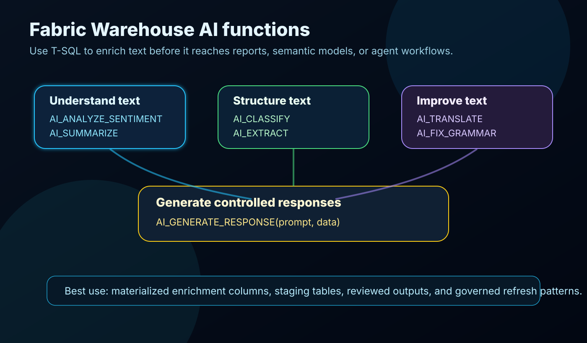
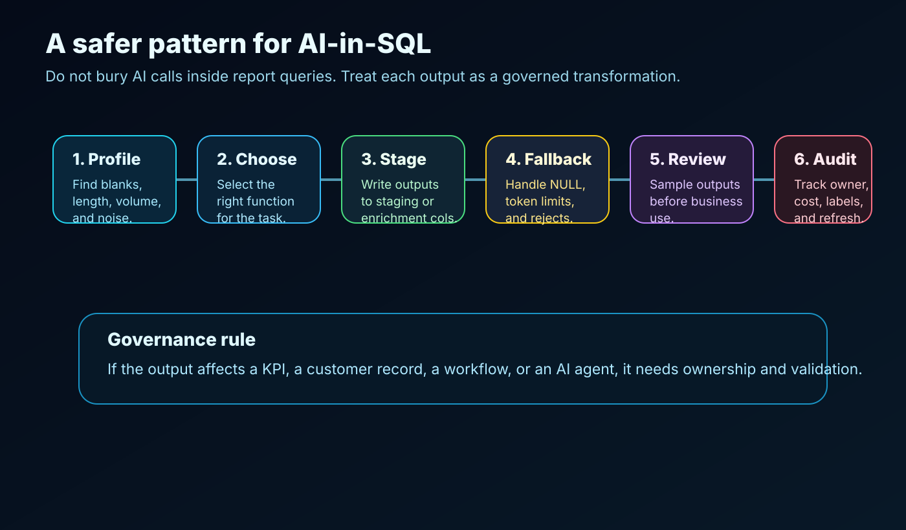

Fabric Data Warehouse now has preview AI functions that let you classify, summarize, translate, extract, and improve text directly from T-SQL.

That is a bigger shift than it first looks.

For years, a lot of text enrichment work has lived outside the warehouse. It gets handled in notebooks, one-off Python scripts, Power Query steps, spreadsheets, application code, or manual cleanup queues. Sometimes that is the right place. Often, it creates another disconnected transformation layer that nobody governs properly.

The interesting part of these functions is not that Fabric can call AI from SQL. The interesting part is that common text intelligence tasks can now sit closer to governed warehouse workflows.

That gives data teams a practical option:

- enrich support tickets before they reach a semantic model
- classify messy feedback into controlled categories
- extract structured fields from free text
- translate multilingual comments for analysis
- summarize long operational notes
- clean user-entered text before reporting
- generate controlled response drafts from trusted data

Used well, this can reduce friction between AI experiments and production analytics.

Used badly, it can bury expensive, non-deterministic logic inside report queries.

The difference is architecture.

## What Microsoft added

Microsoft documents seven preview AI functions for Fabric Data Warehouse and the SQL analytics endpoint.

| Function | What it does | Practical use |
| --- | --- | --- |
| `AI_ANALYZE_SENTIMENT(text)` | Returns `positive`, `negative`, `mixed`, or `neutral` | Review analysis, support triage, survey feedback |
| `AI_CLASSIFY(text, class1, class2, ...)` | Classifies text into labels you provide | Ticket routing, complaint categories, product issue groups |
| `AI_EXTRACT(text, field1, field2, ...)` | Extracts fields as JSON | Pulling problem, date, sentiment, location, or entity values from text |
| `AI_SUMMARIZE(text)` | Produces a shorter summary | Condensing long notes for analysts or dashboards |
| `AI_GENERATE_RESPONSE(prompt, data)` | Generates a response from a prompt and optional data | Response drafts, internal summaries, controlled explanation text |
| `AI_TRANSLATE(text, lang_code)` | Translates text into supported languages | Multilingual support and feedback analysis |
| `AI_FIX_GRAMMAR(text)` | Corrects grammar in text | Cleaning user-entered comments or notes |

These are not replacements for data modeling, governance, or review. They are transformation tools.

That distinction matters.

## A simple example

Imagine a `support_cases` table with a free-text `case_notes` column.

A useful enrichment table might include sentiment, a business category, a short summary, and structured fields extracted from the notes.

```sql
CREATE TABLE curated.support_case_ai_enrichment AS
SELECT
    case_id,
    case_notes,
    AI_ANALYZE_SENTIMENT(case_notes) AS sentiment,
    AI_CLASSIFY(
        case_notes,
        'billing',
        'delivery',
        'technical issue',
        'account access',
        'other'
    ) AS case_category,
    AI_SUMMARIZE(case_notes) AS case_summary,
    AI_EXTRACT(
        case_notes,
        'problem',
        'product',
        'urgency',
        'time_reported'
    ) AS extracted_json
FROM staging.support_cases;
```

That output can then feed Power BI, a semantic model, an operations dashboard, or a downstream process.

But I would not put this directly inside a report-facing query that runs every time a user opens a dashboard.

Microsoft’s documentation calls out two practical constraints:

- AI functions can return `NULL` if the model cannot process the text.
- Typical processing speed is around 20 to 100 rows per second.

That points to the correct pattern: precompute and materialize repeated transformations.

## The function guide



### 1. Use `AI_ANALYZE_SENTIMENT` for directional signals

Sentiment is useful when you need a rough business signal from text.

Examples:

- customer review sentiment
- employee survey comments
- support ticket tone
- partner feedback
- product complaint notes

Good use:

```sql
SELECT
    review_id,
    AI_ANALYZE_SENTIMENT(review_text) AS review_sentiment
FROM staging.customer_reviews;
```

What I would not do: treat sentiment as absolute truth. It should support analysis, not replace review for high-impact cases.

### 2. Use `AI_CLASSIFY` when you control the categories

`AI_CLASSIFY` is strongest when the business already knows the target categories.

Example:

```sql
SELECT
    case_id,
    AI_CLASSIFY(
        case_notes,
        'billing',
        'service',
        'technical issue',
        'contract',
        'other'
    ) AS case_type
FROM staging.support_cases;
```

The governance point is simple: the labels are part of the data contract. If the business changes the categories, the transformation logic changed too.

Track that change like you would track a schema change.

### 3. Use `AI_EXTRACT` to turn text into structured fields

This is the most interesting function for analytics engineering.

Free text often contains useful structure, but parsing it with regular expressions gets brittle fast. `AI_EXTRACT` lets you ask for fields and returns JSON.

Example:

```sql
SELECT
    case_id,
    AI_EXTRACT(
        case_notes,
        'problem',
        'affected_system',
        'urgency'
    ) AS extracted_case_details
FROM staging.support_cases;
```

For reporting, I would normally parse the JSON into typed columns in a curated table.

```sql
SELECT
    s.case_id,
    j.problem,
    j.affected_system,
    j.urgency
FROM staging.support_cases s
CROSS APPLY OPENJSON(
    AI_EXTRACT(s.case_notes, 'problem', 'affected_system', 'urgency')
)
WITH (
    problem VARCHAR(1000),
    affected_system VARCHAR(200),
    urgency VARCHAR(100)
) AS j;
```

This is where validation matters. Sample the output. Review wrong extractions. Keep the original text.

### 4. Use `AI_SUMMARIZE` for readability, not evidence

Summaries are useful when analysts need context without reading a full comment field.

Example:

```sql
SELECT
    incident_id,
    AI_SUMMARIZE(incident_notes) AS incident_summary
FROM staging.incidents;
```

The summary should not become the only version of the record. Keep the original text beside it or one click away.

A summary is a reading aid. It is not the source of truth.

### 5. Use `AI_TRANSLATE` when language blocks analysis

`AI_TRANSLATE` can help standardize multilingual text for analysis.

Example:

```sql
SELECT
    feedback_id,
    feedback_text,
    AI_TRANSLATE(feedback_text, 'en') AS feedback_text_en
FROM staging.customer_feedback;
```

Microsoft lists supported language codes including `en`, `de`, `fr`, `it`, `es`, `el`, `pl`, `sv`, `fi`, and `cs`.

For global reporting, this can make feedback analysis easier. Still, translation can change nuance, especially in complaints, legal text, or regulated workflows. Keep the original language value.

### 6. Use `AI_FIX_GRAMMAR` carefully

Grammar correction is useful for presentation and readability.

Example:

```sql
UPDATE curated.customer_feedback
SET cleaned_comment = ISNULL(
    AI_FIX_GRAMMAR(raw_comment),
    raw_comment
);
```

The `ISNULL` pattern matters. Microsoft’s docs note that AI functions can return `NULL`, so avoid overwriting useful source text with a blank result.

I would use this for cleaned display fields, not for replacing the original source record.

### 7. Use `AI_GENERATE_RESPONSE` with the most discipline

This function can generate text from a prompt and data.

Example:

```sql
SELECT
    case_id,
    AI_GENERATE_RESPONSE(
        'Write a concise internal summary for a support manager:',
        case_notes
    ) AS manager_summary
FROM staging.support_cases;
```

This is powerful, but it is also where teams need the most control.

If generated text will be sent to customers, used in decisions, or shown in operational workflows, add human review, prompt ownership, audit fields, and clear usage rules.

Generated text should not quietly become an automated business action.

## The production pattern I would use

I would treat each AI function output as a governed transformation.

That means:

1. Profile the source text first.
2. Choose the function based on the business task.
3. Materialize the output in a staging or enrichment table.
4. Keep the original text.
5. Add fallback behavior for `NULL` results.
6. Validate a sample of outputs.
7. Track prompt or label changes.
8. Monitor refresh time and cost.
9. Separate experimental outputs from certified reporting fields.

The practical table design might include:

```sql
CREATE TABLE curated.support_case_ai_enrichment
(
    case_id BIGINT,
    source_text_hash VARCHAR(200),
    ai_function_used VARCHAR(100),
    ai_labels_or_prompt VARCHAR(4000),
    ai_output VARCHAR(4000),
    ai_output_status VARCHAR(50),
    validated_flag BIT,
    validation_sample_group VARCHAR(100),
    created_at DATETIME2(6),
    created_by_pipeline VARCHAR(200)
);
```

This may look heavy for a demo. It is not heavy for production.

If the output will influence reporting, routing, prioritization, or an AI agent, someone needs to know where it came from and how it was produced.

## Where this fits in a Fabric architecture

The strongest use cases are not generic AI demos.

They are specific enrichment steps inside a real data workflow:

- classify customer feedback before semantic model refresh
- extract product issue fields from support notes
- summarize long incident comments for operations dashboards
- translate multilingual survey comments for regional comparison
- clean messy user-entered text in curated reporting tables
- generate internal response drafts for review queues

That is the sweet spot.

The warehouse becomes a controlled place to enrich text, not just store it.

## What I would avoid

I would avoid four patterns:

1. Calling AI functions repeatedly in interactive report queries.
2. Treating model output as deterministic truth.
3. Replacing original text with AI-cleaned text.
4. Using generated responses without review, ownership, and audit.

Preview features are for learning and controlled adoption. The right move is to test the pattern, measure the cost, validate outputs, and decide where it belongs in the pipeline.

## Final take

This is a useful direction for Fabric.

Not because it makes every warehouse query smarter by default. That would be the wrong framing.

It is useful because it gives data teams a practical way to move common text enrichment closer to the governed data layer.

If your team already has free-text feedback, support cases, notes, reviews, comments, or multilingual text sitting in the warehouse, these functions are worth testing.

Just test them like production data transformations, not like magic buttons.

Start with one table, one business use case, one materialized output, and one validation sample.

That is enough to learn quickly without turning AI-in-SQL into another unmanaged layer.
