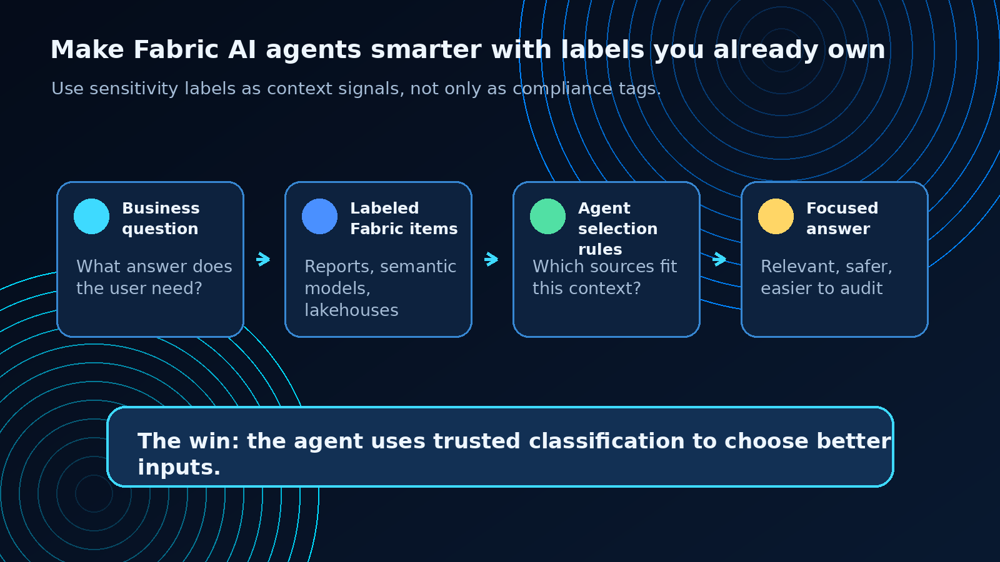
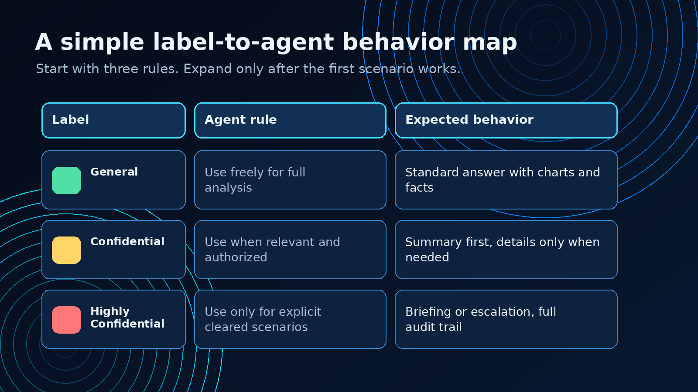
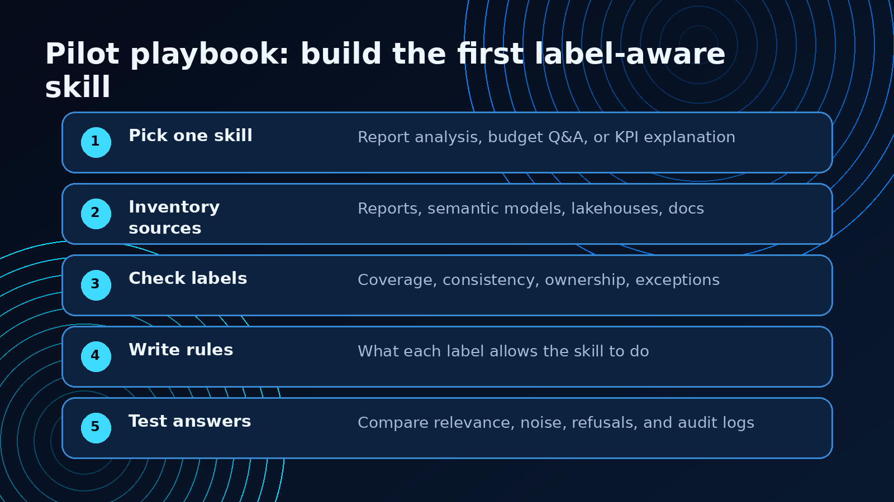
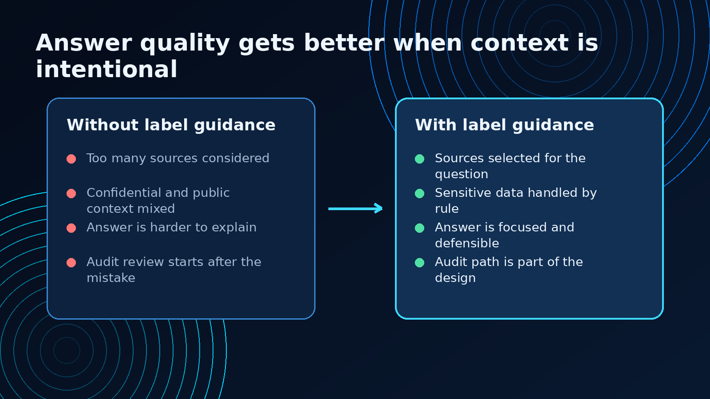

Microsoft Fabric just gave sensitivity labels a more interesting job.

Most teams think about sensitivity labels as governance metadata: General, Confidential, Highly Confidential, custom labels, protection policies, access rules, and audit expectations.

That work still matters.

But the new AI angle is better: those labels can also help Fabric AI agents decide which data belongs in an answer.

That turns sensitivity labels from a control layer into a context layer.

And that is a very useful shift.

If an AI agent can access several reports, semantic models, lakehouses, or other Fabric items, the hard question is not only “does the user have permission?”

The harder question is:

Which sources should the agent consider for this question?

That is where labels become valuable. They give the agent a signal your organization already understands.

General data can support broader analysis. Confidential data may require tighter answer rules. Highly Confidential data may need explicit clearance, summary-only responses, escalation, or a full audit trail.

The practical win is simple: better answers with less noise and clearer governance.

## The opportunity

AI agents do not fail only because they lack access.

They also fail because they have too much undifferentiated context.

A reporting skill that can read every report equally may produce an answer that is technically grounded, but still poorly scoped. It might mix public sales summaries with confidential forecast material. It might use executive planning data in a broad operational answer. It might answer with more detail than the scenario deserves.

That is not a model problem. It is a context design problem.

Sensitivity labels can help solve it.

Microsoft’s update describes a pattern where labels guide how an AI skill or agent selects and prioritizes data. The agent still respects protection and permissions, but labels also become a relevance signal.

In plain language:

The label tells the agent how the organization thinks about that data.

That is useful because organizations already invest time in classification. They already know which information is broadly shareable, which information needs care, and which information belongs in specific business contexts.

The next step is to stop treating that classification as something only humans and compliance tools can use.

Let the agent use it too.

## The architecture pattern I would use

I would not start with a complex policy framework.

I would start with a small behavior map.



For each label category, define what the agent is allowed to do with that content.

A simple first version might look like this:

### General

Use it freely for normal analysis.

The agent can summarize it, compare it, cite it, and use it as the primary context for broad business questions.

Good fit for:

- public sales summaries
- operational KPI reports
- broadly shared semantic models
- documentation intended for many teams

### Confidential

Use it only when relevant and when the user is authorized.

The agent can summarize, but it should avoid pulling confidential detail into broad answers unless the question clearly requires it.

Good fit for:

- budget forecasts
- customer-specific analysis
- margin or pricing reports
- internal planning material

### Highly Confidential

Use it only for explicit, cleared scenarios.

The agent may need to decline, escalate, or provide a high-level briefing instead of a detailed answer.

Good fit for:

- executive strategy
- M&A planning
- legal-sensitive reporting
- restricted financial planning

Your labels will not look exactly like this. They should not.

The important part is the translation layer: label to agent behavior.

Without that translation, the label exists, but the AI skill does not know what to do with it.

## A practical example

Imagine a Fabric AI skill that analyzes Power BI reports and answers questions about business performance.

A user asks:

> What are our Q3 projections?

The skill can see several possible sources:

- a General-labeled sales performance report
- a Confidential finance forecast semantic model
- a Highly Confidential executive planning report
- a department-specific Lakehouse table

A normal permission check answers only part of the question.

The user may be allowed to access more than one of those assets. But permission alone does not tell the agent which source should shape the answer.

A label-aware skill can apply a better decision model:

```text
If the question is broad and operational:
  prefer General-labeled sources
  use Confidential sources only when the question explicitly needs them
  exclude Highly Confidential sources unless the user and scenario are cleared

If Confidential sources are used:
  summarize first
  avoid unnecessary row-level detail
  record the source and rationale

If Highly Confidential sources are needed:
  require explicit clearance
  return a briefing or escalate
  log the question and source selection
```

That is not heavy governance. That is practical answer design.

The agent becomes more useful because it stops treating every accessible source as equally appropriate.

## The pilot playbook

The safest way to use this pattern is to pilot it with one skill and one business scenario.



Here is the sequence I would use.

### 1. Pick one skill

Do not start across the whole estate.

Pick one focused AI skill:

- report analysis
- KPI explanation
- budget Q&A
- customer summary generation
- operations briefing

The skill should have a clear business owner and a clear answer pattern.

If nobody owns the answers, nobody will own the rules.

### 2. Inventory the sources

List the Fabric items the skill can use:

- reports
- semantic models
- lakehouses
- warehouses
- Eventhouse tables
- notebooks or generated outputs
- supporting documents, if they are part of the workflow

For each source, capture owner, label, workspace, refresh pattern, and business purpose.

This is where many teams find the first gap: important sources are unlabeled, inconsistently labeled, or owned by the wrong team.

That is useful to know before the agent starts answering real questions.

### 3. Check label coverage

A label-aware skill is only as good as the labels behind it.

Before building rules, ask four questions:

- Are the key sources labeled?
- Are labels applied consistently across reports, semantic models, and data items?
- Does each label have a clear business meaning?
- Are there exceptions the agent needs to know about?

If the answer is no, fix the labeling pattern first.

Otherwise the skill will learn from inconsistent signals.

### 4. Write agent behavior rules

This is the part most teams will be tempted to skip.

Do not skip it.

For each label, define what the skill should do:

- use normally
- use only when clearly relevant
- summarize instead of showing detail
- exclude from broad answers
- require a higher clearance path
- log usage
- ask a clarifying question
- decline and explain why

Keep the rules short enough for a product owner, data owner, and compliance stakeholder to read together.

If the rules are too complex for review, they will be too complex to operate.

### 5. Test answer quality

Do not test only whether the agent blocks the right things.

Test whether the answer gets better.

Use a small evaluation set:

- broad business questions
- sensitive finance questions
- ambiguous questions
- questions that should trigger clarifying prompts
- questions that should avoid sensitive sources
- questions that should escalate

Then compare the agent before and after label guidance.

Look for four outcomes:

- less irrelevant context
- fewer mixed-context answers
- clearer explanation of source choice
- stronger auditability

That is the point of this pattern.

## What improves when labels guide context

The most obvious benefit is governance, but the more interesting benefit is answer quality.



A label-aware skill can avoid a common AI problem: over-answering.

If a user asks a broad question, the agent does not need to pull the most sensitive source just because it can. It can start with the broadly appropriate source and only move into restricted context when the question, permission, and scenario justify it.

That makes the answer easier to trust.

It also makes the system easier to explain.

When someone asks why the agent used a source, the answer is not vague. It can point to a rule:

- this source was General-labeled and appropriate for broad analysis
- this Confidential source was used because the question explicitly asked for forecast detail
- this Highly Confidential source was excluded because the user did not have the required scenario clearance

That is the kind of explanation real organizations need if AI agents are going to touch business data.

## The checklist

Before using sensitivity labels as AI guidance, I would want these items in place.

### Label foundation

- Key Fabric items are labeled.
- Labels are defined in Microsoft Purview.
- Labels have business meaning, not only compliance meaning.
- Custom labels are documented where they exist.
- Owners know which assets they are responsible for labeling.

### Agent design

- The skill has a defined business scenario.
- The allowed source list is explicit.
- Label-to-behavior rules are documented.
- The skill has a fallback path for ambiguous questions.
- The skill can explain why it used or avoided a source.

### Governance and operations

- Confidential and highly sensitive usage is logged.
- Rules are reviewed when labels change.
- Output behavior is tested with real example questions.
- There is a process for correcting mislabeled sources.
- The business owner can review sample answers before rollout.

### Quality review

- Answers use fewer irrelevant sources.
- Sensitive context does not leak into broad answers.
- Refusals are understandable.
- Summaries preserve meaning without exposing unnecessary detail.
- Audit logs show which sources shaped the answer.

This is the difference between “we added AI” and “we designed how AI should behave around our data.”

## What I would avoid

I would avoid three traps.

First, do not assume access control is enough.

Access control tells you what a user can reach. It does not always tell you what an AI answer should include.

Second, do not build label rules only for the most sensitive case.

The everyday value is often in the middle: helping agents choose between broad operational context and confidential planning context.

Third, do not let every skill invent its own interpretation of labels.

If one agent treats Confidential as “summary only” and another treats it as “full detail if authorized,” users will not understand the system. Create a shared pattern, then adjust only where the scenario requires it.

## The practical takeaway

This update is bigger than it looks.

Sensitivity labels are already part of Fabric and Power BI governance. Microsoft is now showing how those same labels can help AI agents produce more relevant and context-aware answers.

That is exactly the kind of pattern teams need as agents move from demos to real data work.

Start small:

- pick one skill
- inventory the sources
- check label coverage
- define label-to-behavior rules
- test whether answers improve

The best version of this is not AI with a compliance sticker on top.

It is AI that understands the context your organization already uses to manage data.

That is how Fabric AI agents become smarter, safer, and more useful.

## Source

Microsoft Fabric Updates Blog: [Use sensitivity labels to improve AI Agents accuracy and organizational alignment](https://community.fabric.microsoft.com/t5/Fabric-Updates-Blog/Use-sensitivity-labels-to-improve-AI-Agents-accuracy-and/ba-p/5256054)

Microsoft Learn: [Information protection in Microsoft Fabric](https://learn.microsoft.com/en-us/fabric/governance/information-protection)

Microsoft Learn: [Apply sensitivity labels in Microsoft Fabric](https://learn.microsoft.com/fabric/fundamentals/apply-sensitivity-labels)


*Shai Karmani is a data engineering, Microsoft Fabric, Power BI, and AI practitioner focused on building practical data systems people can trust.*
