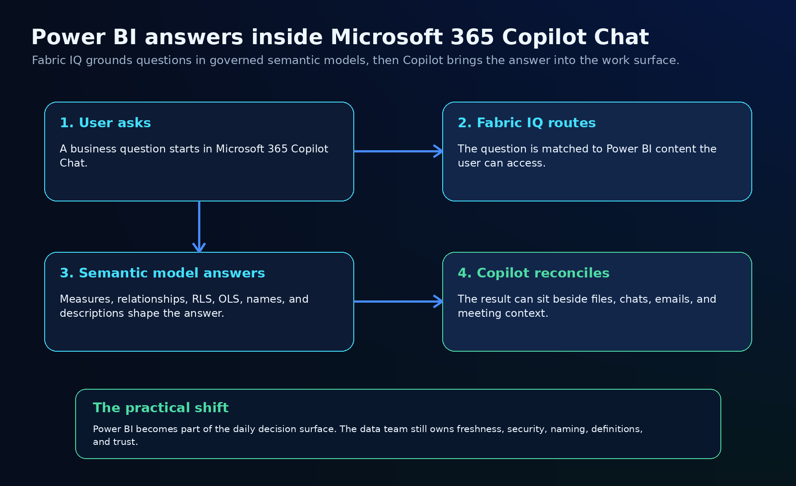
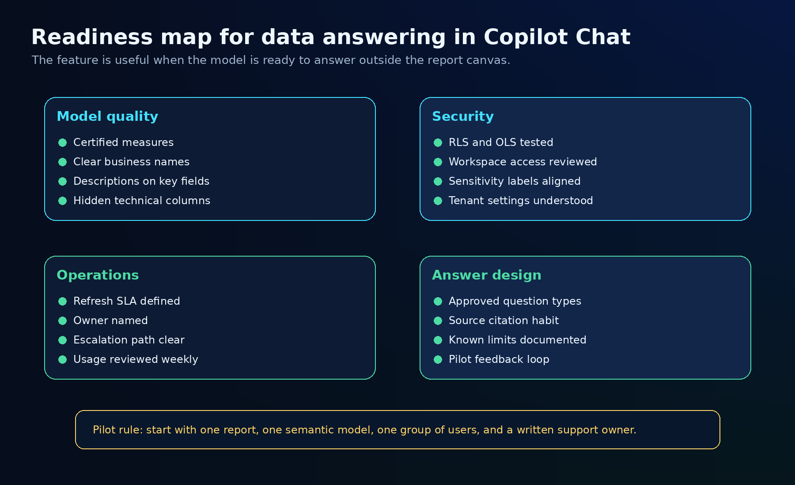
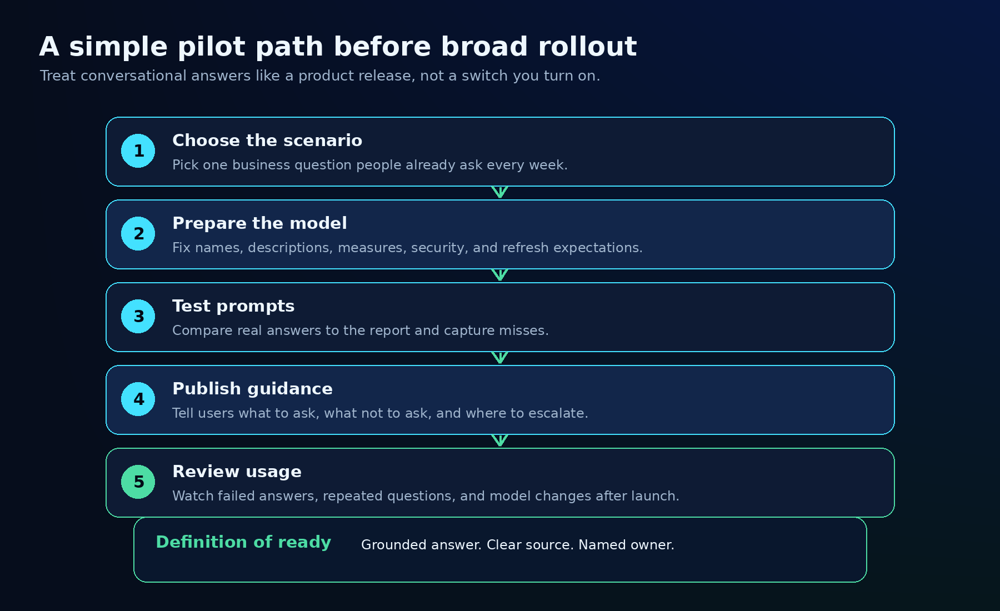

Power BI answers are starting to move closer to where decisions already happen.

That is the useful part of Fabric IQ in Microsoft 365 Copilot Chat.

The feature lets users ask Microsoft 365 Copilot questions grounded in Power BI reports and semantic models. Instead of switching to Power BI, finding the right report, applying filters, and interpreting the visual, a user can ask a data question in Copilot Chat and bring the answer into the same place where they are already working with files, chats, emails, and meetings.

That sounds small if you look at it as another Copilot surface.

It is bigger if you look at the workflow.

For years, BI teams have tried to pull users into dashboards. This pattern starts pulling governed BI answers into the user’s normal decision path.

That is a real opportunity. It also raises the bar for semantic model quality.

When a Power BI report is opened by a trained analyst, the analyst brings context. They know which measure to trust, which filter matters, which visual is old, and which field name is misleading.

When a question is asked through Copilot Chat, much of that implicit human context has to be built into the model, the report, the access model, and the operating process.

That is the part teams should prepare for now.

## What changed

Microsoft’s Fabric IQ connector for Microsoft 365 Copilot Chat is currently described as a Frontier capability. It allows eligible users to ask questions grounded in Power BI reports and semantic models from Copilot Chat.

The important mechanics are straightforward:

- Copilot uses the user’s existing permissions to access relevant Power BI content.
- Users can reference reports by pasting a report link, using the attachment menu when available, or naming the report in the prompt.
- The answer is grounded in Power BI data, then can be reconciled with broader Microsoft 365 context.
- Users need the right Microsoft 365 Copilot licensing and access to the relevant Power BI content.

That last point matters.

This does not remove BI governance. It exposes BI governance in a new place.

If your semantic model is well named, secure, documented, refreshed, and owned, this can become a very useful decision layer.

If the model is messy, the mess now has a new audience.

## The architecture pattern

The clean mental model is not “Copilot answers everything.”

The better model is this:

1. The user asks a business question in Microsoft 365 Copilot Chat.
2. Fabric IQ helps connect that question to relevant Power BI content.
3. The semantic model provides measures, relationships, security, business names, and definitions.
4. Copilot brings the answer back into the user’s work context.

That makes the semantic model the contract.


The report still matters. The visuals still matter. But for conversational answering, the semantic model becomes even more important because it carries the business logic.

The model needs to answer questions without relying on a report author standing next to the user.

That means the basics become production requirements:

- measures need clear names
- field descriptions need to exist
- hidden technical fields should stay hidden
- certified models need to be obvious
- RLS and OLS need to be tested with real user scenarios
- refresh expectations need to be documented
- ownership needs to be visible

None of this is glamorous. That is why it matters.

Most AI failure modes in BI will not come from spectacular model hallucinations. They will come from ordinary BI hygiene gaps that were tolerable inside a dashboard and painful inside a chat answer.

## A readiness checklist for BI teams

Before I would promote this broadly, I would run a readiness check across four areas.



### 1. Model quality

Start with the semantic model.

A conversational answer depends on the model being understandable without a human translator.

Check:

- Are the key measures named in business language?
- Do important fields have descriptions?
- Are technical columns hidden from the user experience?
- Are calculation groups, relationships, and measure folders organized enough to support discovery?
- Is the model certified or promoted when it should be?
- Are duplicate or outdated models still competing for attention?

This is where many teams will need cleanup.

If five models all claim to represent “sales,” Copilot is not the root problem. The estate is.

### 2. Security and permissions

Copilot uses the user’s existing access, so the permission model has to be correct before the feature becomes trusted.

Check:

- Is RLS tested with the same roles real users have?
- Is OLS used where sensitive fields should not be exposed?
- Are workspace permissions tighter than “everyone can view everything”?
- Are sensitivity labels aligned with the data’s real business meaning?
- Are report and semantic model permissions reviewed together?

The key test is simple:

If this user asks a question in chat, would we be comfortable with the same answer appearing in a meeting recap or shared work thread?

If not, fix access before expanding usage.

### 3. Operations

A chat answer feels immediate. That makes stale data more dangerous.

Inside a report, users sometimes notice context clues: refresh timestamps, page titles, filters, bookmarks, or report notes. In chat, the answer may feel more direct and more final.

That means the operating model needs to be explicit.

Check:

- What is the refresh SLA for the model?
- Who owns failed refreshes?
- Who owns bad answers?
- How are model changes reviewed?
- Where do users report issues?
- How often are usage and failures reviewed?

A good Copilot experience is not only a good prompt experience. It is a supportable data product.

### 4. Answer design

Not every question should be answered the same way.

Some questions need a number. Some need a trend. Some need a filtered slice. Some need a warning that the model does not contain the right context.

Create a small answer design guide for the first pilot:

- which questions are supported
- which questions are out of scope
- which report or model should be referenced
- how users should phrase common questions
- what answer quality looks like
- when the user should open the report instead of relying on chat

That guidance does not have to be heavy. One page is enough for a pilot.

But it should exist.

## A practical pilot path

I would not roll this out across the whole Power BI estate first.

I would choose one high-value scenario and make it boringly reliable.



### Step 1: Choose one recurring business question

Pick a question people already ask every week.

Good candidates:

- “How are sales tracking this month?”
- “Which region is behind target?”
- “What changed in pipeline since last week?”
- “Which customers are driving the variance?”
- “What should I know before the forecast meeting?”

Avoid vague pilots like “ask anything about revenue.”

That invites noise.

### Step 2: Pick the trusted report and semantic model

Choose one report and one model as the source of truth for the pilot.

Do not let the first pilot search across ten similar assets.

The point is to prove the answer path, not to test every governance edge case at once.

### Step 3: Prepare the model for questions

This is the cleanup sprint.

Focus on:

- business-friendly measure names
- descriptions for the most important fields
- certified status where appropriate
- hidden fields that should not appear in answers
- tested RLS and OLS
- refresh visibility
- clear ownership

If the model cannot explain itself, the chat experience will struggle.

### Step 4: Test with real prompts

Use the questions people actually ask.

For each one, compare the Copilot answer to the Power BI report and the semantic model logic.

Capture:

- correct answers
- incomplete answers
- confusing wording
- unsupported questions
- security or access surprises
- cases where opening the report is still better

This becomes the pilot’s improvement backlog.

### Step 5: Publish a small user guide

Users need guardrails, not a training course.

Give them:

- three example prompts that work well
- two examples that are out of scope
- the trusted report name
- the owner or support channel
- a reminder that governed data still depends on refresh and model design

That is enough to start.

### Step 6: Review after launch

After the pilot goes live, review what happened.

Look for:

- repeated questions
- confusing answers
- reports users keep referencing manually
- model fields that need better names
- missing measures
- access issues
- opportunities to add a second scenario

This is where the value compounds.

Every good question teaches the BI team what the model needs to support next.

## What I would tell BI teams to do now

Do not wait for every Copilot surface to be fully mature before cleaning up the model layer.

The preparation is useful either way.

A semantic model with clear names, tested security, good descriptions, certified ownership, and a refresh SLA is better for Power BI, Fabric Apps, AI skills, and Copilot Chat.

The same work improves the whole estate.

My short checklist would be:

```text
For each candidate semantic model:

1. Confirm business owner and technical owner.
2. Confirm the model is the trusted source for a real decision path.
3. Review measure names and descriptions.
4. Hide technical fields from user-facing experiences.
5. Test RLS and OLS with real user roles.
6. Confirm refresh SLA and failure ownership.
7. Create 10 approved example questions.
8. Test answers against the report and source logic.
9. Publish a one-page user guide.
10. Review usage and misses after launch.
```

That is the work that turns a Copilot feature into a reliable business capability.

## The bigger shift

For a long time, the center of gravity in BI was the report.

Then the semantic model became more important as teams standardized measures, lineage, security, and reusable business logic.

Now conversational interfaces are pushing that model layer into more places.

Microsoft 365 Copilot Chat is one of the most important places because it sits close to the work: meetings, files, messages, decisions, and follow-ups.

That does not make Power BI less important.

It makes Power BI governance more visible.

The teams that win here will not be the teams with the most dashboards. They will be the teams with the most trustworthy models and the clearest ownership.

That is a good direction.

It rewards the BI work that already should have mattered: definitions, security, freshness, ownership, and practical trust.

## Sources

- [Fabric IQ in Microsoft 365 Copilot Chat (Frontier), Microsoft Learn](https://learn.microsoft.com/en-us/fabric/iq/connectors/microsoft-365-copilot-overview)
- [Power BI June 2026 update, Microsoft Learn](https://learn.microsoft.com/en-us/power-bi/fundamentals/desktop-latest-update)

---

Want to discuss Power BI, Microsoft Fabric, or practical AI implementation? [Connect with me on LinkedIn](https://www.linkedin.com/in/shai-kr).
